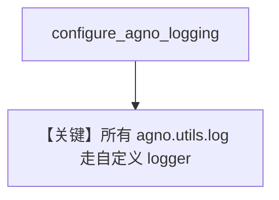

# custom_logging.py — 实现原理分析

> 源文件：`cookbook/02_agents/14_advanced/custom_logging.py`

## 概述

本示例展示 **`configure_agno_logging(custom_default_logger=...)`**：将标准 `logging.Logger` 注入 Agno 全局日志，`log_info` 与后续 `Agent` 运行走同一 handler。

**核心配置：** `Agent()` 无参（默认模型依环境）。

## 运行机制与因果链

统一 **可观测出口** 到 ELK/Splunk 等。

## Mermaid 流程图

## 关键源码文件索引

| 文件 | 作用 |
|------|------|
| `agno/utils/log.py` | `configure_agno_logging` |
