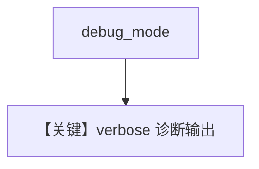

# debug.py — 实现原理分析

<!-- cookbook-py-source:start -->
## 完整源码

```python
"""
Debug
=============================

Debug.
"""

from agno.agent import Agent
from agno.models.openai import OpenAIResponses

# You can set the debug mode on the agent for all runs to have more verbose output
# ---------------------------------------------------------------------------
# Create Agent
# ---------------------------------------------------------------------------
agent = Agent(
    model=OpenAIResponses(id="gpt-5-mini"),
    debug_mode=True,
)

# ---------------------------------------------------------------------------
# Run Agent
# ---------------------------------------------------------------------------
if __name__ == "__main__":
    agent.print_response(input="Tell me a joke.")

    # You can also set the debug mode on a single run
    agent = Agent(
        model=OpenAIResponses(id="gpt-5-mini"),
    )
    agent.print_response(input="Tell me a joke.", debug_mode=True)
```

<!-- cookbook-py-source:end -->

> 源文件：`cookbook/02_agents/14_advanced/debug.py`

## 概述

本示例展示 **Agent 级与 run 级 `debug_mode`**：构造时 `debug_mode=True` 全局详细日志；或默认 Agent 在单次 `print_response(..., debug_mode=True)` 打开。

**核心配置：** `OpenAIResponses(id="gpt-5-mini")`。

## 运行机制与因果链

用于排查 **消息组装、工具调用、API 负载**（具体输出依框架日志级别）。

## Mermaid 流程图



## 关键源码文件索引

| 文件 | 作用 |
|------|------|
| `agno/agent/_run.py` | `debug_mode` 分支 |
