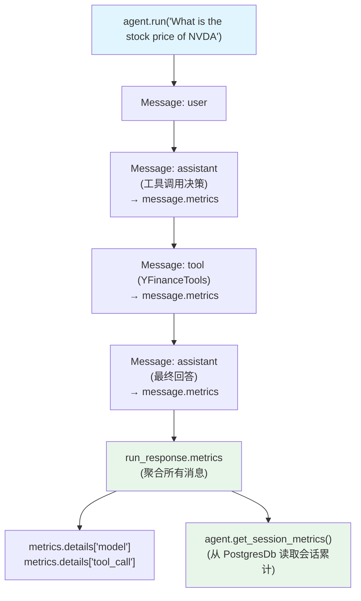

# metrics.py — 实现原理分析

> 源文件：`cookbook/02_agents/14_advanced/metrics.py`

## 概述

本示例展示 Agno Agent 的**三级 metrics**：消息级（`message.metrics`）、运行级（`run_response.metrics`）、会话级（`agent.get_session_metrics()`），涵盖 token 消耗、工具调用、模型细节的完整追踪。

**核心配置一览：**

| 配置项 | 值 | 说明 |
|--------|------|------|
| `model` | `OpenAIResponses(gpt-5.2)` | Responses API |
| `tools` | `[YFinanceTools()]` | 股票工具 |
| `markdown` | `True` | Markdown 输出 |
| `session_id` | `"test-session-metrics"` | 固定会话 ID |
| `db` | `PostgresDb` | 持久化（会话 metrics） |

## 三级 Metrics 层级

```
会话级 (Session)                              ← get_session_metrics()
  └── 运行级 (Run)                            ← run_response.metrics
        ├── 消息级 Message 1 (assistant)      ← message.metrics
        ├── 消息级 Message 2 (tool_call)      ← message.metrics
        └── 消息级 Message 3 (assistant)      ← message.metrics
```

## 核心代码模式

```python
run_response = agent.run("What is the stock price of NVDA")

# 1. 消息级 metrics
for message in run_response.messages:
    if message.role == "assistant":
        print(message.metrics)  # input_tokens, output_tokens, time 等

# 2. 运行级 metrics（所有消息的聚合）
pprint(run_response.metrics)   # total_tokens, details 等

# 3. 会话级 metrics（跨多次 run 的累计）
session_metrics = agent.get_session_metrics()
pprint(session_metrics)
```

## metrics 字段说明

| 层级 | 关键字段 | 说明 |
|------|---------|------|
| message | `input_tokens`, `output_tokens`, `time` | 单条消息的模型消耗 |
| run | `input_tokens`, `output_tokens`, `total_tokens`, `duration`, `details` | 整个 run 的聚合 |
| run.details | `{"model": [...], "tool_call": [...]}` | 分类型的详细 metrics |
| session | 同 run 但跨所有 run 累计 | 会话总消耗 |

## Mermaid 流程图



## 关键源码文件索引

| 文件 | 关键函数/类 | 作用 |
|------|------------|------|
| `agno/run/agent.py` | `RunOutput.metrics` | 运行级 metrics |
| `agno/models/message.py` | `Message.metrics` | 消息级 metrics |
| `agno/agent/agent.py` | `get_session_metrics()` | 会话级 metrics |
