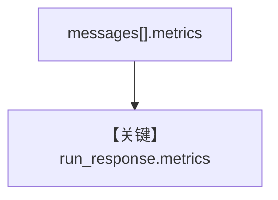

# metrics.py — 实现原理分析

> 源文件：`cookbook/02_agents/14_advanced/metrics.py`

## 概述

本示例展示 **消息级与 run 级 metrics**：`YFinanceTools` 触发工具调用后，遍历 `run_response.messages` 打印 **assistant** 消息的 `message.metrics`，再打印 **`run_response.metrics`**；`PostgresDb` + 固定 `session_id`。

**核心配置：** `OpenAIResponses`；`session_id="test-session-metrics"`。

## 运行机制与因果链

细分 **每轮 assistant/tool** 耗时与 token，对比整 run 汇总。

## Mermaid 流程图

```mermaid
flowchart TD
    M["messages[].metrics"] --> R["【关键】run_response.metrics"]
```

## 关键源码文件索引

| 文件 | 作用 |
|------|------|
| `agno/models/metrics.py` | `MessageMetrics` |
