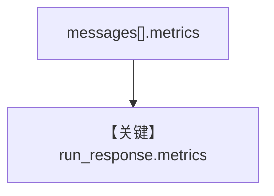

# metrics.py — 实现原理分析

<!-- cookbook-py-source:start -->
## 完整源码

```python
"""
Metrics
=============================

Metrics.
"""

from agno.agent import Agent
from agno.db.postgres import PostgresDb
from agno.models.openai import OpenAIResponses
from agno.tools.yfinance import YFinanceTools
from rich.pretty import pprint

# ---------------------------------------------------------------------------
# Create Agent
# ---------------------------------------------------------------------------
agent = Agent(
    model=OpenAIResponses(id="gpt-5.2"),
    tools=[YFinanceTools()],
    markdown=True,
    session_id="test-session-metrics",
    db=PostgresDb(db_url="postgresql+psycopg://ai:ai@localhost:5532/ai"),
)

# ---------------------------------------------------------------------------
# Run Agent
# ---------------------------------------------------------------------------
if __name__ == "__main__":
    # Get the run response directly from the non-streaming call
    run_response = agent.run("What is the stock price of NVDA")
    print("Tool execution completed successfully!")

    # Print metrics per message
    if run_response and run_response.messages:
        for message in run_response.messages:
            if message.role == "assistant":
                if message.content:
                    print(
                        f"Message: {message.content[:100]}..."
                    )  # Truncate for readability
                elif message.tool_calls:
                    print(f"Tool calls: {len(message.tool_calls)} tool call(s)")
                print("---" * 5, "Message Metrics", "---" * 5)
                if message.metrics:
                    pprint(message.metrics)
                else:
                    print("No metrics available for this message")
                print("---" * 20)

    # Print the run metrics
    print("---" * 5, "Run Metrics", "---" * 5)
    if run_response and run_response.metrics:
        pprint(run_response.metrics)
    else:
        print("No run metrics available")

    # Print the session metrics
    print("---" * 5, "Session Metrics", "---" * 5)
    try:
        session_metrics = agent.get_session_metrics()
        if session_metrics:
            pprint(session_metrics)
        else:
            print("No session metrics available")
    except Exception as e:
        print(f"Error getting session metrics: {e}")
```

<!-- cookbook-py-source:end -->

> 源文件：`cookbook/02_agents/14_advanced/metrics.py`

## 概述

本示例展示 **消息级与 run 级 metrics**：`YFinanceTools` 触发工具调用后，遍历 `run_response.messages` 打印 **assistant** 消息的 `message.metrics`，再打印 **`run_response.metrics`**；`PostgresDb` + 固定 `session_id`。

**核心配置：** `OpenAIResponses`；`session_id="test-session-metrics"`。

## 运行机制与因果链

细分 **每轮 assistant/tool** 耗时与 token，对比整 run 汇总。

## Mermaid 流程图


```mermaid
flowchart TD
    M["messages[].metrics"] --> R["【关键】run_response.metrics"]
```

## 关键源码文件索引

| 文件 | 作用 |
|------|------|
| `agno/models/metrics.py` | `MessageMetrics` |
