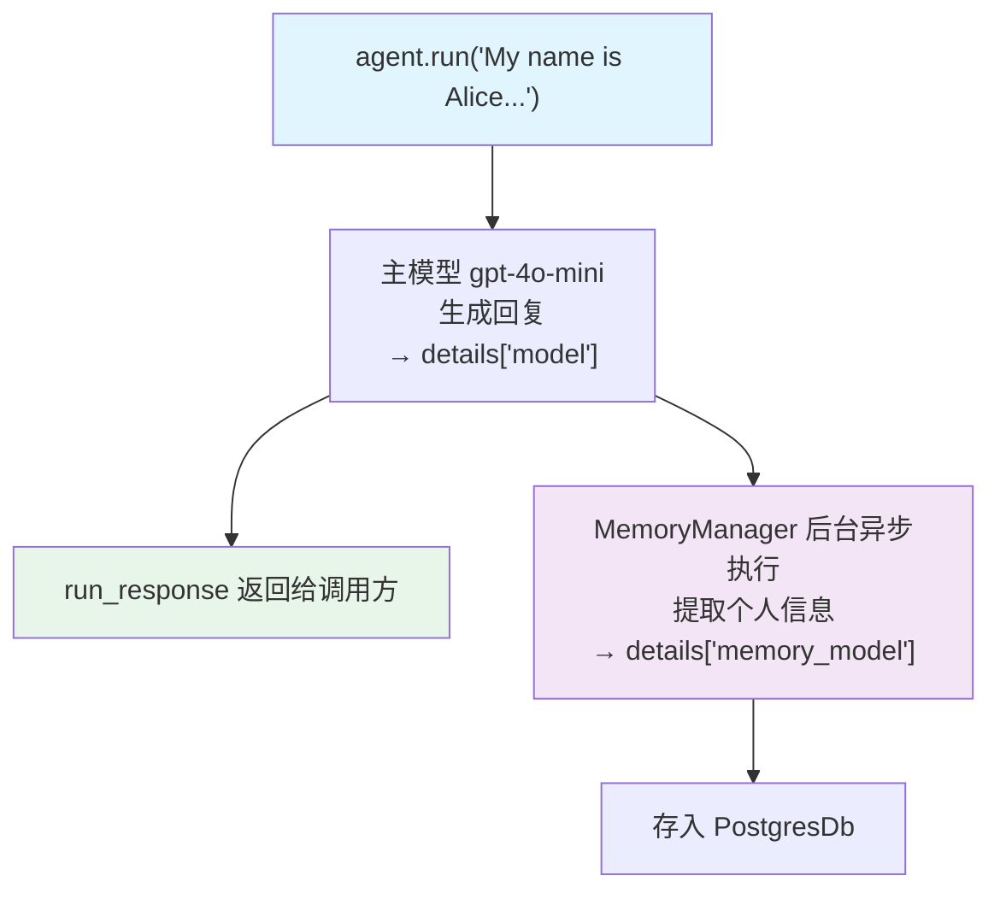

# multi_model_metrics.py — 实现原理分析

> 源文件：`cookbook/02_agents/14_advanced/multi_model_metrics.py`

## 概述

本示例展示 **MemoryManager 的 metrics 追踪**：当 Agent 配置 `memory_manager` 和 `update_memory_on_run=True` 时，MemoryManager 的 LLM 调用被记录在 `metrics.details["memory_model"]` 下，与主模型 `"model"` key 分开追踪。

**核心配置一览：**

| 配置项 | 值 | 说明 |
|--------|------|------|
| `model` | `OpenAIChat(gpt-4o-mini)` | 主模型 |
| `memory_manager` | `MemoryManager(model=gpt-4o-mini, db=PostgresDb)` | 记忆管理器 |
| `update_memory_on_run` | `True` | 每次运行后提取并更新记忆 |
| `db` | `PostgresDb` | 持久化存储 |

## 核心代码模式

```python
run_response = agent.run(
    "My name is Alice and I work at Google as a senior engineer."
)

# 分模型 detail keys
for model_type, model_metrics_list in run_response.metrics.details.items():
    print(f"\n{model_type}:")  # "model" 和 "memory_model"
    for model_metric in model_metrics_list:
        pprint(model_metric)
```

## metrics.details 键说明

| key | 来源 | 说明 |
|-----|------|------|
| `model` | 主 Agent gpt-4o-mini | 对用户的直接回复 |
| `memory_model` | MemoryManager gpt-4o-mini | 后台提取个人信息并存入 DB |

MemoryManager 在 run 完成后**异步**调用 LLM，从对话中提取结构化记忆（如"Alice，Google，高级工程师"）存入 PostgresDb。

## Mermaid 流程图



## 关键源码文件索引

| 文件 | 关键函数/类 | 作用 |
|------|------------|------|
| `agno/memory/manager.py` | `MemoryManager` | 记忆提取与存储 |
| `agno/run/agent.py` | `RunMetrics.details["memory_model"]` | 记忆模型 metrics |
| `agno/agent/_managers.py` | `start_memory_future()` | 后台异步记忆更新 |
