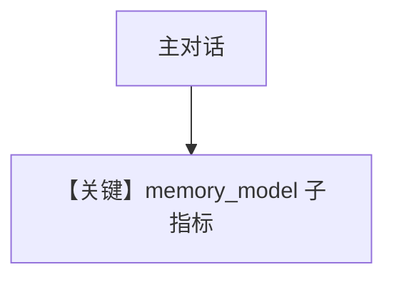

# multi_model_metrics.py — 实现原理分析

> 源文件：`cookbook/02_agents/14_advanced/multi_model_metrics.py`

## 概述

本示例展示 **`memory_model` 分键**：`MemoryManager` 与主 `model` 分离，`update_memory_on_run=True`，打印 `metrics.details` 中 **`model` vs `memory_model`**。

**核心配置：** `PostgresDb`；双 `OpenAIChat`。

## 运行机制与因果链

记忆摘要/更新 **单独计费**，便于主对话成本对齐。

## Mermaid 流程图

```mermaid
flowchart TD
    A["主对话"] --> MM["【关键】memory_model 子指标"]
```

## 关键源码文件索引

| 文件 | 作用 |
|------|------|
| `agno/memory/manager.py` | 内部模型调用 |
