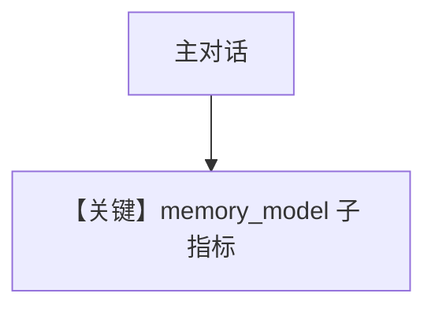

# multi_model_metrics.py — 实现原理分析

<!-- cookbook-py-source:start -->
## 完整源码

```python
"""
Multi-Model Metrics
=============================

When an agent uses a MemoryManager, each manager's model calls
are tracked under separate detail keys in metrics.details.

This example shows the "model" vs "memory_model" breakdown.
"""

from agno.agent import Agent
from agno.db.postgres import PostgresDb
from agno.memory.manager import MemoryManager
from agno.models.openai import OpenAIChat
from rich.pretty import pprint

# ---------------------------------------------------------------------------
# Create Agent
# ---------------------------------------------------------------------------
db = PostgresDb(db_url="postgresql+psycopg://ai:ai@localhost:5532/ai")

agent = Agent(
    model=OpenAIChat(id="gpt-4o-mini"),
    memory_manager=MemoryManager(model=OpenAIChat(id="gpt-4o-mini"), db=db),
    update_memory_on_run=True,
    db=db,
)

# ---------------------------------------------------------------------------
# Run Agent
# ---------------------------------------------------------------------------
if __name__ == "__main__":
    run_response = agent.run(
        "My name is Alice and I work at Google as a senior engineer."
    )

    print("=" * 50)
    print("RUN METRICS")
    print("=" * 50)
    pprint(run_response.metrics)

    print("=" * 50)
    print("MODEL DETAILS")
    print("=" * 50)
    if run_response.metrics and run_response.metrics.details:
        for model_type, model_metrics_list in run_response.metrics.details.items():
            print(f"\n{model_type}:")
            for model_metric in model_metrics_list:
                pprint(model_metric)
```

<!-- cookbook-py-source:end -->

> 源文件：`cookbook/02_agents/14_advanced/multi_model_metrics.py`

## 概述

本示例展示 **`memory_model` 分键**：`MemoryManager` 与主 `model` 分离，`update_memory_on_run=True`，打印 `metrics.details` 中 **`model` vs `memory_model`**。

**核心配置：** `PostgresDb`；双 `OpenAIChat`。

## 运行机制与因果链

记忆摘要/更新 **单独计费**，便于主对话成本对齐。

## Mermaid 流程图


```mermaid
flowchart TD
    A["主对话"] --> MM["【关键】memory_model 子指标"]
```

## 关键源码文件索引

| 文件 | 作用 |
|------|------|
| `agno/memory/manager.py` | 内部模型调用 |
