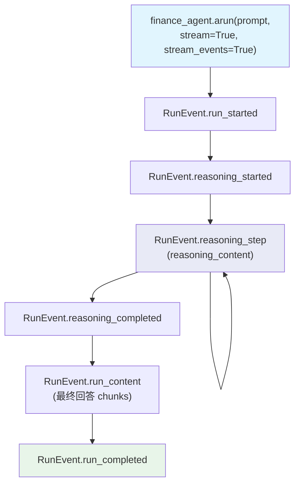

# reasoning_agent_events.py — 实现原理分析

> 源文件：`cookbook/02_agents/14_advanced/reasoning_agent_events.py`

## 概述

本示例展示 **推理 Agent 的事件流**：启用 `reasoning=True` 后，通过 `stream_events=True` 可捕获推理阶段的专属事件：`reasoning_started`、`reasoning_step`（含推理内容）、`reasoning_completed`，以及常规的 `run_started`、`run_content`、`run_completed`。

**核心配置一览：**

| 配置项 | 值 | 说明 |
|--------|------|------|
| `model` | `OpenAIResponses(gpt-5.2)` | Responses API |
| `reasoning` | `True` | 启用推理模式 |

## 核心事件监控模式

```python
async for run_output_event in finance_agent.arun(
    prompt,
    stream=True,
    stream_events=True,
):
    # 运行开始/结束
    if run_output_event.event in [RunEvent.run_started, RunEvent.run_completed]:
        print(f"\nEVENT: {run_output_event.event}")

    # 推理开始
    if run_output_event.event in [RunEvent.reasoning_started]:
        print(f"\nEVENT: {run_output_event.event}")

    # 推理步骤（含具体推理内容）
    if run_output_event.event in [RunEvent.reasoning_step]:
        print(f"\nEVENT: {run_output_event.event}")
        print(f"REASONING CONTENT: {run_output_event.reasoning_content}")

    # 推理完成
    if run_output_event.event in [RunEvent.reasoning_completed]:
        print(f"\nEVENT: {run_output_event.event}")

    # 内容块（模型最终回答）
    if run_output_event.event in [RunEvent.run_content]:
        print(run_output_event.content, end="")
```

## 推理事件时序

```
run_started
  → reasoning_started
  → reasoning_step (thinking_1)     ← reasoning_content
  → reasoning_step (thinking_2)     ← reasoning_content
  → ...
  → reasoning_completed
  → run_content (最终回答 chunk 1)
  → run_content (最终回答 chunk 2)
  → ...
  → run_completed
```

## RunOutputEvent 推理字段

| 字段 | 事件 | 说明 |
|------|------|------|
| `reasoning_content` | `reasoning_step` | 模型的推理中间过程文本 |

## Mermaid 流程图



## 关键源码文件索引

| 文件 | 关键函数/类 | 作用 |
|------|------------|------|
| `agno/run/agent.py` | `RunEvent.reasoning_started/step/completed` | 推理事件枚举 |
| `agno/run/agent.py` | `RunOutputEvent.reasoning_content` | 推理内容字段 |
| `agno/agent/agent.py` | `Agent(reasoning=True)` | 启用推理 |
