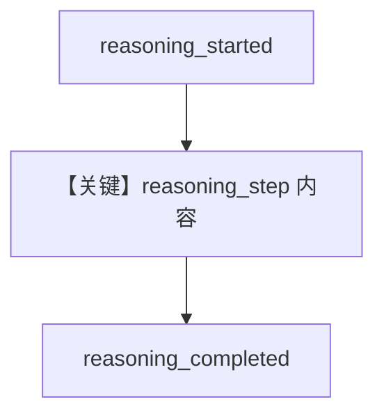

# reasoning_agent_events.py — 实现原理分析

<!-- cookbook-py-source:start -->
## 完整源码

```python
"""
Reasoning Agent Events
=============================

Reasoning Agent Events.
"""

import asyncio

from agno.agent import RunEvent
from agno.agent.agent import Agent
from agno.models.openai import OpenAIResponses

# ---------------------------------------------------------------------------
# Create Agent
# ---------------------------------------------------------------------------
finance_agent = Agent(
    model=OpenAIResponses(id="gpt-5.2"),
    reasoning=True,
)


async def run_agent_with_events(prompt: str):
    content_started = False
    async for run_output_event in finance_agent.arun(
        prompt,
        stream=True,
        stream_events=True,
    ):
        if run_output_event.event in [RunEvent.run_started, RunEvent.run_completed]:
            print(f"\nEVENT: {run_output_event.event}")

        if run_output_event.event in [RunEvent.reasoning_started]:
            print(f"\nEVENT: {run_output_event.event}")

        if run_output_event.event in [RunEvent.reasoning_step]:
            print(f"\nEVENT: {run_output_event.event}")
            print(f"REASONING CONTENT: {run_output_event.reasoning_content}")  # type: ignore

        if run_output_event.event in [RunEvent.reasoning_completed]:
            print(f"\nEVENT: {run_output_event.event}")

        if run_output_event.event in [RunEvent.run_content]:
            if not content_started:
                print("\nCONTENT:")
                content_started = True
            else:
                print(run_output_event.content, end="")


# ---------------------------------------------------------------------------
# Run Agent
# ---------------------------------------------------------------------------
if __name__ == "__main__":
    task = (
        "Analyze the key factors that led to the signing of the Treaty of Versailles in 1919. "
        "Discuss the political, economic, and social impacts of the treaty on Germany and how it "
        "contributed to the onset of World War II. Provide a nuanced assessment that includes "
        "multiple historical perspectives."
    )
    asyncio.run(
        run_agent_with_events(
            task,
        )
    )
```

<!-- cookbook-py-source:end -->

> 源文件：`cookbook/02_agents/14_advanced/reasoning_agent_events.py`

## 概述

本示例展示 **推理阶段事件**：`reasoning=True` + `stream_events=True`，监听 `reasoning_started` / `reasoning_step` / `reasoning_completed`，打印 `reasoning_content`。

**核心配置：** `OpenAIResponses(id="gpt-5.2")`。

## 运行机制与因果链

UI 可展示 **思维链** 与最终回答分离的时间线。

## Mermaid 流程图


```mermaid
flowchart TD
    RS["reasoning_started"] --> RQ["【关键】reasoning_step 内容"]
    RQ --> RC["reasoning_completed"]
```

## 关键源码文件索引

| 文件 | 作用 |
|------|------|
| `agno/agent` | `RunEvent.reasoning_*` |
