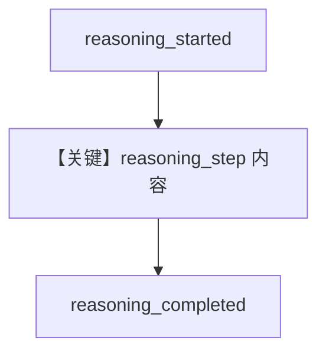

# reasoning_agent_events.py — 实现原理分析

> 源文件：`cookbook/02_agents/14_advanced/reasoning_agent_events.py`

## 概述

本示例展示 **推理阶段事件**：`reasoning=True` + `stream_events=True`，监听 `reasoning_started` / `reasoning_step` / `reasoning_completed`，打印 `reasoning_content`。

**核心配置：** `OpenAIResponses(id="gpt-5.2")`。

## 运行机制与因果链

UI 可展示 **思维链** 与最终回答分离的时间线。

## Mermaid 流程图

```mermaid
flowchart TD
    RS["reasoning_started"] --> RQ["【关键】reasoning_step 内容"]
    RQ --> RC["reasoning_completed"]
```

## 关键源码文件索引

| 文件 | 作用 |
|------|------|
| `agno/agent` | `RunEvent.reasoning_*` |
