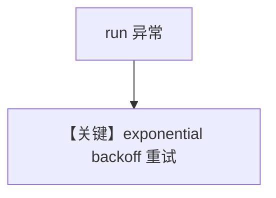

# retries.py — 实现原理分析

<!-- cookbook-py-source:start -->
## 完整源码

```python
"""
Retries
=============================

Example demonstrating how to set up retries with an Agent.
"""

from agno.agent import Agent
from agno.tools.websearch import WebSearchTools

# ---------------------------------------------------------------------------
# Create Agent
# ---------------------------------------------------------------------------
agent = Agent(
    name="Web Search Agent",
    role="Search the web for information",
    tools=[WebSearchTools()],
    retries=3,  # The Agent run will be retried 3 times in case of error.
    delay_between_retries=1,  # Delay between retries in seconds.
    exponential_backoff=True,  # If True, the delay between retries is doubled each time.
)

# ---------------------------------------------------------------------------
# Run Agent
# ---------------------------------------------------------------------------
if __name__ == "__main__":
    agent.print_response(
        "What exactly is an AI Agent?",
        stream=True,
    )
```

<!-- cookbook-py-source:end -->

> 源文件：`cookbook/02_agents/14_advanced/retries.py`

## 概述

本示例展示 **Agent 级重试策略**：`retries=3`，`delay_between_retries=1`，`exponential_backoff=True`；`WebSearchTools`；**未显式传入 `model`**（依赖框架/环境默认模型，运行前请确认）。

**核心配置：** `name`/`role` 字面量见 `.py`。

## 运行机制与因果链

网络或模型错误时 **自动退避重跑** 整个 run（非单次 HTTP）。

## Mermaid 流程图



## 关键源码文件索引

| 文件 | 作用 |
|------|------|
| `agno/agent/_run.py` | 重试循环 |
