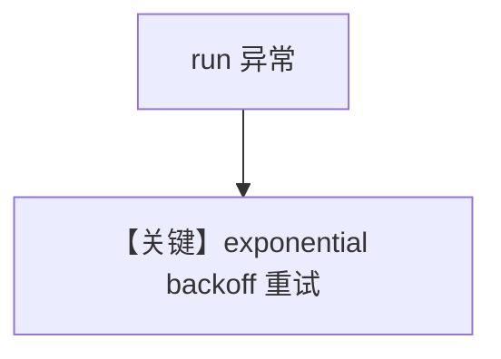

# retries.py — 实现原理分析

> 源文件：`cookbook/02_agents/14_advanced/retries.py`

## 概述

本示例展示 **Agent 级重试策略**：`retries=3`，`delay_between_retries=1`，`exponential_backoff=True`；`WebSearchTools`；**未显式传入 `model`**（依赖框架/环境默认模型，运行前请确认）。

**核心配置：** `name`/`role` 字面量见 `.py`。

## 运行机制与因果链

网络或模型错误时 **自动退避重跑** 整个 run（非单次 HTTP）。

## Mermaid 流程图

## 关键源码文件索引

| 文件 | 作用 |
|------|------|
| `agno/agent/_run.py` | 重试循环 |
