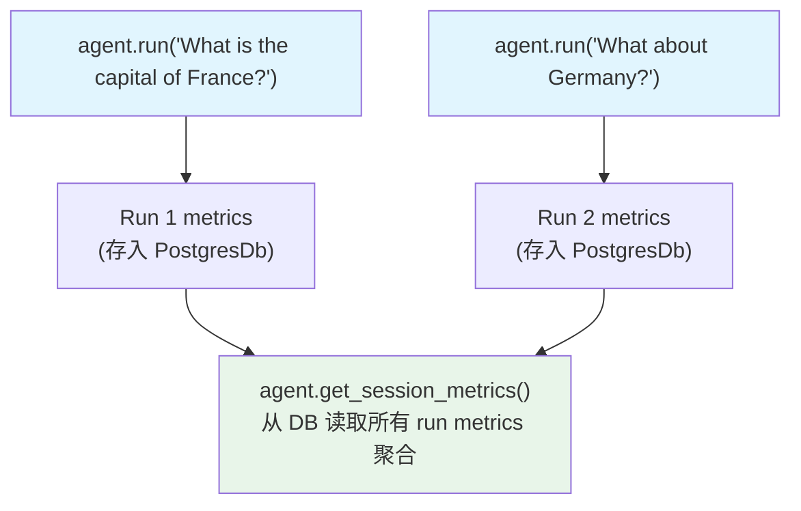

# session_metrics.py — 实现原理分析

> 源文件：`cookbook/02_agents/14_advanced/session_metrics.py`

## 概述

本示例展示 **会话级 metrics 的跨 run 累积**：同一 `session_id` 下的多次 `agent.run()` 调用产生各自的运行 metrics，同时 `agent.get_session_metrics()` 返回该会话所有 run 的聚合 token 和时间消耗总量。

**核心配置一览：**

| 配置项 | 值 | 说明 |
|--------|------|------|
| `model` | `OpenAIChat(gpt-4o-mini)` | 主模型 |
| `db` | `PostgresDb(session_table="agent_metrics_sessions")` | 持久化，支持会话 metrics |
| `session_id` | `"session_metrics_demo"` | 固定会话 ID 以累积 metrics |
| `add_history_to_context` | `True` | 保留对话历史 |

## 核心代码模式

```python
# Run 1
run_output_1 = agent.run("What is the capital of France?")
pprint(run_output_1.metrics)   # Run 1 的 token 消耗

# Run 2（同一会话）
run_output_2 = agent.run("What about Germany?")
pprint(run_output_2.metrics)   # Run 2 的 token 消耗（含对话历史）

# 会话级累积（Run 1 + Run 2 合计）
session_metrics = agent.get_session_metrics()
pprint(session_metrics)        # total_tokens = run1 + run2
```

## metrics 层级对比

| 层级 | 获取方式 | 范围 |
|------|---------|------|
| Run 1 metrics | `run_output_1.metrics` | 仅第一次 run |
| Run 2 metrics | `run_output_2.metrics` | 仅第二次 run（含历史 token） |
| Session metrics | `agent.get_session_metrics()` | 两次 run 合计 |

会话 metrics 需要 `db` 配置（PostgresDb），因为需要持久化每次 run 的 metrics 并在读取时聚合。

## Mermaid 流程图



## 关键源码文件索引

| 文件 | 关键函数/类 | 作用 |
|------|------------|------|
| `agno/agent/agent.py` | `get_session_metrics()` | 会话级 metrics 聚合读取 |
| `agno/run/agent.py` | `RunOutput.metrics` | 运行级 metrics |
| `agno/db/postgres.py` | `PostgresDb` | 持久化存储 metrics |
