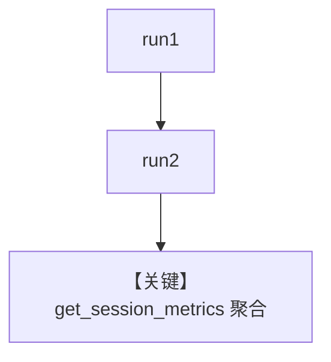

# session_metrics.py — 实现原理分析

<!-- cookbook-py-source:start -->
## 完整源码

```python
"""
Demonstrates session-level metrics that accumulate across multiple runs.
"""

from agno.agent import Agent
from agno.db.postgres import PostgresDb
from agno.models.openai import OpenAIChat
from rich.pretty import pprint

# ---------------------------------------------------------------------------
# Setup
# ---------------------------------------------------------------------------
db_url = "postgresql+psycopg://ai:ai@localhost:5532/ai"
db = PostgresDb(db_url=db_url, session_table="agent_metrics_sessions")

# ---------------------------------------------------------------------------
# Create Agent
# ---------------------------------------------------------------------------
agent = Agent(
    model=OpenAIChat(id="gpt-4o-mini"),
    db=db,
    session_id="session_metrics_demo",
    add_history_to_context=True,
)

# ---------------------------------------------------------------------------
# Run Agent
# ---------------------------------------------------------------------------
if __name__ == "__main__":
    # First run
    run_output_1 = agent.run("What is the capital of France?")
    print("=" * 50)
    print("RUN 1 METRICS")
    print("=" * 50)
    pprint(run_output_1.metrics)

    # Second run on the same session
    run_output_2 = agent.run("What about Germany?")
    print("=" * 50)
    print("RUN 2 METRICS")
    print("=" * 50)
    pprint(run_output_2.metrics)

    # Session metrics aggregate both runs
    print("=" * 50)
    print("SESSION METRICS (accumulated)")
    print("=" * 50)
    session_metrics = agent.get_session_metrics()
    pprint(session_metrics)
```

<!-- cookbook-py-source:end -->

> 源文件：`cookbook/02_agents/14_advanced/session_metrics.py`

## 概述

本示例展示 **`get_session_metrics()` 会话累计**：同一 `session_id` 两次 `run` 后，单次 run 的 `metrics` 与 **跨 run 聚合的 session 指标** 对比打印。

**核心配置：** `PostgresDb`；`add_history_to_context=True`；`session_id="session_metrics_demo"`。

## 运行机制与因果链

长对话成本与 token **按会话汇总**，利于计费仪表盘。

## Mermaid 流程图


```mermaid
flowchart TD
    R1["run1"] --> R2["run2"]
    R2 --> S["【关键】get_session_metrics 聚合"]
```

## 关键源码文件索引

| 文件 | 作用 |
|------|------|
| `agno/agent/agent.py` | `get_session_metrics` |
