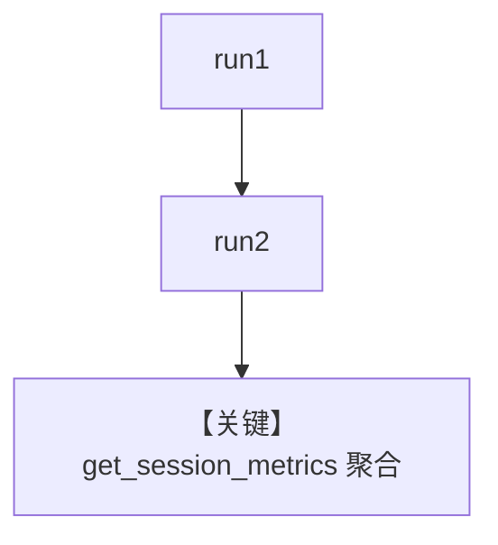

# session_metrics.py — 实现原理分析

> 源文件：`cookbook/02_agents/14_advanced/session_metrics.py`

## 概述

本示例展示 **`get_session_metrics()` 会话累计**：同一 `session_id` 两次 `run` 后，单次 run 的 `metrics` 与 **跨 run 聚合的 session 指标** 对比打印。

**核心配置：** `PostgresDb`；`add_history_to_context=True`；`session_id="session_metrics_demo"`。

## 运行机制与因果链

长对话成本与 token **按会话汇总**，利于计费仪表盘。

## Mermaid 流程图

```mermaid
flowchart TD
    R1["run1"] --> R2["run2"]
    R2 --> S["【关键】get_session_metrics 聚合"]
```

## 关键源码文件索引

| 文件 | 作用 |
|------|------|
| `agno/agent/agent.py` | `get_session_metrics` |
