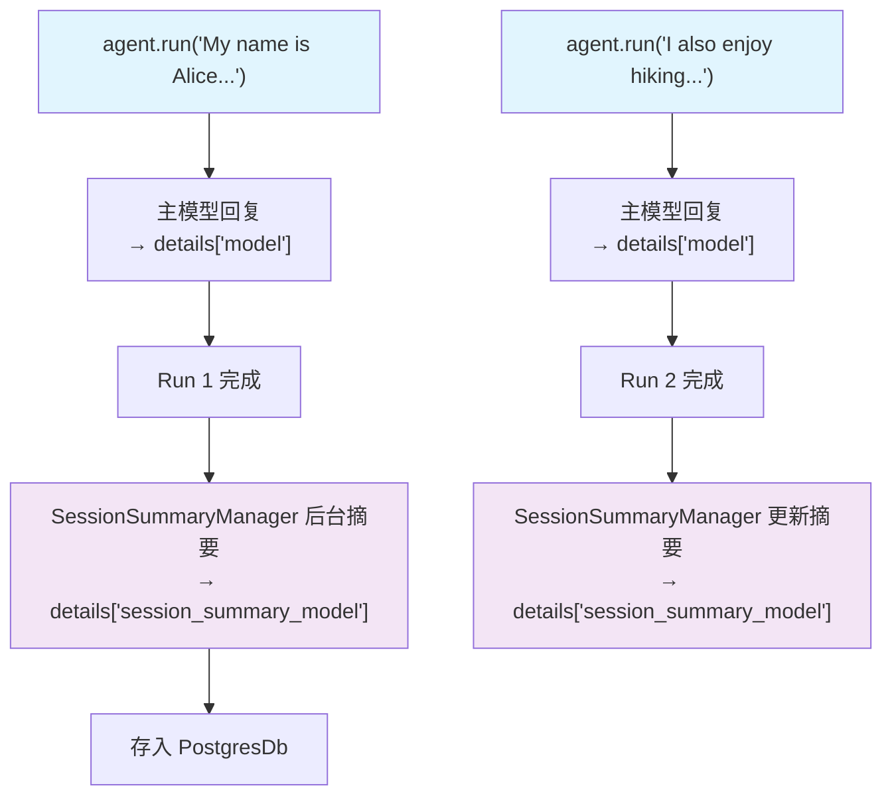

# session_summary_metrics.py — 实现原理分析

> 源文件：`cookbook/02_agents/14_advanced/session_summary_metrics.py`

## 概述

本示例展示 **SessionSummaryManager 的 metrics 追踪**：当 Agent 配置 `session_summary_manager` 和 `enable_session_summaries=True` 时，会话摘要模型的调用被记录在 `metrics.details["session_summary_model"]` 下，可与主模型消耗分开分析。

**核心配置一览：**

| 配置项 | 值 | 说明 |
|--------|------|------|
| `model` | `OpenAIChat(gpt-4o-mini)` | 主模型 |
| `session_summary_manager` | `SessionSummaryManager(model=gpt-4o-mini)` | 摘要管理器 |
| `enable_session_summaries` | `True` | 每次 run 后生成会话摘要 |
| `db` | `PostgresDb` | 持久化存储 |
| `session_id` | `"session-summary-metrics-demo"` | 固定会话 ID |

## 核心代码模式

```python
# Run 1：摘要还未触发（第一次可能不立即摘要）
run_response_1 = agent.run("My name is Alice and I work at Google.")
pprint(run_response_1.metrics)

# Run 2：触发会话摘要，details["session_summary_model"] 出现
run_response_2 = agent.run("I also enjoy hiking on weekends.")
pprint(run_response_2.metrics)

# 查看 session_summary_model 的 token 消耗
for model_type, model_metrics_list in run_response_2.metrics.details.items():
    print(f"\n{model_type}:")  # "model" 和 "session_summary_model"
    for model_metric in model_metrics_list:
        pprint(model_metric)

# 会话累积
session_metrics = agent.get_session_metrics()
```

## metrics.details 键说明

| key | 来源 | 触发时机 |
|-----|------|---------|
| `model` | 主 Agent gpt-4o-mini | 每次 run |
| `session_summary_model` | SessionSummaryManager | 每次 run 完成后（后台异步） |

## Mermaid 流程图



## 关键源码文件索引

| 文件 | 关键函数/类 | 作用 |
|------|------------|------|
| `agno/session/summary.py` | `SessionSummaryManager` | 会话摘要生成 |
| `agno/run/agent.py` | `RunMetrics.details["session_summary_model"]` | 摘要模型 metrics |
