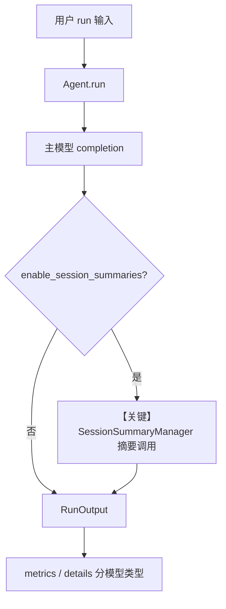

# session_summary_metrics.py — 实现原理分析

<!-- cookbook-py-source:start -->
## 完整源码

```python
"""
Session Summary Metrics
=============================

When an agent uses a SessionSummaryManager, the summary model's token
usage is tracked separately under the "session_summary_model" detail key.

This lets you see how many tokens are spent summarizing the session
versus the agent's own model calls.

The session summary runs after each interaction to maintain a concise
summary of the conversation so far.
"""

from agno.agent import Agent
from agno.db.postgres import PostgresDb
from agno.models.openai import OpenAIChat
from agno.session.summary import SessionSummaryManager
from rich.pretty import pprint

# ---------------------------------------------------------------------------
# Create Agent
# ---------------------------------------------------------------------------
db = PostgresDb(db_url="postgresql+psycopg://ai:ai@localhost:5532/ai")

agent = Agent(
    model=OpenAIChat(id="gpt-5.1"),
    session_summary_manager=SessionSummaryManager(
        model=OpenAIChat(id="gpt-4o-mini"),
    ),
    enable_session_summaries=True,
    db=db,
    session_id="session-summary-metrics-demo",
)

# ---------------------------------------------------------------------------
# Run Agent
# ---------------------------------------------------------------------------
if __name__ == "__main__":
    # First run
    run_response_1 = agent.run("My name is Alice and I work at Google.")
    print("=" * 50)
    print("RUN 1 METRICS")
    print("=" * 50)
    pprint(run_response_1.metrics)

    # Second run - triggers session summary
    run_response_2 = agent.run("I also enjoy hiking on weekends.")
    print("=" * 50)
    print("RUN 2 METRICS")
    print("=" * 50)
    pprint(run_response_2.metrics)

    print("=" * 50)
    print("MODEL DETAILS (Run 2)")
    print("=" * 50)
    if run_response_2.metrics and run_response_2.metrics.details:
        for model_type, model_metrics_list in run_response_2.metrics.details.items():
            print(f"\n{model_type}:")
            for model_metric in model_metrics_list:
                pprint(model_metric)

    print("=" * 50)
    print("SESSION METRICS (accumulated)")
    print("=" * 50)
    session_metrics = agent.get_session_metrics()
    if session_metrics:
        pprint(session_metrics)
```

<!-- cookbook-py-source:end -->

> 源文件：`cookbook/02_agents/14_advanced/session_summary_metrics.py`

## 概述

本示例展示 Agno 的 **Session 摘要与指标拆分（session_summary_model）** 机制：在启用 `SessionSummaryManager` 与 `enable_session_summaries` 时，会话摘要用独立模型生成，其 token 等指标在 `RunOutput.metrics.details` 中按 `session_summary_model` 等键与主模型区分开，便于对比「对话模型消耗」与「摘要模型消耗」。

**核心配置一览：**

| 配置项 | 值 | 说明 |
|--------|------|------|
| `model` | `OpenAIChat(id="gpt-5.1")` | Chat Completions API，主对话模型 |
| `session_summary_manager` | `SessionSummaryManager(model=OpenAIChat(id="gpt-4o-mini"))` | 摘要专用子模型 |
| `enable_session_summaries` | `True` | 开启跑后/交互后会话摘要 |
| `db` | `PostgresDb(db_url="postgresql+psycopg://ai:ai@localhost:5532/ai")` | 持久化会话（生产型示例） |
| `session_id` | `"session-summary-metrics-demo"` | 固定会话 id |
| `name` | 未设置 | 未设置 |
| `instructions` / `description` | 未设置 | 未设置 |

## 架构分层

```
用户代码层                agno.agent 层
┌──────────────────────┐    ┌────────────────────────────────────────┐
│ session_summary_     │    │ Agent.run() → _run / 会话摘要管线       │
│ metrics.py           │    │  ├ 主模型 completion → metrics         │
│ Agent(...,           │───>│  └ SessionSummaryManager → 摘要模型调用  │
│  session_summary_    │    │       → metrics.details["session_..."] │
│  manager, db)        │    └────────────────────────────────────────┘
└──────────────────────┘                    │
                                            ▼
                                   ┌─────────────────┐
                                   │ OpenAIChat      │
                                   │ gpt-5.1 / 4o-mini│
                                   └─────────────────┘
```

## 核心组件解析

### SessionSummaryManager 与指标键

会话摘要逻辑在 `agno/session/summary.py` 中处理摘要响应；指标类型常量 `SESSION_SUMMARY_MODEL = "session_summary_model"` 定义于 `agno/metrics.py`（约 L18），用于在聚合指标中区分摘要模型调用。

### PostgresDb 与 session

`PostgresDb` 将会话状态写入 PostgreSQL，使多轮 run 与摘要可跨进程复现（与仓库规则「生产用 Postgres」一致）。

### 运行机制与因果链

1. **数据路径**：用户 `agent.run(...)` → 主模型完成对话 → 若启用摘要，框架在适当时机调用摘要模型 → `RunOutput.metrics` 汇总；`agent.get_session_metrics()` 读取会话级累计。
2. **状态与副作用**：写入 DB 的会话记录；第二次 run 触发「需更新摘要」路径时，摘要模型产生独立 token 计数，出现在 `metrics.details` 的分组中。
3. **关键分支**：`enable_session_summaries=False` 时不走摘要模型；无 `session_summary_manager` 则无法按示例拆分摘要指标。
4. **与相邻示例差异**：本文件聚焦 **metrics.details 中按模型类型拆分**，而非单纯展示 `SessionSummaryManager` 配置。

## System Prompt 组装

本示例未设置 `instructions`、`description` 或自定义 `system_message`，走 `get_system_message()`（`agno/agent/_messages.py`）默认路径 **# 3**：`build_context` 默认为真时，仅包含模型侧默认 instruction（若有）及空 instruction 时的最小默认拼装。

| 序号 | 组成部分 | 本文件中的值/来源 | 是否生效 |
|------|---------|-----------------|---------|
| 1 | `description` | 未设置 | 否 |
| 2 | `role` | 未设置 | 否 |
| 3 | `instructions` | 未设置 | 否 |
| 4.1 | `markdown` | 默认 False | 否（且无额外 markdown 段） |
| 其余 | 默认 #3.3 段 | 可能仅含模型 `get_instructions_for_model` | 视模型而定 |

### 拼装顺序与源码锚点

默认顺序见 `_messages.py` `get_system_message()` 注释 `# 3.3.1`～`# 3.3.3`：description → role → instructions → additional_information → …。本示例前几项多为空，系统消息可能极短或由模型默认指令构成。

### 还原后的完整 System 文本

```text
（本示例未在 cookbook 中显式给出 instructions/description；完整 system 文本依赖运行时模型默认与 OpenAIChat 的 get_instructions_for_model 返回值。）

验证方式：在 get_system_message() 返回前对 Message.content 打断点或临时打印。
```

### 段落释义（模型视角）

- 主对话模型收到的约束主要来自其默认系统侧行为；用户消息为两次自然语言输入。
- 摘要模型在独立调用中收到摘要任务相关提示（由 SessionSummaryManager 构造，未在本 .py 中静态展开）。

### 与 User / Developer 消息的边界

用户文本两次通过 user 消息传入；摘要调用发生在会话管线内部，与用户可见消息分离。

## 完整 API 请求

主模型为 **OpenAI Chat Completions** 系：`OpenAIChat` 使用 `chat.completions.create`，`messages` 含 system（若存在）、user/assistant 历史等。

```python
# 概念结构（主对话一次典型 completion）
# client.chat.completions.create(
#     model="gpt-5.1",
#     messages=[
#         # {"role": "system", "content": <get_system_message 产物>},
#         {"role": "user", "content": "My name is Alice..."},
#     ],
# )
# 摘要模型 gpt-4o-mini 在 SessionSummaryManager 触发的单独请求中调用，体现在 metrics.details["session_summary_model"]（或框架当前使用的等价键）。
```

## Mermaid 流程图


```mermaid
flowchart TD
    U["用户 run 输入"] --> R["Agent.run"]
    R --> M["主模型 completion"]
    M --> C{"enable_session_summaries?"}
    C -->|是| S["【关键】SessionSummaryManager 摘要调用"]
    C -->|否| Out["RunOutput"]
    S --> Out
    Out --> Met["metrics / details 分模型类型"]
```

- **【关键】SessionSummaryManager 摘要调用**：产生与主模型分离的 token 指标，便于对比。

## 关键源码文件索引

| 文件 | 关键函数/类 | 作用 |
|------|------------|------|
| `agno/agent/_messages.py` | `get_system_message()` L106+ | 默认 system 拼装 |
| `agno/metrics.py` | `SESSION_SUMMARY_MODEL` L18 | 摘要模型指标键名 |
| `agno/session/summary.py` | `SessionSummaryManager` | 会话摘要生命周期 |
| `agno/db/postgres.py` | `PostgresDb` | 会话持久化 |
