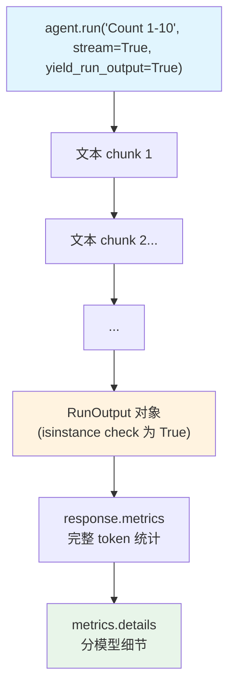

# streaming_metrics.py — 实现原理分析

> 源文件：`cookbook/02_agents/14_advanced/streaming_metrics.py`

## 概述

本示例展示如何在**流式响应**中捕获完整 metrics：使用 `agent.run(stream=True, yield_run_output=True)`，在流结束时额外 yield 一个 `RunOutput` 对象，包含完整的 token 统计和 metrics.details。

**核心配置一览：**

| 配置项 | 值 | 说明 |
|--------|------|------|
| `model` | `OpenAIChat(gpt-4o-mini)` | Chat API |

## 核心代码模式

```python
response = None
for event in agent.run("Count from 1 to 10.", stream=True, yield_run_output=True):
    if isinstance(event, RunOutput):
        # 流结束时的最后一个对象，包含完整 metrics
        response = event

if response and response.metrics:
    pprint(response.metrics)          # total_tokens, duration 等
    
    # 分模型细节
    for model_type, model_metrics_list in response.metrics.details.items():
        print(f"\n{model_type}:")
        for model_metric in model_metrics_list:
            pprint(model_metric)
```

## yield_run_output=True 原理

| 参数 | 流式输出类型 | 最后元素 |
|------|------------|---------|
| `stream=True`（默认） | `RunOutputEvent` / 文本块 | 无 RunOutput |
| `stream=True, yield_run_output=True` | 文本块 + **最后 yield 一个 RunOutput** | 包含完整 metrics |

`RunOutput` 在流结束后由 Agno 构建，包含：
- 完整 `content`（所有 chunk 合并）
- `metrics`（run 级聚合）
- `metrics.details`（分模型细节）

## Mermaid 流程图



## 关键源码文件索引

| 文件 | 关键函数/类 | 作用 |
|------|------------|------|
| `agno/agent/agent.py` | `run(yield_run_output=True)` | 流尾注入 RunOutput |
| `agno/run/agent.py` | `RunOutput` | 完整运行输出（含 metrics） |
