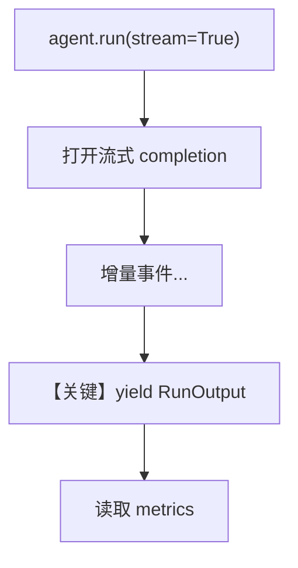

# streaming_metrics.py — 实现原理分析

> 源文件：`cookbook/02_agents/14_advanced/streaming_metrics.py`

## 概述

本示例展示 Agno 的 **流式输出与最终 RunOutput 指标（yield_run_output）** 机制：在 `stream=True` 时迭代事件流，配合 `yield_run_output=True` 在流末尾产出完整 `RunOutput`，从而读取 `metrics`（含 tokens、details），解决「流式过程中尚无最终指标」的问题。

**核心配置一览：**

| 配置项 | 值 | 说明 |
|--------|------|------|
| `model` | `OpenAIChat(id="gpt-4o-mini")` | Chat Completions API |
| `session_summary_manager` | `None` | 未设置 |
| `db` | `None` | 未设置 |
| `stream` / `yield_run_output` | 在 `run()` 调用处 | `stream=True`, `yield_run_output=True` |

## 架构分层

```
用户代码层                agno.agent 层
┌──────────────────────┐    ┌────────────────────────────────────┐
│ streaming_metrics.py │    │ Agent.run(stream=True,               │
│ for event in         │───>│      yield_run_output=True)            │
│   agent.run(...)     │    │  → 流式事件 + 最终 RunOutput          │
└──────────────────────┘    └────────────────────────────────────┘
                                        │
                                        ▼
                               ┌─────────────────┐
                               │ OpenAIChat      │
                               │ gpt-4o-mini     │
                               └─────────────────┘
```

## 核心组件解析

### yield_run_output 与 RunOutput

`run()` 在流式模式下可产生多种事件类型；当 `yield_run_output=True` 时，迭代器中会包含类型为 `RunOutput` 的项，示例用 `isinstance(event, RunOutput)` 捕获最终对象并读取 `metrics`。

### 运行机制与因果链

1. **路径**：用户迭代 `agent.run(...)` → 内部流式拉取模型 token → 结束时组装 `RunOutput` 并作为最后一项 yield。
2. **副作用**：无额外 DB；指标附着在最终 `RunOutput`。
3. **分支**：若 `yield_run_output=False`，需用其他 API 获取聚合 metrics（本示例不演示）。
4. **差异**：相对非流式 `run()`，本示例强调 **流结束后** 的 metrics 获取方式。

## System Prompt 组装

未配置 `instructions`/`description`，默认 `get_system_message()`（`agno/agent/_messages.py` L106+）路径，系统消息可能仅含模型默认补充。

| 序号 | 组成部分 | 本文件 | 是否生效 |
|------|---------|--------|---------|
| `instructions` | 无 | 否 |
| `markdown` | 默认 | 否 |

### 还原后的完整 System 文本

```text
（未在 cookbook 中静态给出；依赖默认拼装与模型默认指令。）
```

### 段落释义

- 模型行为由默认 system（若有）与用户消息「Count from 1 to 10.」共同约束。

## 完整 API 请求

`OpenAIChat` → Chat Completions 流式：`chat.completions.create(..., stream=True)`，增量 delta 聚合成 assistant 内容；metrics 在客户端聚合后写入最终 `RunOutput`。

```python
# 等价概念：stream=True 的 create，随后 agno 聚合 usage 到 RunOutput.metrics
```

## Mermaid 流程图


```mermaid
flowchart TD
    A["agent.run(stream=True)"] --> B["打开流式 completion"]
    B --> C["增量事件..."]
    C --> D["【关键】yield RunOutput"]
    D --> E["读取 metrics"]
```

- **【关键】yield RunOutput**：流结束时的完整运行结果与 token 指标。

## 关键源码文件索引

| 文件 | 关键函数/类 | 作用 |
|------|------------|------|
| `agno/run/agent.py` | `RunOutput` | 承载 metrics |
| `agno/agent/agent.py` | `run()` 流式分支 | yield_run_output 行为 |
