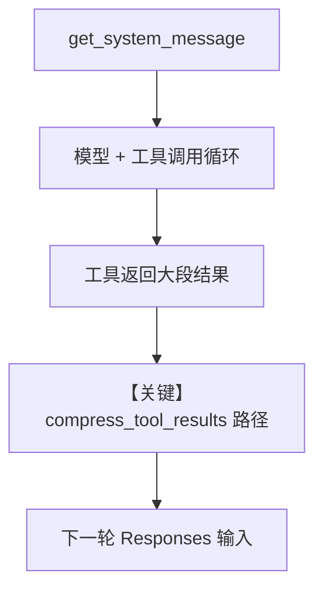

# tool_call_compression.py — 实现原理分析

> 源文件：`cookbook/02_agents/14_advanced/tool_call_compression.py`

## 概述

本示例展示 Agno 的 **工具结果压缩（compress_tool_results）** 机制：在启用 `compress_tool_results=True` 时，运行管线将 `compression_manager` 传入工具结果处理（见 `agno/agent/_run.py` 等处），在长工具链或大体量检索结果场景下减少回注模型的上下文长度。本例配合 `OpenAIResponses` 与 `WebSearchTools` 演示竞品调研类任务。

**核心配置一览：**

| 配置项 | 值 | 说明 |
|--------|------|------|
| `model` | `OpenAIResponses(id="gpt-5-mini")` | OpenAI **Responses** API |
| `tools` | `[WebSearchTools()]` | 联网搜索 |
| `description` | `"Specialized in tracking competitor activities"` | 进入 system 拼装 |
| `instructions` | `"Use the search tools..."` | 进入 `<instructions>` 或等价段 |
| `db` | `SqliteDb(db_file="tmp/dbs/tool_call_compression.db")` | 开发用本地库 |
| `compress_tool_results` | `True` | 开启工具结果压缩路径 |
| `markdown` | `None` | 未设置（默认） |

## 架构分层

```
用户代码层                agno.agent 层
┌──────────────────────┐    ┌────────────────────────────────────────┐
│ tool_call_compression│    │ Agent.run → 工具循环                    │
│ compress_tool_results│───>│ _run/_response: compression_manager    │
│ = True               │    │  在 tool 结果回注前压缩                 │
└──────────────────────┘    └────────────────────────────────────────┘
                                        │
                                        ▼
                               ┌─────────────────┐
                               │ OpenAIResponses │
                               │ Responses API   │
                               └─────────────────┘
```

## 核心组件解析

### compress_tool_results 与 compression_manager

初始化逻辑见 `agno/agent/_init.py`（约 L174–184）：`compress_tool_results` 与 `compression_manager` 互相关联；运行时 `_run.py`（约 L517 等）在构造响应处理时传入 `compression_manager=... if agent.compress_tool_results else None`。

### WebSearchTools

工具定义与执行在 `agno/tools/websearch`；模型通过 Responses 的工具调用循环拉取搜索结果。

### 运行机制与因果链

1. **路径**：用户长 prompt → 模型多次 `web_search`（或等价）→ 工具结果若过大则经 compression 再进入下一轮上下文。
2. **副作用**：SQLite 会话库；搜索可能产生外部网络请求。
3. **分支**：`compress_tool_results=False` 时完整工具原文回注，上下文压力更大。
4. **差异**：相对仅 `WebSearchTools` 的示例，本文件只多 **压缩开关**。

## System Prompt 组装

走默认 `get_system_message()`（`_messages.py` L106+）：`description` 在 `# 3.3.1`，`instructions` 在 `# 3.3.3`；无 `markdown=True` 故无「Use markdown…」附加段（`# 3.2.1` 条件为 `agent.markdown and output_schema is None`）。

### 还原后的完整 System 文本

```text
Specialized in tracking competitor activities

Use the search tools and always use the latest information and data.

（若 use_instruction_tags 为默认 false，instructions 可能以列表行或单段形式出现；上文为字面量核心。）
```

### 段落释义

- `description` 限定角色为竞品追踪；`instructions` 强制优先使用搜索与最新数据。

## 完整 API 请求

`OpenAIResponses` 使用 **Responses API**（非 `chat.completions`）：`responses.create`，输入为 `input` 消息列表，工具以 Responses 原生工具格式绑定；`role_map` 将 `system` 映射为 `developer`（`agno/models/openai/responses.py` 约 L84–90）。

```python
# 概念：client.responses.create(model="gpt-5-mini", input=[...], tools=[...], ...)
# 具体字段以 agno OpenAIResponses.invoke 实现为准
```

## Mermaid 流程图



- **【关键】compress_tool_results 路径**：控制是否经 compression_manager 缩减工具结果再回注。

## 关键源码文件索引

| 文件 | 关键函数/类 | 作用 |
|------|------------|------|
| `agno/agent/_init.py` | 压缩初始化 L174+ | 与 compression_manager 协同 |
| `agno/agent/_run.py` | `_run` 内 compression_manager L517 等 | 运行时注入 |
| `agno/agent/_messages.py` | `get_system_message()` L106+ | description/instructions 顺序 |
| `agno/models/openai/responses.py` | `OpenAIResponses` | Responses API 调用 |
