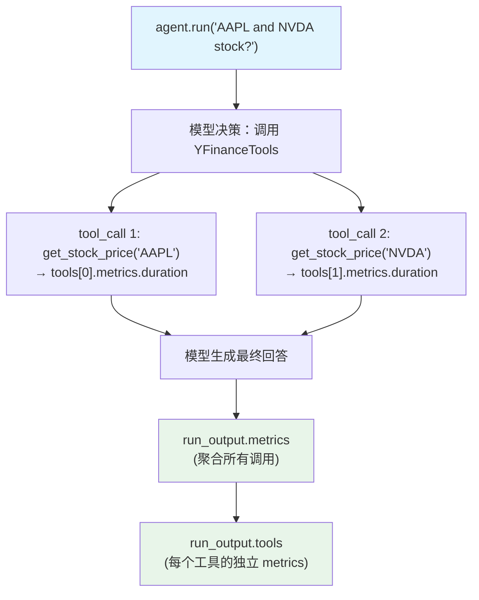

# tool_call_metrics.py — 实现原理分析

> 源文件：`cookbook/02_agents/14_advanced/tool_call_metrics.py`

## 概述

本示例展示 **工具调用级别的 metrics**：每个工具调用对象（`run_output.tools`）携带 `metrics` 属性，记录工具执行的 `start_time`、`end_time`、`duration`，可与 run 级和模型级 metrics 一起分析完整调用耗时。

**核心配置一览：**

| 配置项 | 值 | 说明 |
|--------|------|------|
| `model` | `OpenAIChat(gpt-4o-mini)` | Chat API |
| `tools` | `[YFinanceTools()]` | 股票工具 |
| `markdown` | `True` | Markdown 输出 |

## 三层 metrics 展示

```python
run_output = agent.run("What is the stock price of AAPL and NVDA?")

# 1. Run 级 metrics（所有模型调用的聚合）
pprint(run_output.metrics)

# 2. 工具调用级 metrics（每个工具的执行时间）
if run_output.tools:
    for tool_call in run_output.tools:
        print(f"Tool: {tool_call.tool_name}")
        if tool_call.metrics:
            pprint(tool_call.metrics)  # start_time, end_time, duration

# 3. 模型分类 metrics（details key）
for model_type, model_metrics_list in run_output.metrics.details.items():
    print(f"\n{model_type}:")  # "model", "tool_call" 等
    for model_metric in model_metrics_list:
        pprint(model_metric)
```

## 工具调用 metrics 字段

| 字段 | 类型 | 说明 |
|------|------|------|
| `tool_name` | str | 工具函数名 |
| `metrics.start_time` | float | 工具执行开始时间戳 |
| `metrics.end_time` | float | 工具执行结束时间戳 |
| `metrics.duration` | float | 工具执行耗时（秒） |

## Mermaid 流程图



## 关键源码文件索引

| 文件 | 关键函数/类 | 作用 |
|------|------------|------|
| `agno/run/agent.py` | `RunOutput.tools` | 工具调用列表 |
| `agno/run/tool.py` | `ToolExecution.metrics` | 工具级 metrics 记录 |
| `agno/run/agent.py` | `RunMetrics.details["tool_call"]` | 工具类 metrics 汇总 |
