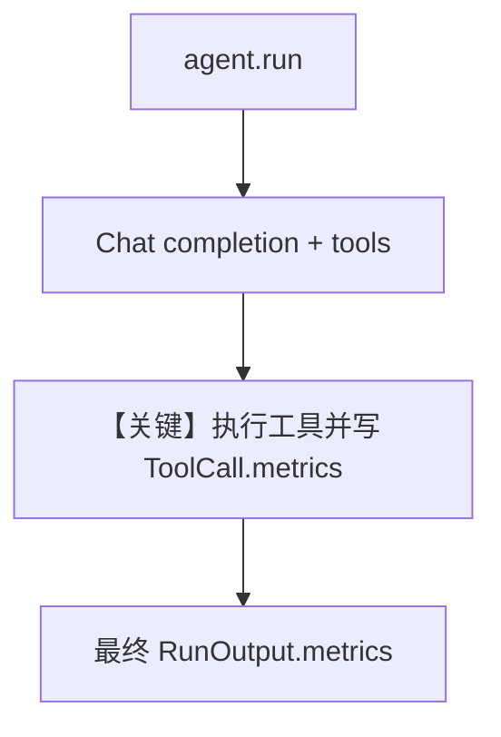

# tool_call_metrics.py — 实现原理分析

<!-- cookbook-py-source:start -->
## 完整源码

```python
"""
Tool Call Metrics
=============================

Demonstrates tool execution timing metrics.
Each tool call records start_time, end_time, and duration.
"""

from agno.agent import Agent
from agno.models.openai import OpenAIChat
from agno.tools.yfinance import YFinanceTools
from rich.pretty import pprint

# ---------------------------------------------------------------------------
# Create Agent
# ---------------------------------------------------------------------------
agent = Agent(
    model=OpenAIChat(id="gpt-4o-mini"),
    tools=[YFinanceTools()],
    markdown=True,
)

# ---------------------------------------------------------------------------
# Run Agent
# ---------------------------------------------------------------------------
if __name__ == "__main__":
    run_output = agent.run("What is the stock price of AAPL and NVDA?")

    # Run-level metrics show total tokens across all model calls
    print("=" * 50)
    print("RUN METRICS")
    print("=" * 50)
    pprint(run_output.metrics)

    # Each tool call in the run carries its own timing metrics
    print("=" * 50)
    print("TOOL CALL METRICS")
    print("=" * 50)
    if run_output.tools:
        for tool_call in run_output.tools:
            print(f"Tool: {tool_call.tool_name}")
            if tool_call.metrics:
                pprint(tool_call.metrics)
            print("-" * 40)

    # Per-model breakdown from details
    print("=" * 50)
    print("MODEL DETAILS")
    print("=" * 50)
    if run_output.metrics and run_output.metrics.details:
        for model_type, model_metrics_list in run_output.metrics.details.items():
            print(f"\n{model_type}:")
            for model_metric in model_metrics_list:
                pprint(model_metric)
```

<!-- cookbook-py-source:end -->

> 源文件：`cookbook/02_agents/14_advanced/tool_call_metrics.py`

## 概述

本示例展示 Agno 的 **工具调用级指标（tool call metrics）** 机制：在单次 `agent.run` 中，除 `RunOutput.metrics` 的运行级 token 统计外，每个 `ToolCall` 对象可携带 `metrics`（如起止时间、耗时），便于观测「哪一步工具慢」。

**核心配置一览：**

| 配置项 | 值 | 说明 |
|--------|------|------|
| `model` | `OpenAIChat(id="gpt-4o-mini")` | Chat Completions API |
| `tools` | `[YFinanceTools()]` | 金融数据工具 |
| `markdown` | `True` | 启用 markdown 附加说明段（`# 3.2.1`） |

## 架构分层

```
用户代码层                agno.agent 层
┌──────────────────────┐    ┌────────────────────────────────────┐
│ tool_call_metrics.py │    │ run → 工具执行包装                  │
│ run_output.tools     │───>│ 每工具调用记录 metrics              │
└──────────────────────┘    └────────────────────────────────────┘
                                        │
                                        ▼
                               ┌─────────────────┐
                               │ OpenAIChat      │
                               └─────────────────┘
```

## 核心组件解析

### RunOutput.tools 与 ToolCall.metrics

示例遍历 `run_output.tools`，打印 `tool_call.tool_name` 与 `tool_call.metrics`，与 `run_output.metrics`（整体）及 `run_output.metrics.details`（按模型类型）区分。

### 运行机制与因果链

1. **路径**：单轮 user → 模型决定调用 YFinance 工具 → 工具执行器计时 → 结果回注 → 最终 assistant。
2. **副作用**：无持久化 DB；仅内存中的运行结果对象。
3. **分支**：无工具调用时 `tools` 为空，则无 per-tool metrics。
4. **差异**：与 `streaming_metrics.py` 对比，本示例强调 **工具级** 计时，而非流式 RunOutput。

## System Prompt 组装

`markdown=True` 触发 `_messages.py` `# 3.2.1`：`additional_information` 含「Use markdown to format your answers.」。未设置 `description`/`instructions` 字面量。

### 还原后的完整 System 文本

```text
Use markdown to format your answers.

（无 description/role/instructions 字面量时，system 主要含上述 additional_information 与可能的模型默认指令。）
```

## 完整 API 请求

`OpenAIChat` → `chat.completions.create`，带 tools schema；多轮可含 `tool` role 消息。

## Mermaid 流程图


```mermaid
flowchart TD
    R["agent.run"] --> L["Chat completion + tools"]
    L --> X["【关键】执行工具并写 ToolCall.metrics"]
    X --> Y["最终 RunOutput.metrics"]
```

- **【关键】执行工具并写 ToolCall.metrics**：单次 run 内每个工具独立计时信息。

## 关键源码文件索引

| 文件 | 关键函数/类 | 作用 |
|------|------------|------|
| `agno/run/agent.py` | `RunOutput`、工具列表结构 | 承载 tools 与 metrics |
| `agno/agent/_messages.py` | `get_system_message()` L184+ | markdown 附加段 |
