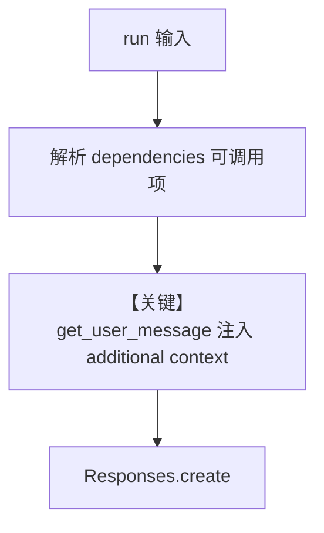

# dependencies_in_context.py — 实现原理分析

<!-- cookbook-py-source:start -->
## 完整源码

```python
"""
Dependencies In Context
=============================

Dependencies In Context.
"""

import json

import httpx
from agno.agent import Agent
from agno.models.openai import OpenAIResponses


def get_top_hackernews_stories(num_stories: int = 5) -> str:
    """Fetch and return the top stories from HackerNews.

    Args:
        num_stories: Number of top stories to retrieve (default: 5)
    Returns:
        JSON string containing story details (title, url, score, etc.)
    """
    # Get top stories
    stories = [
        {
            k: v
            for k, v in httpx.get(
                f"https://hacker-news.firebaseio.com/v0/item/{id}.json"
            )
            .json()
            .items()
            if k != "kids"  # Exclude discussion threads
        }
        for id in httpx.get(
            "https://hacker-news.firebaseio.com/v0/topstories.json"
        ).json()[:num_stories]
    ]
    return json.dumps(stories, indent=4)


# Create a Context-Aware Agent that can access real-time HackerNews data
# ---------------------------------------------------------------------------
# Create Agent
# ---------------------------------------------------------------------------
agent = Agent(
    model=OpenAIResponses(id="gpt-5.2"),
    # Each function in the dependencies is resolved when the agent is run,
    # think of it as dependency injection for Agents
    dependencies={"top_hackernews_stories": get_top_hackernews_stories},
    # We can add the entire dependencies dictionary to the user message
    add_dependencies_to_context=True,
    markdown=True,
)

# ---------------------------------------------------------------------------
# Run Agent
# ---------------------------------------------------------------------------
if __name__ == "__main__":
    # Example usage
    agent.print_response(
        "Summarize the top stories on HackerNews and identify any interesting trends.",
        stream=True,
    )
```

<!-- cookbook-py-source:end -->

> 源文件：`cookbook/02_agents/15_dependencies/dependencies_in_context.py`

## 概述

本示例展示 Agno 的 **依赖注入进用户消息（dependencies + add_dependencies_to_context）** 机制：在 Agent 上注册 `dependencies` 字典（可含可调用对象），并在 `run` 时解析；当 `add_dependencies_to_context=True` 时，`get_user_message()`（`agno/agent/_messages.py`）将依赖序列化进 **user 消息** 的 `<additional context>` 段，而非 system。

**核心配置一览：**

| 配置项 | 值 | 说明 |
|--------|------|------|
| `model` | `OpenAIResponses(id="gpt-5.2")` | Responses API |
| `dependencies` | `{"top_hackernews_stories": get_top_hackernews_stories}` | 可调用在运行期解析 |
| `add_dependencies_to_context` | `True` | 注入用户消息 |
| `markdown` | `True` | system 附加 markdown 提示 |

## 架构分层

```
用户代码层                agno.agent 层
┌──────────────────────┐    ┌────────────────────────────────────────┐
│ dependencies_in_     │    │ run_context.dependencies               │
│ context.py           │───>│ get_user_message: # 4.2                │
│ add_dependencies_  │    │  if add_dependencies_to_context:       │
│ to_context=True      │    │    convert_dependencies_to_string(...) │
└──────────────────────┘    └────────────────────────────────────────┘
```

## 核心组件解析

### convert_dependencies_to_string

`_messages.py` 中 `get_user_message` / `aget_user_message` 在 `add_dependencies_to_context and dependencies is not None` 时拼接（约 L966–969、L1131+）：

```python
# 逻辑要点（带行号见仓库 _messages.py）
# user_msg_content_str += "\n\n<additional context>\n"
# user_msg_content_str += convert_dependencies_to_string(agent, dependencies) + "\n"
# user_msg_content_str += "</additional context>"
```

### 运行机制与因果链

1. **路径**：用户自然语言请求 → user 消息 = 原始输入 + `<additional context>` 内 HN 数据（函数调用结果）。
2. **副作用**：HTTP 请求 Hacker News API；无 DB。
3. **分支**：`add_dependencies_to_context=False` 时依赖仍可在 `RunContext` 中供工具使用，但不自动拼进 user 文本。
4. **差异**：与 `dependencies_in_tools.py` 相比，本文件强调 **上下文可见性**（模型直接看到数据），而非仅在工具内读取。

## System Prompt 组装

依赖**不**通过 `get_system_message` 的固定段注入；system 侧含 `markdown` 附加（`# 3.2.1`）。HN 数据出现在 **user** 侧扩展。

| 序号 | 组成部分 | 是否生效 |
|------|---------|---------|
| `instructions` | 无 | 否 |
| `markdown` | True | 是（additional_information） |

### 还原后的完整 System 文本

```text
Use markdown to format your answers.

（无 description/role；若有模型默认 developer 映射见 Responses 适配器。）
```

### 与 User 消息边界

用户可见查询在 user 消息首部；**实时 HN 内容**在尾部 `<additional context>`，由 `convert_dependencies_to_string` 生成。

## 完整 API 请求

`OpenAIResponses` → `responses.create`；`input` 中含 role 映射后的 developer/user 消息。

## Mermaid 流程图



- **【关键】get_user_message 注入 additional context**：本示例核心演示点。

## 关键源码文件索引

| 文件 | 关键函数/类 | 作用 |
|------|------------|------|
| `agno/agent/_messages.py` | `get_user_message()` L966+ | `<additional context>` |
| `agno/agent/_utils.py` | `convert_dependencies_to_string` | 序列化依赖 |
