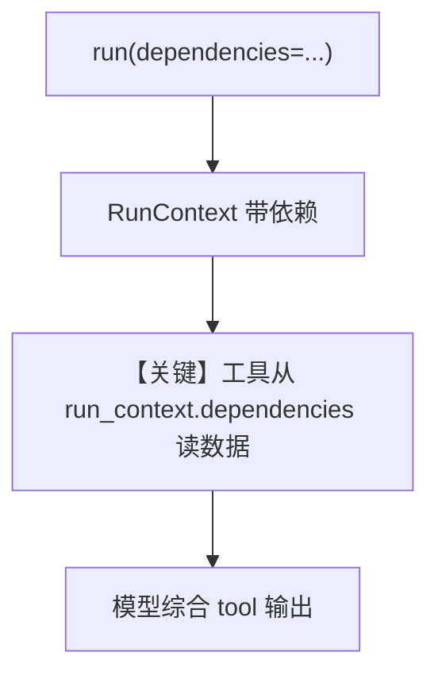

# dependencies_in_tools.py — 实现原理分析

<!-- cookbook-py-source:start -->
## 完整源码

```python
"""
Dependencies In Tools
=============================

Example showing how tools can access dependencies passed to the agent.
"""

from datetime import datetime

from agno.agent import Agent
from agno.models.openai import OpenAIResponses
from agno.run import RunContext


def get_current_context() -> dict:
    """Get current contextual information like time, weather, etc."""
    return {
        "current_time": datetime.now().strftime("%Y-%m-%d %H:%M:%S"),
        "timezone": "PST",
        "day_of_week": datetime.now().strftime("%A"),
    }


def analyze_user(user_id: str, run_context: RunContext) -> str:
    """
    Analyze a specific user's profile and provide insights.

    This tool analyzes user behavior and preferences using available data sources.
    Call this tool with the user_id you want to analyze.

    Args:
        user_id: The user ID to analyze (e.g., 'john_doe', 'jane_smith')
        run_context: The run context containing dependencies (automatically provided)

    Returns:
        Detailed analysis and insights about the user
    """
    dependencies = run_context.dependencies
    if not dependencies:
        return "No data sources available for analysis."

    print(f"--> Tool received data sources: {list(dependencies.keys())}")

    results = [f"=== USER ANALYSIS FOR {user_id.upper()} ==="]

    # Use user profile data if available
    if "user_profile" in dependencies:
        profile_data = dependencies["user_profile"]
        results.append(f"Profile Data: {profile_data}")

        # Add analysis based on the profile
        if profile_data.get("role"):
            results.append(
                f"Professional Analysis: {profile_data['role']} with expertise in {', '.join(profile_data.get('preferences', []))}"
            )

    # Use current context data if available
    if "current_context" in dependencies:
        context_data = dependencies["current_context"]
        results.append(f"Current Context: {context_data}")
        results.append(
            f"Time-based Analysis: Analysis performed on {context_data['day_of_week']} at {context_data['current_time']}"
        )

    print(f"--> Tool returned results: {results}")

    return "\n\n".join(results)


# Create an agent with the analysis tool function
# ---------------------------------------------------------------------------
# Create Agent
# ---------------------------------------------------------------------------
agent = Agent(
    model=OpenAIResponses(id="gpt-5.2"),
    tools=[analyze_user],
    name="User Analysis Agent",
    description="An agent specialized in analyzing users using integrated data sources.",
    instructions=[
        "You are a user analysis expert with access to user analysis tools.",
        "When asked to analyze any user, use the analyze_user tool.",
        "This tool has access to user profiles and current context through integrated data sources.",
        "After getting tool results, provide additional insights and recommendations based on the analysis.",
        "Be thorough in your analysis and explain what the tool found.",
    ],
)

# ---------------------------------------------------------------------------
# Run Agent
# ---------------------------------------------------------------------------
if __name__ == "__main__":
    print("=== Tool Dependencies Access Example ===\n")

    response = agent.run(
        input="Please analyze user 'john_doe' and provide insights about their professional background and preferences.",
        dependencies={
            "user_profile": {
                "name": "John Doe",
                "preferences": ["AI/ML", "Software Engineering", "Finance"],
                "location": "San Francisco, CA",
                "role": "Senior Software Engineer",
            },
            "current_context": get_current_context,
        },
        session_id="test_tool_dependencies",
    )

    print(f"\nAgent Response: {response.content}")
```

<!-- cookbook-py-source:end -->

> 源文件：`cookbook/02_agents/15_dependencies/dependencies_in_tools.py`

## 概述

本示例展示 Agno 的 **RunContext.dependencies 在工具内访问** 机制：工具函数签名中的 `run_context: RunContext` 由框架注入；`agent.run(..., dependencies={...})` 在单次运行传入业务数据（含可调用 `get_current_context`），工具从 `run_context.dependencies` 读取，无需把大块数据拼进 user 消息（本例未开启 `add_dependencies_to_context`）。

**核心配置一览：**

| 配置项 | 值 | 说明 |
|--------|------|------|
| `model` | `OpenAIResponses(id="gpt-5.2")` | Responses API |
| `tools` | `[analyze_user]` | 单工具，依赖 RunContext |
| `name` | `"User Analysis Agent"` | 若 `add_name_to_context` 未开则不进入默认名段 |
| `description` | 长字符串 | system description |
| `instructions` | 字符串列表 | system instructions |
| `add_dependencies_to_context` | `None` | 未设置，默认不把依赖拼 user |

## 架构分层

```
用户代码层                agno.agent 层
┌──────────────────────┐    ┌────────────────────────────────────────┐
│ agent.run(           │    │ 构建 RunContext.dependencies           │
│   dependencies={...})│───>│ 工具调用时注入 run_context             │
└──────────────────────┘    └────────────────────────────────────────┘
```

## 核心组件解析

### RunContext 注入

工具 `analyze_user(user_id, run_context)` 从 `run_context.dependencies` 取 `user_profile` 与 `current_context`；其中 `current_context` 为可调用，在依赖解析阶段求值（框架约定）。

### 运行机制与因果链

1. **路径**：user 请求分析 john_doe → 模型调 `analyze_user` → 工具打印并返回聚合分析字符串 → 模型生成最终答复。
2. **副作用**：`session_id` 传入；无示例 DB。
3. **分支**：若 `dependencies` 为空，工具分支返回「No data sources available」。
4. **差异**：与 `dependencies_in_context.py` 对照，本例数据**主要给工具用**，不强调拼进 user 消息。

## System Prompt 组装

本文件显式提供 `description` 与多行 `instructions`，按 `_messages.py` `# 3.3.1`–`# 3.3.3` 进入默认 system。

### 还原后的完整 System 文本

```text
An agent specialized in analyzing users using integrated data sources.

You are a user analysis expert with access to user analysis tools.
When asked to analyze any user, use the analyze_user tool.
This tool has access to user profiles and current context through integrated data sources.
After getting tool results, provide additional insights and recommendations based on the analysis.
Be thorough in your analysis and explain what the tool found.

（多行 instructions 在 use_instruction_tags 默认下可能为 `- 行` 列表格式；上列为字面量内容。）
```

## 完整 API 请求

`OpenAIResponses` + 工具：Responses API 原生工具循环。

## Mermaid 流程图



- **【关键】工具从 run_context.dependencies 读数据**：与注入 user 上下文的示例形成对比。

## 关键源码文件索引

| 文件 | 关键函数/类 | 作用 |
|------|------------|------|
| `agno/run/__init__.py` / `run_context` | `RunContext` | 依赖载体 |
| `agno/agent/_messages.py` | `get_system_message()` | description/instructions |
