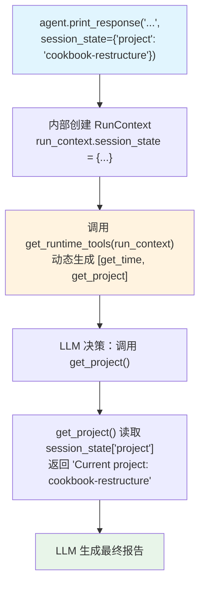

# dynamic_tools.py — 实现原理分析

> 源文件：`cookbook/02_agents/15_dependencies/dynamic_tools.py`

## 概述

本示例展示 **动态工具（Dynamic Tools）**模式：将 `tools` 参数设置为一个 callable（`tools=get_runtime_tools`），Agent 在每次 run 时调用该函数，基于 `RunContext`（含 `session_state`）动态生成工具列表，实现工具集的运行时定制。

**核心配置一览：**

| 配置项 | 值 | 说明 |
|--------|------|------|
| `name` | `"Dynamic Tools Agent"` | Agent 名称 |
| `model` | `OpenAIResponses(gpt-5.2)` | Responses API |
| `tools` | `get_runtime_tools`（callable） | 动态工具工厂函数 |

## 核心模式：tools 为 callable

```python
def get_runtime_tools(run_context: RunContext):
    """基于 session_state 动态返回工具列表"""
    
    def get_time() -> str:
        return datetime.utcnow().isoformat()

    def get_project() -> str:
        # 工具内部可读取 session_state
        project = (run_context.session_state or {}).get("project", "unknown")
        return f"Current project: {project}"

    return [get_time, get_project]

agent = Agent(
    name="Dynamic Tools Agent",
    model=OpenAIResponses(id="gpt-5.2"),
    tools=get_runtime_tools,   # 传入 callable，而非列表
)

# 运行时传入 session_state，工具工厂可据此定制工具行为
agent.print_response(
    "Use available tools to report current context.",
    session_state={"project": "cookbook-restructure"},
    stream=True,
)
```

## 动态工具 vs 静态工具

| 特性 | 静态工具（`tools=[ToolA()]`） | 动态工具（`tools=callable`） |
|------|---------------------------|--------------------------|
| 工具集 | 固定（Agent 初始化时确定） | 每次 run 时重新生成 |
| 依赖 RunContext | 否 | 是（可读 session_state） |
| 适用场景 | 工具集不变 | 按用户/会话/状态定制工具 |

## Mermaid 流程图



## 关键源码文件索引

| 文件 | 关键函数/类 | 作用 |
|------|------------|------|
| `agno/agent/agent.py` | `Agent(tools=callable)` | 动态工具工厂入口 |
| `agno/run/__init__.py` | `RunContext` | 传递给工具工厂的上下文 |
