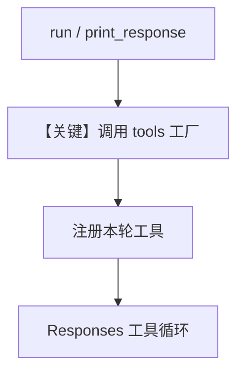

# dynamic_tools.py — 实现原理分析

<!-- cookbook-py-source:start -->
## 完整源码

```python
"""
Dynamic Tools
=============================

Dynamic Tools.
"""

from datetime import datetime

from agno.agent import Agent
from agno.models.openai import OpenAIResponses
from agno.run import RunContext


def get_runtime_tools(run_context: RunContext):
    """Return tools dynamically based on session state."""

    def get_time() -> str:
        return datetime.utcnow().isoformat()

    def get_project() -> str:
        project = (run_context.session_state or {}).get("project", "unknown")
        return f"Current project: {project}"

    return [get_time, get_project]


# ---------------------------------------------------------------------------
# Create Agent
# ---------------------------------------------------------------------------
agent = Agent(
    name="Dynamic Tools Agent",
    model=OpenAIResponses(id="gpt-5.2"),
    tools=get_runtime_tools,
)

# ---------------------------------------------------------------------------
# Run Agent
# ---------------------------------------------------------------------------
if __name__ == "__main__":
    agent.print_response(
        "Use available tools to report current context.",
        session_state={"project": "cookbook-restructure"},
        stream=True,
    )
```

<!-- cookbook-py-source:end -->

> 源文件：`cookbook/02_agents/15_dependencies/dynamic_tools.py`

## 概述

本示例展示 Agno 的 **运行时工具工厂（tools 可调用）** 机制：`tools` 传入 `get_runtime_tools(run_context)`，在运行期根据 `RunContext`（如 `session_state`）返回实际可调工具列表，实现「同一 Agent 配置、不同会话不同工具集」。

**核心配置一览：**

| 配置项 | 值 | 说明 |
|--------|------|------|
| `name` | `"Dynamic Tools Agent"` | Agent 名称 |
| `model` | `OpenAIResponses(id="gpt-5.2")` | Responses API |
| `tools` | `get_runtime_tools` | 可调用，返回工具列表 |

## 架构分层

```
用户代码层                agno.agent 层
┌──────────────────────┐    ┌────────────────────────────────────────┐
│ print_response(      │    │ 解析 tools 工厂 → Function 列表        │
│   session_state=...) │───>│ get_runtime_tools 内闭包读 session_state│
└──────────────────────┘    └────────────────────────────────────────┘
```

## 核心组件解析

### 工具工厂与 session_state

`get_runtime_tools` 返回 `[get_time, get_project]`；`get_project` 从 `run_context.session_state` 读取 `project` 键。工具注册逻辑在 agent 初始化/运行前由框架调用工厂（参见 `agno` 工具解析相关代码）。

### 运行机制与因果链

1. **路径**：用户请求 → 工厂根据当前 `session_state` 暴露工具 → 模型择工具调用 → 返回上下文字符串。
2. **副作用**：仅内存 `session_state`，无 DB。
3. **分支**：`session_state` 无 `project` 时示例返回 `unknown`。
4. **差异**：与静态 `tools=[fn1, fn2]` 相比，本文件强调 **工厂** 模式。

## System Prompt 组装

未设置 `instructions`/`description`；若有 `name` 且未 `add_name_to_context`，则名称不自动进 system（见 `_messages.py` `# 3.2.4` 条件 `agent.name is not None and agent.add_name_to_context`）。

### 还原后的完整 System 文本

```text
（无显式 instructions/description；默认拼装可能极短。）
```

## 完整 API 请求

`OpenAIResponses` + 动态工具 schema。

## Mermaid 流程图


```mermaid
flowchart TD
    A["run / print_response"] --> B["【关键】调用 tools 工厂"]
    B --> C["注册本轮工具"]
    C --> D["Responses 工具循环"]
```

- **【关键】调用 tools 工厂**：决定本轮可见工具集合。

## 关键源码文件索引

| 文件 | 关键函数/类 | 作用 |
|------|------------|------|
| `agno/agent/_tools.py` 等 | 工具解析 | 可调用 tools 工厂 |
| `agno/run/` | `RunContext` | session_state |
