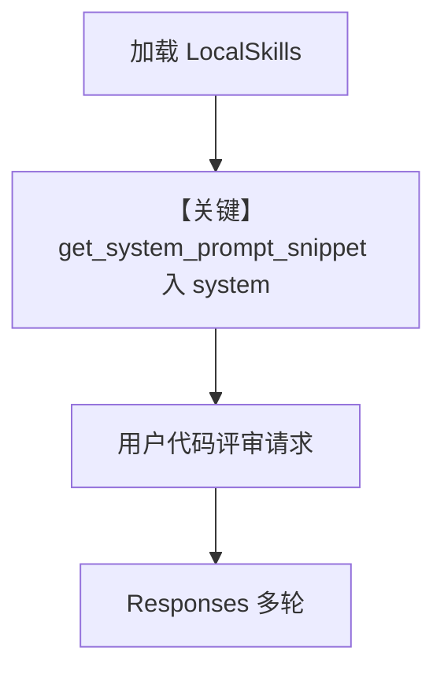

# basic_skills.py — 实现原理分析

<!-- cookbook-py-source:start -->
## 完整源码

````python
"""
Basic Skills
=============================

Basic Skills Example.
"""

from pathlib import Path

from agno.agent import Agent
from agno.models.openai import OpenAIResponses
from agno.skills import LocalSkills, Skills

# ---------------------------------------------------------------------------
# Create Agent
# ---------------------------------------------------------------------------
# Get the skills directory relative to this file
skills_dir = Path(__file__).parent / "sample_skills"

# Create an agent with skills loaded from the directory
agent = Agent(
    name="Code Review Agent",
    model=OpenAIResponses(id="gpt-5.2"),
    skills=Skills(loaders=[LocalSkills(str(skills_dir))]),
    instructions=[
        "You are a helpful assistant with access to specialized skills.",
    ],
    markdown=True,
)


# ---------------------------------------------------------------------------
# Run Agent
# ---------------------------------------------------------------------------
if __name__ == "__main__":
    # Ask the agent to review some code
    agent.print_response(
        "Review this Python code and provide feedback:\n\n"
        "```python\n"
        "def calculate_total(items):\n"
        "    total = 0\n"
        "    for i in range(len(items)):\n"
        "        total = total + items[i]['price'] * items[i]['quantity']\n"
        "    return total\n"
        "```"
    )
````

<!-- cookbook-py-source:end -->

> 源文件：`cookbook/02_agents/16_skills/basic_skills.py`

## 概述

本示例展示 Agno 的 **Skills 系统提示注入（skills + LocalSkills）** 机制：`Skills(loaders=[LocalSkills(path)])` 从目录加载技能包；`get_system_message()` 在 `# 3.3.8.1` 调用 `agent.skills.get_system_prompt_snippet()` 拼入 system（`_messages.py` 约 L281–285），使模型获知可用技能与调用约定。

**核心配置一览：**

| 配置项 | 值 | 说明 |
|--------|------|------|
| `name` | `"Code Review Agent"` | Agent 名 |
| `model` | `OpenAIResponses(id="gpt-5.2")` | Responses API |
| `skills` | `Skills(loaders=[LocalSkills(...)])` | 本地目录加载 |
| `instructions` | 列表字符串 | 基础指令 |
| `markdown` | `True` | 附加 markdown 段 |

## 架构分层

```
用户代码层                agno.agent 层
┌──────────────────────┐    ┌────────────────────────────────────────┐
│ basic_skills.py      │    │ get_system_message # 3.3.8.1           │
│ Skills + LocalSkills │───>│ skills_snippet 追加到 system          │
└──────────────────────┘    └────────────────────────────────────────┘
```

## 核心组件解析

### get_system_prompt_snippet

源码锚点：`agno/agent/_messages.py`：

```python
# 3.3.8.1 Then add skills to the system prompt
if agent.skills is not None:
    skills_snippet = agent.skills.get_system_prompt_snippet()
    if skills_snippet:
        system_message_content += f"\n{skills_snippet}\n"
```

### 运行机制与因果链

1. **路径**：加载目录下技能元数据 → system 含技能说明 → 用户请求代码评审 → 模型按技能文档调用子脚本或遵循流程。
2. **副作用**：无 DB；读取本地 `sample_skills` 文件。
3. **分支**：`skills=None` 时不追加技能段。
4. **差异**：相对无 `skills` 的 Agent，仅多 **技能片段** 与 loaders。

## System Prompt 组装

| 序号 | 组成部分 | 本文件 |
|------|---------|--------|
| `instructions` | 列表 | 是 |
| `markdown` | True | 是（# 3.2.1） |
| `skills` | LocalSkills | 是（# 3.3.8.1） |

### 还原后的完整 System 文本

```text
Use markdown to format your answers.

You are a helpful assistant with access to specialized skills.

<skills 目录解析得到的 get_system_prompt_snippet() 正文需运行时从 LocalSkills 读取，本仓库 sample_skills 含 code-review、git-workflow 等；静态还原请打开对应包内定义或运行时打印 snippet。>
```

### 段落释义

- `instructions` 声明助手身份；技能片段补充**可执行能力边界**与脚本路径提示（以实际 loader 为准）。

## 完整 API 请求

`OpenAIResponses`：`responses.create`，developer/user 映射见适配器。

## Mermaid 流程图



- **【关键】get_system_prompt_snippet 入 system**：技能机制作用点。

## 关键源码文件索引

| 文件 | 关键函数/类 | 作用 |
|------|------------|------|
| `agno/agent/_messages.py` | `get_system_message()` L281+ | 技能段拼装 |
| `agno/skills/` | `Skills`, `LocalSkills` | 加载与片段生成 |
