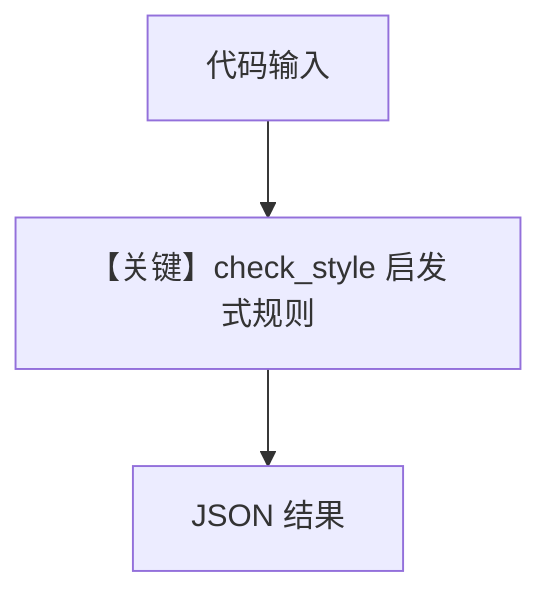

# check_style.py — 实现原理分析

<!-- cookbook-py-source:start -->
## 完整源码

```python
# ---------------------------------------------------------------------------
# Create Agent
# ---------------------------------------------------------------------------
#!/usr/bin/env python3
"""
Check Style
=============================

Check Python code for style issues.
"""

import json
import sys


def check_style(code: str) -> dict:
    """Check code for common style issues."""
    issues = []
    lines = code.split("\n")

    for i, line in enumerate(lines, 1):
        # Check line length
        if len(line) > 100:
            issues.append(
                {"line": i, "issue": f"Line exceeds 100 characters ({len(line)})"}
            )

        # Check trailing whitespace
        if line.endswith(" ") or line.endswith("\t"):
            issues.append({"line": i, "issue": "Trailing whitespace"})

        # Check for camelCase variables (simple heuristic)
        if "=" in line and not line.strip().startswith("#"):
            var = line.split("=")[0].strip()
            if (
                any(c.isupper() for c in var)
                and "_" not in var
                and not var[0].isupper()
            ):
                issues.append(
                    {
                        "line": i,
                        "issue": f"Possible camelCase: '{var}' - use snake_case",
                    }
                )

        # Check for single-letter variables
        if "=" in line:
            var = line.split("=")[0].strip()
            if len(var) == 1 and var not in "ijkxyz_":
                issues.append(
                    {
                        "line": i,
                        "issue": f"Single-letter variable '{var}' - use descriptive name",
                    }
                )

    return {
        "total_issues": len(issues),
        "issues": issues,
        "passed": len(issues) == 0,
    }


# ---------------------------------------------------------------------------
# Run Agent
# ---------------------------------------------------------------------------
if __name__ == "__main__":
    try:
        if len(sys.argv) > 1:
            code = sys.argv[1]
        else:
            code = sys.stdin.read()

        result = check_style(code)
        print(json.dumps(result, indent=2))
    except Exception as e:
        print(json.dumps({"error": str(e)}))
```

<!-- cookbook-py-source:end -->

> 源文件：`cookbook/02_agents/16_skills/sample_skills/code-review/scripts/check_style.py`

## 概述

本文件 **不是** Agno `Agent` 示例，而是 **可被技能工作流调用的独立 CLI 脚本**：对输入 Python 代码做行宽、尾随空白、camelCase 等启发式检查，返回 JSON。无 `get_system_message` 或模型调用；与 cookbook 中 `basic_skills.py` 的关系是：**Agent 侧 system 中的技能说明可能引导模型调用此脚本**。

**「核心配置一览」：** 不适用 Agent 构造参数；脚本入口为 `if __name__ == "__main__"`，通过 argv 或 stdin 读入代码。

## 架构分层

```
技能/用户调用层          脚本层
┌──────────────────┐    ┌─────────────────────┐
│ stdin / argv 代码 │───>│ check_style(code)   │
│                  │    │  → dict JSON 输出    │
└──────────────────┘    └─────────────────────┘
```

## 核心组件解析

### check_style

对每行检查：长度 >100、尾随空白、camelCase 启发式、单字母变量等，返回 `total_issues`/`issues`/`passed`。

### 运行机制与因果链

1. **数据路径**：代码字符串 → `check_style` → stdout JSON。
2. **无副作用**：无 session/db。
3. **分支**：`len(sys.argv) > 1` 用第一个参数为代码，否则读 stdin。

## System Prompt 组装

**不存在**单一 Agent 的 `get_system_message`。若由 Agno Agent 使用，提示词出现在 **父级 Agent**（如 `basic_skills.py`）的 system 与技能片段中；本脚本自身仅含模块 docstring，不进入框架默认 system。

## 完整 API 请求

无 LLM API；无 `invoke`。

## Mermaid 流程图



- **【关键】check_style 启发式规则**：脚本核心逻辑。

## 关键源码文件索引

| 文件 | 作用 |
|------|------|
| 本脚本 | `check_style()` | 风格检查 |
| `cookbook/.../basic_skills.py` | Agent + Skills | 若需端到端 Agent 行为 |
