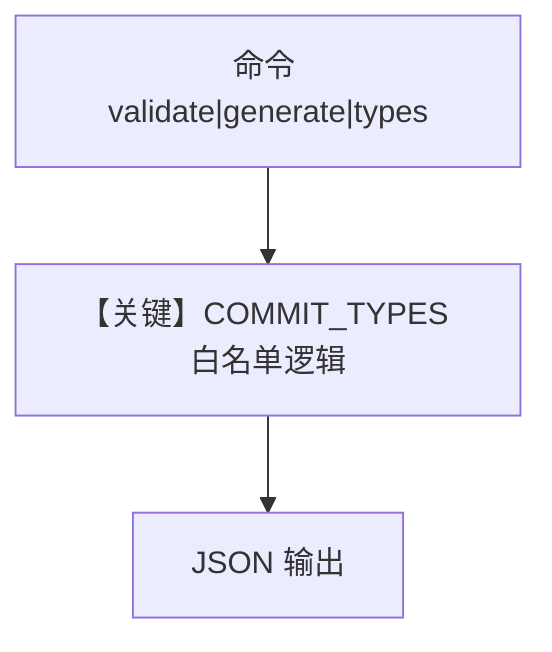

# commit_message.py — 实现原理分析

<!-- cookbook-py-source:start -->
## 完整源码

```python
# ---------------------------------------------------------------------------
# Create Agent
# ---------------------------------------------------------------------------
#!/usr/bin/env python3
"""
Commit Message
=============================

Validate or generate conventional commit messages.
"""

import json
import sys

COMMIT_TYPES = {
    "feat": "A new feature",
    "fix": "A bug fix",
    "docs": "Documentation changes",
    "style": "Formatting, no code change",
    "refactor": "Code restructuring",
    "perf": "Performance improvement",
    "test": "Adding/updating tests",
    "chore": "Maintenance tasks",
    "build": "Build system changes",
    "ci": "CI/CD changes",
}


def validate(message: str) -> dict:
    """Validate a commit message."""
    errors = []
    warnings = []

    lines = message.strip().split("\n")
    if not lines or not lines[0]:
        return {"valid": False, "errors": ["Empty commit message"]}

    subject = lines[0]

    # Check format: type: description
    if ":" not in subject:
        errors.append("Missing ':' separator (expected 'type: description')")
    else:
        type_part, desc = subject.split(":", 1)
        type_part = type_part.strip().rstrip("!").split("(")[0]
        desc = desc.strip()

        if type_part not in COMMIT_TYPES:
            errors.append(
                f"Unknown type '{type_part}'. Valid: {', '.join(COMMIT_TYPES.keys())}"
            )

        if not desc:
            errors.append("Description required after ':'")

        if len(subject) > 72:
            warnings.append(f"Subject is {len(subject)} chars (recommended: ≤72)")

    return {"valid": len(errors) == 0, "errors": errors, "warnings": warnings}


def generate(commit_type: str, description: str, scope: str = None) -> dict:
    """Generate a commit message."""
    if commit_type not in COMMIT_TYPES:
        return {
            "error": f"Unknown type '{commit_type}'. Valid: {', '.join(COMMIT_TYPES.keys())}"
        }

    if scope:
        message = f"{commit_type}({scope}): {description}"
    else:
        message = f"{commit_type}: {description}"

    return {"message": message, "type": commit_type, "description": description}


def list_types() -> dict:
    """List all valid commit types."""
    return {"types": COMMIT_TYPES}


# ---------------------------------------------------------------------------
# Run Agent
# ---------------------------------------------------------------------------
if __name__ == "__main__":
    try:
        if len(sys.argv) < 2:
            print(
                json.dumps(
                    {
                        "error": "Usage: commit_message.py <validate|generate|types> [args]"
                    }
                )
            )
            sys.exit(1)

        command = sys.argv[1]

        if command == "validate":
            msg = sys.argv[2] if len(sys.argv) > 2 else sys.stdin.read()
            result = validate(msg)
        elif command == "generate":
            if len(sys.argv) < 4:
                result = {
                    "error": "Usage: commit_message.py generate <type> <description> [scope]"
                }
            else:
                commit_type = sys.argv[2]
                description = sys.argv[3]
                scope = sys.argv[4] if len(sys.argv) > 4 else None
                result = generate(commit_type, description, scope)
        elif command == "types":
            result = list_types()
        else:
            result = {
                "error": f"Unknown command '{command}'. Use: validate, generate, types"
            }

        print(json.dumps(result, indent=2))
    except Exception as e:
        print(json.dumps({"error": str(e)}))
```

<!-- cookbook-py-source:end -->

> 源文件：`cookbook/02_agents/16_skills/sample_skills/git-workflow/scripts/commit_message.py`

## 概述

本文件 **不是** Agno `Agent` 示例，而是 **命令行工具**：校验或生成符合 Conventional Commits 风格的消息，`COMMIT_TYPES` 定义允许的类型。输出 JSON，供技能工作流或人工脚本使用；**无模型 API**。

**核心配置一览：** 不适用；全局 `COMMIT_TYPES` 为脚本内字典。

## 架构分层

```
CLI 参数 / stdin       脚本逻辑
┌────────────────┐    ┌──────────────────────────┐
│ validate /     │───>│ validate() / generate()  │
│ generate / types│    │ print JSON              │
└────────────────┘    └──────────────────────────┘
```

## 核心组件解析

- `validate(message)`：检查首行 `type: desc`、类型白名单、长度警告。
- `generate(type, desc, scope)`：拼合 subject。
- `list_types()`：返回允许类型列表。

## System Prompt 组装

不存在 Agent `get_system_message`。若嵌入 Agno 技能体系，指令由上层 Agent 的 skills 与 instructions 提供。

## 完整 API 请求

无。

## Mermaid 流程图



- **【关键】COMMIT_TYPES 白名单逻辑**：校验与生成的基础。

## 关键源码文件索引

| 文件 | 作用 |
|------|------|
| 本脚本 | `validate`, `generate` | 提交信息处理 |
