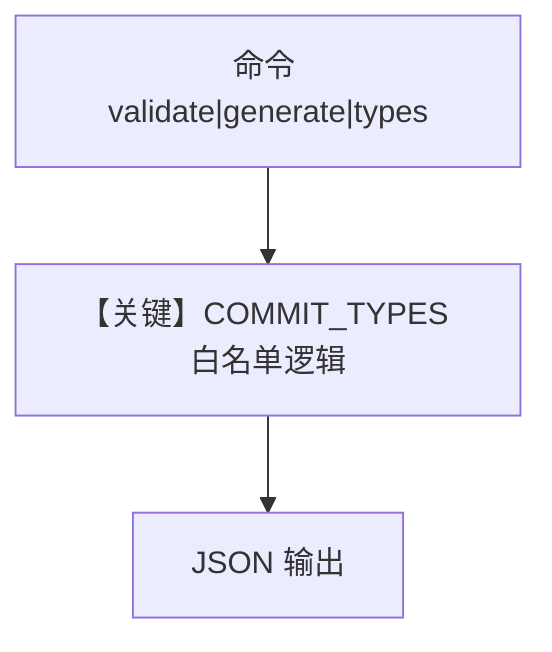

# commit_message.py — 实现原理分析

> 源文件：`cookbook/02_agents/16_skills/sample_skills/git-workflow/scripts/commit_message.py`

## 概述

本文件 **不是** Agno `Agent` 示例，而是 **命令行工具**：校验或生成符合 Conventional Commits 风格的消息，`COMMIT_TYPES` 定义允许的类型。输出 JSON，供技能工作流或人工脚本使用；**无模型 API**。

**核心配置一览：** 不适用；全局 `COMMIT_TYPES` 为脚本内字典。

## 架构分层

```
CLI 参数 / stdin       脚本逻辑
┌────────────────┐    ┌──────────────────────────┐
│ validate /     │───>│ validate() / generate()  │
│ generate / types│    │ print JSON              │
└────────────────┘    └──────────────────────────┘
```

## 核心组件解析

- `validate(message)`：检查首行 `type: desc`、类型白名单、长度警告。
- `generate(type, desc, scope)`：拼合 subject。
- `list_types()`：返回允许类型列表。

## System Prompt 组装

不存在 Agent `get_system_message`。若嵌入 Agno 技能体系，指令由上层 Agent 的 skills 与 instructions 提供。

## 完整 API 请求

无。

## Mermaid 流程图



- **【关键】COMMIT_TYPES 白名单逻辑**：校验与生成的基础。

## 关键源码文件索引

| 文件 | 作用 |
|------|------|
| 本脚本 | `validate`, `generate` | 提交信息处理 |
