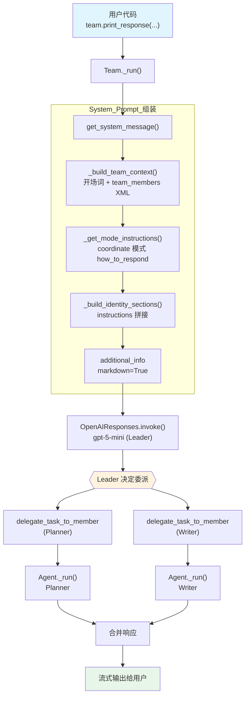

# 01_basic_coordination.py — 实现原理分析

> 源文件：`cookbook/03_teams/01_quickstart/01_basic_coordination.py`

## 概述

本示例展示 Agno 的 **`Team` 协作协调**机制：通过一个 Team Leader 模型在两名专职 Agent 成员之间分配任务，最终合并输出。Team 默认运行在 **coordinate 模式**，Leader 自主决定委派哪些成员、如何整合各成员的响应。

**核心配置一览：**

| 配置项 | 值 | 说明 |
|--------|------|------|
| `name` | `"Planning Team"` | Team 名称 |
| `model` | `OpenAIResponses(id="gpt-5-mini")` | Leader 使用 Responses API |
| `members` | `[planner, writer]` | 两名成员 Agent |
| `instructions` | `[str, str]` | 协调指令（两条） |
| `markdown` | `True` | 启用 markdown 格式化 |
| `show_members_responses` | `True` | 显示成员 Agent 的响应 |
| `mode` | `None`（默认 coordinate） | 协调模式 |
| `description` | `None` | 未设置 |
| `db` | `None` | 未设置，无持久化 |

| 成员 | `name` | `model` | `role` |
|------|--------|---------|--------|
| planner | `"Planner"` | `OpenAIResponses(id="gpt-5-mini")` | `"You plan tasks and split work into clear, ordered steps."` |
| writer | `"Writer"` | `OpenAIResponses(id="gpt-5-mini")` | `"You draft concise, readable summaries from the team discussion."` |

## 架构分层

```
用户代码层                      agno.team 层（Leader）
┌──────────────────────────┐    ┌────────────────────────────────────────┐
│ 01_basic_coordination.py │    │ Team._run()                            │
│                          │    │  ├─ get_system_message()               │
│ team.print_response(     │───>│  │    _build_team_context()            │
│   "...",                 │    │  │      → 开场词 + <team_members>      │
│   stream=True,           │    │  │      → <how_to_respond> (coordinate)│
│ )                        │    │  │    _build_identity_sections()       │
│                          │    │  │      → instructions 拼接            │
│                          │    │  │    additional_info (markdown)       │
└──────────────────────────┘    └────────────────────────────────────────┘
                                          │ Leader 调用 LLM
                                          ▼
                                ┌─────────────────────┐
                                │ OpenAIResponses      │
                                │ gpt-5-mini (Leader) │
                                └─────────────────────┘
                                          │ delegate_task_to_member(...)
                                          ▼
                          ┌───────────────────────────────┐
                          │ Agent._run() × N（成员）       │
                          │  Planner → OpenAIResponses     │
                          │  Writer  → OpenAIResponses     │
                          └───────────────────────────────┘
```

## 核心组件解析

### Team Leader 与成员委派

Team 的核心机制是「Leader + Members」双层结构。Leader 模型负责理解用户请求、选择合适的成员并下达任务（通过内置工具 `delegate_task_to_member`），再将成员响应合并为最终答案。

```python
# _default_tools.py L475 — 内置委派工具
def delegate_task_to_member(member_id: str, task: str) -> Iterator[...]:
    """委派任务给指定 member_id 的成员 Agent，返回其流式响应"""
    ...
```

Leader 在 system prompt 中收到所有成员的 ID、名称、角色，并通过 `<how_to_respond>` 获得 coordinate 模式下的操作指南。

### 成员注册与 system prompt 注入

成员信息通过 `get_members_system_message_content()`（`_messages.py` L76）注入 Leader 的 system prompt：

```python
# team/_messages.py L97-107 — 成员信息格式化
content += f'<member id="{member_id}" name="{member.name}">\n'
if member.role is not None:
    content += f"  Role: {member.role}\n"
content += f"</member>\n"
```

### coordinate 模式指令

`_get_mode_instructions()`（`_messages.py` L121）根据 `team.mode` 决定 `<how_to_respond>` 的内容。默认 coordinate 模式下，Leader 被指导：

- 按成员角色匹配子任务
- 写自包含的任务描述
- 合并所有响应，不直接拼接

## System Prompt 组装（Team Leader）

| 序号 | 组成部分 | 本文件中的值/来源 | 是否生效 |
|------|---------|-----------------|---------|
| 1 | `system_message`（自定义） | `None` | 否 |
| 2.1 | 开场词 + `<team_members>` XML | Planner / Writer 角色 | 是 |
| 2.1 | `<how_to_respond>` coordinate 模式 | 默认 coordinate | 是 |
| 2.2 | `description` | `None` | 否 |
| 2.2 | `role` | `None` | 否 |
| 2.2 | `instructions` 拼接 | 两条列表指令 | 是 |
| 2.3 | knowledge 搜索指令 | `None` | 否 |
| 2.4 | memories | `None` | 否 |
| - | `markdown` | `True` → "Use markdown..." | 是 |
| - | `add_datetime_to_context` | `False` | 否 |
| - | `add_name_to_context` | `False` | 否 |
| - | model system message | OpenAIResponses 内置 | 是 |
| - | `expected_output` | `None` | 否 |
| - | `additional_context` | `None` | 否 |
| - | `add_session_state_to_context` | `False` | 否 |
| - | JSON output prompt | `output_schema=None` | 否 |

### 最终 System Prompt（Leader）

```text
You coordinate a team of specialized AI agents to fulfill the user's request. Delegate to members when their expertise or tools are needed. For straightforward requests you can handle directly — including using your own tools — respond without delegating.

<team_members>
<member id="Planner" name="Planner">
  Role: You plan tasks and split work into clear, ordered steps.
</member>
<member id="Writer" name="Writer">
  Role: You draft concise, readable summaries from the team discussion.
</member>
</team_members>

<how_to_respond>
You operate in coordinate mode. For requests that need member expertise, select the best member(s), delegate with clear task descriptions, and synthesize their outputs into a unified response. ...

Delegation:
- Match each sub-task to the member whose role and tools are the best fit. ...
- Write task descriptions that are self-contained: ...
- Use only the member's ID when delegating — do not prefix it with the team ID.

After receiving member responses:
- If a response is incomplete or off-target, re-delegate with clearer instructions or try a different member.
- Synthesize all results into a single coherent response. ...
</how_to_respond>

- Coordinate with the two members to answer the user question.
- First plan the response, then generate a clear final summary.

<additional_information>
- Use markdown to format your answers.
</additional_information>
```

## 完整 API 请求

**第一轮（Leader 调用 LLM，决定委派）：**

```python
client.responses.create(
    model="gpt-5-mini",
    input=[
        # 1. System Message（role_map: system → developer）
        {"role": "developer", "content": "You coordinate a team of specialized AI agents..."},
        # 2. 用户输入
        {"role": "user", "content": "Create a three-step outline for launching a small coding side project."}
    ],
    tools=[
        # 内置工具：委派任务给成员
        {
            "type": "function",
            "name": "delegate_task_to_member",
            "description": "Delegate a task to a specific team member.",
            "parameters": {
                "type": "object",
                "properties": {
                    "member_id": {"type": "string", "description": "The ID of the member to delegate to"},
                    "task": {"type": "string", "description": "The task description"}
                },
                "required": ["member_id", "task"]
            }
        }
    ],
    stream=True,
    stream_options={"include_usage": True}
)
```

**工具调用后（成员 Agent Planner 运行）：**

```python
# Planner Agent 收到的请求（OpenAIResponses）
client.responses.create(
    model="gpt-5-mini",
    input=[
        {"role": "developer", "content": "<your_role>\nYou plan tasks and split work into clear, ordered steps.\n</your_role>"},
        {"role": "user", "content": "<task>\n...\n</task>"}
    ],
    stream=True
)
```

> Leader 第二轮再调用 Writer Agent，最终整合两个成员的输出为统一响应。

## Mermaid 流程图



## 关键源码文件索引

| 文件 | 关键函数/类 | 作用 |
|------|------------|------|
| `agno/team/team.py` | `Team` L70 | Team 类定义，`mode`/`members` 等属性 |
| `agno/team/mode.py` | `TeamMode.coordinate` | 协调模式枚举 |
| `agno/team/_messages.py` | `get_system_message()` L328 | 构建 Team Leader system prompt |
| `agno/team/_messages.py` | `_build_team_context()` L198 | 开场词 + 成员 XML + 模式指令 |
| `agno/team/_messages.py` | `get_members_system_message_content()` L76 | 格式化成员信息 |
| `agno/team/_messages.py` | `_get_mode_instructions()` L121 | 生成 `<how_to_respond>` 内容 |
| `agno/team/_default_tools.py` | `delegate_task_to_member()` L475 | 委派任务给单个成员 |
