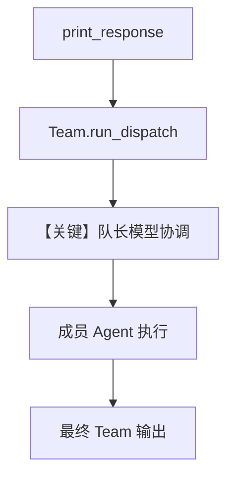

# 01_basic_coordination.py — 实现原理分析

> 源文件：`cookbook/03_teams/01_quickstart/01_basic_coordination.py`

## 概述

本示例展示 Agno 的 **Team 多成员协同（默认 coordinate 行为）** 机制：`Team` 使用队长模型协调 `Planner` 与 `Writer` 两名 `Agent`，通过 `instructions` 规定「先规划再总结」；`show_members_responses=True` 便于观察成员输出。

**核心配置一览（Team）：**

| 配置项 | 值 | 说明 |
|--------|------|------|
| `model` | `OpenAIResponses(id="gpt-5-mini")` | 队长模型，Responses API |
| `name` | `"Planning Team"` | 团队名 |
| `members` | `[planner, writer]` | 两成员 Agent |
| `instructions` | 列表字符串 | 协调策略 |
| `markdown` | `True` | `team/_messages.py` 附加 markdown 提示 |
| `show_members_responses` | `True` | 展示成员回复 |
| `mode` | `None` | 使用默认协调（非 route/broadcast/tasks） |

## 架构分层

```
用户代码层                agno.team 层
┌──────────────────────┐    ┌────────────────────────────────────────┐
│ 01_basic_coordination│    │ Team.run → _run.run_dispatch（team.py） │
│ team.print_response  │───>│ 队长 OpenAIResponses + 成员 Agent.run   │
└──────────────────────┘    └────────────────────────────────────────┘
```

## 核心组件解析

### Team.run

`Team.run` 重载见 `agno/team/team.py` L732–813，实现委托 `_run.run_dispatch(...)`。

### Team 的 get_system_message

`agno/team/_messages.py` `get_system_message()`（L328+）：默认路径在 `# 1.1`–`# 1.3` 拼装 `instructions`、模型附加指令、`markdown` 段（`# 1.3.1`）。

### 运行机制与因果链

1. **路径**：用户问题 → 队长多轮 reasoning → 按需调用成员 → 合成最终答复。
2. **状态**：无 `db`，会话不落库（除非默认生成 session）。
3. **分支**：成员 `role` 进入各 Agent 的 system（成员侧 `get_system_message`）。
4. **差异**：最小 Team 示例，仅两成员 + 协调指令。

## System Prompt 组装

队长侧走 `agno/team/_messages.py` 默认拼装；**非** `agno/agent/_messages.py`（除非把成员当普通 Agent 调用）。

### 还原后的完整 System 文本（队长 Team）

```text
Coordinate with the two members to answer the user question.
First plan the response, then generate a clear final summary.

Use markdown to format your answers.

（另含 OpenAIResponses 的 get_instructions_for_model 默认段，运行时确定。）
```

## 完整 API 请求

队长与成员均为 `OpenAIResponses` → OpenAI **Responses API**（`responses.create`），具体见 `agno/models/openai/responses.py`。

## Mermaid 流程图


```mermaid
flowchart TD
    U["print_response"] --> T["Team.run_dispatch"]
    T --> L["【关键】队长模型协调"]
    L --> M["成员 Agent 执行"]
    M --> R["最终 Team 输出"]
```

- **【关键】队长模型协调**：默认模式下由队长决定调用顺序与汇总方式。

## 关键源码文件索引

| 文件 | 关键函数/类 | 作用 |
|------|------------|------|
| `agno/team/team.py` | `Team` L71；`run` L732+ | 团队入口 |
| `agno/team/_messages.py` | `get_system_message()` L328+ | 队长 system |
