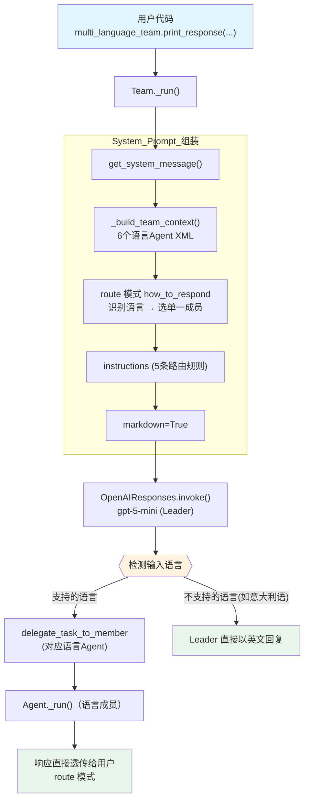

# 02_respond_directly_router_team.py — 实现原理分析

> 源文件：`cookbook/03_teams/01_quickstart/02_respond_directly_router_team.py`

## 概述

本示例展示 Agno 的 **`TeamMode.route` 路由模式**机制：Team Leader 分析请求语言，将任务路由到对应的语言专家 Agent，并**直接返回成员响应**给用户（不经 Leader 合并）。同时演示了 **sync + async** 双模式调用方式。

**核心配置一览：**

| 配置项 | 值 | 说明 |
|--------|------|------|
| `name` | `"Multi Language Team"` | Team 名称 |
| `model` | `OpenAIResponses(id="gpt-5-mini")` | Leader 使用 Responses API |
| `mode` | `TeamMode.route` | 路由模式，成员响应直接返回 |
| `members` | 6 个语言 Agent | english/spanish/japanese/french/german/chinese |
| `instructions` | `[str, str, str, str, str]` | 路由规则指令 |
| `markdown` | `True` | 启用 markdown 格式化 |
| `show_members_responses` | `True` | 显示成员 Agent 的响应 |
| `description` | `None` | 未设置 |
| `db` | `None` | 未设置，无持久化 |

| 成员 | `name` | `model` | `role` |
|------|--------|---------|--------|
| english_agent | `"English Agent"` | `OpenAIResponses(id="gpt-5-mini")` | `"You only answer in English"` |
| japanese_agent | `"Japanese Agent"` | `OpenAIResponses(id="gpt-5-mini")` | `"You only answer in Japanese"` |
| chinese_agent | `"Chinese Agent"` | `OpenAIResponses(id="gpt-5-mini")` | `"You only answer in Chinese"` |
| spanish_agent | `"Spanish Agent"` | `OpenAIResponses(id="gpt-5-mini")` | `"You can only answer in Spanish"` |
| french_agent | `"French Agent"` | `OpenAIResponses(id="gpt-5-mini")` | `"You can only answer in French"` |
| german_agent | `"German Agent"` | `OpenAIResponses(id="gpt-5-mini")` | `"You can only answer in German"` |

## 架构分层

```
用户代码层                         agno.team 层（route 模式）
┌───────────────────────────────┐  ┌──────────────────────────────────────┐
│ 02_respond_directly_router.py │  │ Team._run()                          │
│                               │  │  ├─ get_system_message()             │
│ multi_language_team           │  │  │    _build_team_context()           │
│   .print_response(            │->│  │      → 开场词 + 6 成员 XML        │
│     "How are you?",           │  │  │      → route 模式 <how_to_respond>│
│     stream=True,              │  │  │    instructions 拼接（5条）        │
│   )                           │  │  │    additional_info (markdown)     │
│                               │  │  ├─ Leader LLM 决定路由             │
│ asyncio.run(run_async_router) │  │  └─ delegate_task_to_member(单成员) │
└───────────────────────────────┘  └──────────────────────────────────────┘
                                               │ route 模式：成员响应直接返回
                                               ▼
                              ┌─────────────────────────────┐
                              │ OpenAIResponses (Leader)    │
                              │ gpt-5-mini                  │
                              └─────────────────────────────┘
                                               │ delegate to one member
                                               ▼
                              ┌─────────────────────────────┐
                              │ Agent._run()（对应语言成员）  │
                              │ 响应直接透传给用户            │
                              └─────────────────────────────┘
```

## 核心组件解析

### route 模式

`TeamMode.route` 在 `_get_mode_instructions()` 中生成特定指令（`_messages.py` L148-158）：

```python
# team/_messages.py L148-159 — route 模式指令
elif team.mode == TeamMode.route:
    content += (
        "You operate in route mode. For requests that need member expertise, "
        "identify the single best member and delegate to them — "
        "their response is returned directly to the user. ..."
    )
```

与 coordinate 模式的关键区别：
- **route 模式**：只选一个成员，成员响应**直接返回**给用户，Leader 不做合并
- **coordinate 模式**：可选多个成员，Leader 合并所有成员响应后再返回

### 异步支持

示例同时演示了 sync（`print_response`）和 async（`aprint_response`）两种调用方式。两种方式共享同一个 Team 实例（符合"创建一次、复用"原则）：

```python
# 同步
multi_language_team.print_response("How are you?", stream=True)

# 异步（通过 asyncio.run 驱动）
await multi_language_team.aprint_response("你好吗？", stream=True)
```

### 语言路由逻辑

Leader 的 instructions 指定了路由规则：检测输入语言 → 匹配对应 Agent → 委派。对于不支持的语言（如意大利语），Leader 直接以英文回复而不委派。

## System Prompt 组装（Team Leader）

| 序号 | 组成部分 | 本文件中的值/来源 | 是否生效 |
|------|---------|-----------------|---------|
| 1 | `system_message`（自定义） | `None` | 否 |
| 2.1 | 开场词 + `<team_members>` XML（6个） | 6 个语言 Agent 角色 | 是 |
| 2.1 | `<how_to_respond>` route 模式 | `mode=TeamMode.route` | 是 |
| 2.2 | `description` | `None` | 否 |
| 2.2 | `role` | `None` | 否 |
| 2.2 | `instructions` 拼接 | 5 条指令 | 是 |
| 2.3 | knowledge 搜索指令 | `None` | 否 |
| 2.4 | memories | `None` | 否 |
| - | `markdown` | `True` → "Use markdown..." | 是 |
| - | `add_datetime_to_context` | `False` | 否 |
| - | `add_name_to_context` | `False` | 否 |
| - | model system message | OpenAIResponses 内置 | 是 |
| - | `expected_output` | `None` | 否 |
| - | `additional_context` | `None` | 否 |
| - | `add_session_state_to_context` | `False` | 否 |
| - | JSON output prompt | `output_schema=None` | 否 |

### 最终 System Prompt（Leader）

```text
You coordinate a team of specialized AI agents to fulfill the user's request. ...

<team_members>
<member id="English Agent" name="English Agent">
  Role: You only answer in English
</member>
<member id="Japanese Agent" name="Japanese Agent">
  Role: You only answer in Japanese
</member>
...（共 6 个成员）
</team_members>

<how_to_respond>
You operate in route mode. For requests that need member expertise, identify the single best member and delegate to them — their response is returned directly to the user. For requests you can handle directly — simple questions, using your own tools, or general conversation — respond without delegating.

When routing to a member:
- Analyze the request to determine which member's role and tools are the best match.
- Delegate to exactly one member. Use only the member's ID — do not prefix it with the team ID.
...
</how_to_respond>

- You are a language router that directs questions to the appropriate language agent.
- If the user asks in a language whose agent is not a team member, respond in English with: '...'
- Always check the language of the user's input before routing to an agent.
- For unsupported languages like Italian, respond in English with the above message.

<additional_information>
- Use markdown to format your answers.
</additional_information>
```

## 完整 API 请求

**第一轮（Leader 路由决策）：**

```python
client.responses.create(
    model="gpt-5-mini",
    input=[
        {"role": "developer", "content": "You coordinate a team of specialized AI agents...\n<team_members>\n<member id=\"English Agent\" ..."},
        {"role": "user", "content": "How are you?"}
    ],
    tools=[
        {
            "type": "function",
            "name": "delegate_task_to_member",
            "parameters": {
                "type": "object",
                "properties": {
                    "member_id": {"type": "string"},
                    "task": {"type": "string"}
                },
                "required": ["member_id", "task"]
            }
        }
    ],
    stream=True,
    stream_options={"include_usage": True}
)
```

**路由后（English Agent 响应，直接透传）：**

```python
# English Agent 收到的请求
client.responses.create(
    model="gpt-5-mini",
    input=[
        {"role": "developer", "content": "<your_role>\nYou only answer in English\n</your_role>"},
        {"role": "user", "content": "<task>\nHow are you?\n</task>"}
    ],
    stream=True
)
# route 模式：English Agent 的响应直接作为 Team 的最终响应返回
```

## Mermaid 流程图



## 关键源码文件索引

| 文件 | 关键函数/类 | 作用 |
|------|------------|------|
| `agno/team/mode.py` | `TeamMode.route` | 路由模式枚举定义 |
| `agno/team/_messages.py` | `_get_mode_instructions()` L148-158 | 生成 route 模式的 `<how_to_respond>` |
| `agno/team/_messages.py` | `get_members_system_message_content()` L76 | 格式化 6 个成员信息 |
| `agno/team/_default_tools.py` | `delegate_task_to_member()` L475 | 路由到单个成员，其响应直接返回 |
| `agno/team/team.py` | `aprint_response()` | 异步打印响应入口 |
