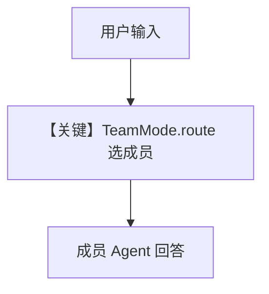

# 02_respond_directly_router_team.py — 实现原理分析

<!-- cookbook-py-source:start -->
## 完整源码

```python
"""
Respond Directly Router Team
=============================

Demonstrates routing multilingual requests to specialized members with direct responses.
"""

import asyncio

from agno.agent import Agent
from agno.models.openai import OpenAIResponses
from agno.team import Team, TeamMode

# ---------------------------------------------------------------------------
# Create Members
# ---------------------------------------------------------------------------
english_agent = Agent(
    name="English Agent",
    role="You only answer in English",
    model=OpenAIResponses(id="gpt-5-mini"),
)
japanese_agent = Agent(
    name="Japanese Agent",
    role="You only answer in Japanese",
    model=OpenAIResponses(id="gpt-5-mini"),
)
chinese_agent = Agent(
    name="Chinese Agent",
    role="You only answer in Chinese",
    model=OpenAIResponses(id="gpt-5-mini"),
)
spanish_agent = Agent(
    name="Spanish Agent",
    role="You can only answer in Spanish",
    model=OpenAIResponses(id="gpt-5-mini"),
)
french_agent = Agent(
    name="French Agent",
    role="You can only answer in French",
    model=OpenAIResponses(id="gpt-5-mini"),
)
german_agent = Agent(
    name="German Agent",
    role="You can only answer in German",
    model=OpenAIResponses(id="gpt-5-mini"),
)

# ---------------------------------------------------------------------------
# Create Team
# ---------------------------------------------------------------------------
multi_language_team = Team(
    name="Multi Language Team",
    model=OpenAIResponses(id="gpt-5-mini"),
    mode=TeamMode.route,
    members=[
        english_agent,
        spanish_agent,
        japanese_agent,
        french_agent,
        german_agent,
        chinese_agent,
    ],
    markdown=True,
    instructions=[
        "You are a language router that directs questions to the appropriate language agent.",
        "If the user asks in a language whose agent is not a team member, respond in English with:",
        "'I can only answer in the following languages: English, Spanish, Japanese, French and German. Please ask your question in one of these languages.'",
        "Always check the language of the user's input before routing to an agent.",
        "For unsupported languages like Italian, respond in English with the above message.",
    ],
    show_members_responses=True,
)


async def run_async_router() -> None:
    # Ask "How are you?" in all supported languages
    await multi_language_team.aprint_response(
        "How are you?",
        stream=True,  # English
    )

    await multi_language_team.aprint_response(
        "你好吗？",
        stream=True,  # Chinese
    )

    await multi_language_team.aprint_response(
        "お元気ですか?",
        stream=True,  # Japanese
    )

    await multi_language_team.aprint_response("Comment allez-vous?", stream=True)

    await multi_language_team.aprint_response(
        "Wie geht es Ihnen?",
        stream=True,  # German
    )

    await multi_language_team.aprint_response(
        "Come stai?",
        stream=True,  # Italian
    )


# ---------------------------------------------------------------------------
# Run Team
# ---------------------------------------------------------------------------
if __name__ == "__main__":
    # --- Sync ---
    multi_language_team.print_response("How are you?", stream=True)

    # --- Async ---
    asyncio.run(run_async_router())
```

<!-- cookbook-py-source:end -->

> 源文件：`cookbook/03_teams/01_quickstart/02_respond_directly_router_team.py`

## 概述

本示例展示 Agno 的 **TeamMode.route 多语言路由** 机制：`mode=TeamMode.route` 时队长将用户语言映射到对应成员；`instructions` 明确不支持语言时的英文回复模板；同时演示 **同步 `print_response` 与异步 `aprint_response`**。

**核心配置一览：**

| 配置项 | 值 | 说明 |
|--------|------|------|
| `mode` | `TeamMode.route` | 路由到单成员 |
| `members` | 6 个语言 Agent | 各 `role` 限定语言 |
| `instructions` | 列表 | 路由与不支持语言处理 |
| `show_members_responses` | `True` | 显示成员输出 |
| `markdown` | `True` | 队长 markdown 附加段 |

## 架构分层

```
用户代码层                agno.team 层
┌──────────────────────┐    ┌────────────────────────────────────────┐
│ multi_language_team  │    │ route 模式：选择一名成员回答            │
└──────────────────────┘    └────────────────────────────────────────┘
```

## 核心组件解析

### TeamMode.route

与 `Team.mode` 字段（`team.py` L97–99）配合，由 `_run` 内路由逻辑选择成员。

### 运行机制与因果链

1. **路径**：用户语句 → 队长判定语言 → 调用对应成员 → 直接返回成员风格答案（视 `respond_directly` 等标志）。
2. **异步示例**：`run_async_router` 多次 `aprint_response` 覆盖多语言与意大利语（不支持）用例。

## System Prompt 组装

队长 `instructions` 含路由规则与英文拒答模板（字面量可完整还原）。

### 还原后的完整 System 文本（核心字面量）

```text
You are a language router that directs questions to the appropriate language agent.
If the user asks in a language whose agent is not a team member, respond in English with:
'I can only answer in the following languages: English, Spanish, Japanese, French and German. Please ask your question in one of these languages.'
Always check the language of the user's input before routing to an agent.
For unsupported languages like Italian, respond in English with the above message.

Use markdown to format your answers.
```

## 完整 API 请求

`OpenAIResponses` ×（队长 + 被选成员）多次 Responses 调用。

## Mermaid 流程图


```mermaid
flowchart TD
    A["用户输入"] --> B["【关键】TeamMode.route 选成员"]
    B --> C["成员 Agent 回答"]
```

- **【关键】TeamMode.route 选成员**：本示例核心。

## 关键源码文件索引

| 文件 | 作用 |
|------|------|
| `agno/team/team.py` | `mode` L97-99 |
| `agno/team/_messages.py` | `get_system_message()` L328+ |
