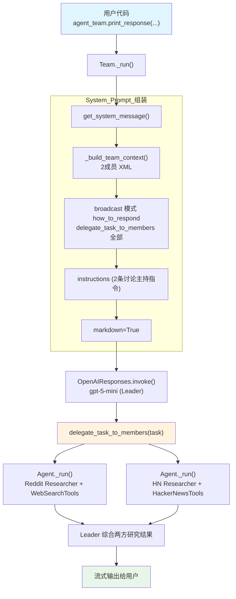

# 03_delegate_to_all_members.py — 实现原理分析

> 源文件：`cookbook/03_teams/01_quickstart/03_delegate_to_all_members.py`

## 概述

本示例展示 Agno 的 **`TeamMode.broadcast` 广播模式**机制：Team Leader 将同一任务**同时委派给所有成员**，再整合各成员视角为统一响应。两名研究员各自持有专属工具（Reddit/HackerNews），并同时演示了 **sync + async** 双模式调用。

**核心配置一览：**

| 配置项 | 值 | 说明 |
|--------|------|------|
| `name` | `"Discussion Team"` | Team 名称 |
| `model` | `OpenAIResponses(id="gpt-5-mini")` | Leader 使用 Responses API |
| `mode` | `TeamMode.broadcast` | 广播模式，同时委派所有成员 |
| `members` | `[reddit_researcher, hackernews_researcher]` | 两名研究员成员 |
| `instructions` | `[str, str]` | 讨论主持指令 |
| `markdown` | `True` | 启用 markdown 格式化 |
| `show_members_responses` | `True` | 显示成员 Agent 的响应 |
| `description` | `None` | 未设置 |
| `db` | `None` | 未设置，无持久化 |

| 成员 | `name` | `model` | `role` | `tools` |
|------|--------|---------|--------|---------|
| reddit_researcher | `"Reddit Researcher"` | `OpenAIResponses(id="gpt-5-mini")` | `"Research a topic on Reddit"` | `WebSearchTools()` |
| hackernews_researcher | `"HackerNews Researcher"` | `OpenAIResponses(id="gpt-5-mini")` | `"Research a topic on HackerNews."` | `HackerNewsTools()` |

## 架构分层

```
用户代码层                          agno.team 层（broadcast 模式）
┌───────────────────────────────┐   ┌───────────────────────────────────────┐
│ 03_delegate_to_all_members.py │   │ Team._run()                           │
│                               │   │  ├─ get_system_message()              │
│ agent_team.print_response(    │──>│  │    _build_team_context()           │
│   input="...",                │   │  │      → 开场词 + 2成员 XML          │
│   stream=True,                │   │  │      → broadcast 模式指令          │
│ )                             │   │  │    instructions 拼接（2条）        │
│                               │   │  │    additional_info (markdown)      │
│ asyncio.run(                  │   │  └─ delegate_task_to_members(全部)    │
│   run_async_collaboration()   │   │       Reddit + HackerNews 同时运行    │
│ )                             │   └───────────────────────────────────────┘
└───────────────────────────────┘
                                              │ Leader 调用 LLM
                                              ▼
                                    ┌─────────────────────┐
                                    │ OpenAIResponses      │
                                    │ gpt-5-mini (Leader) │
                                    └─────────────────────┘
                                              │ delegate_task_to_members(...)
                                              ▼
                          ┌───────────────────────────────────────┐
                          │ Agent._run() × 2（并行/顺序广播）      │
                          │  Reddit Researcher → WebSearchTools    │
                          │  HN Researcher → HackerNewsTools       │
                          └───────────────────────────────────────┘
```

## 核心组件解析

### broadcast 模式

`TeamMode.broadcast` 在 `_get_mode_instructions()` 中生成特定指令（`team/_messages.py` L160-174）：

```python
# team/_messages.py L160-174 — broadcast 模式指令
elif team.mode == TeamMode.broadcast:
    content += (
        "You operate in broadcast mode. For requests that benefit from multiple perspectives, "
        "send the request to all members simultaneously and synthesize their collective responses. "
        ...
        "- Call `delegate_task_to_members` exactly once with a clear task description. "
        "This sends the task to every member in parallel.\n"
        ...
        "- Compare perspectives: note agreements, highlight complementary insights, and reconcile any contradictions.\n"
        "- Synthesize into a unified answer that integrates the strongest contributions thematically...\n"
    )
```

broadcast 模式使用 `delegate_task_to_members`（复数）工具，而非 coordinate/route 模式的 `delegate_task_to_member`（单数）：

| 模式 | 工具 | 接收成员数 | 响应处理 |
|------|------|----------|---------|
| coordinate | `delegate_task_to_member` | 单个（Leader 选择） | Leader 合并所有结果 |
| route | `delegate_task_to_member` | 单个（Leader 选择） | 直接返回成员响应 |
| broadcast | `delegate_task_to_members` | **全部成员** | Leader 综合所有视角 |

### add_name_to_context（成员级）

每个成员 Agent 都启用了 `add_name_to_context=True`，这会在成员的 system prompt 中注入自身名称：

```python
# agent/_messages.py L224-225 — 成员 system prompt 注入名称
if agent.add_name_to_context:
    additional_information.append(f"Your name is: {agent.name}.")
```

成员在响应时会意识到自己的身份（"我是 Reddit Researcher"），增强角色专注度。

### 异步支持

示例同时演示了 sync（`print_response`）和 async（`aprint_response`）两种调用，共享同一 Team 实例：

```python
# 同步
agent_team.print_response(input="...", stream=True)

# 异步（通过 asyncio.run 驱动）
await agent_team.aprint_response(input="...", stream=True)
```

## System Prompt 组装（Team Leader）

| 序号 | 组成部分 | 本文件中的值/来源 | 是否生效 |
|------|---------|-----------------|---------|
| 1 | `system_message`（自定义） | `None` | 否 |
| 2.1 | 开场词 + `<team_members>` XML（2个） | Reddit / HackerNews 研究员 | 是 |
| 2.1 | `<how_to_respond>` broadcast 模式 | `mode=TeamMode.broadcast` | 是 |
| 2.2 | `description` | `None` | 否 |
| 2.2 | `role` | `None` | 否 |
| 2.2 | `instructions` 拼接 | 2 条指令 | 是 |
| 2.3 | knowledge 搜索指令 | `None` | 否 |
| 2.4 | memories | `None` | 否 |
| - | `markdown` | `True` → "Use markdown..." | 是 |
| - | `add_datetime_to_context` | `False` | 否 |
| - | `add_name_to_context` | `False` | 否 |
| - | model system message | OpenAIResponses 内置 | 是 |
| - | `expected_output` | `None` | 否 |
| - | `add_session_state_to_context` | `False` | 否 |

### 最终 System Prompt（Leader）

```text
You coordinate a team of specialized AI agents to fulfill the user's request. Delegate to members when their expertise or tools are needed. For straightforward requests you can handle directly — including using your own tools — respond without delegating.

<team_members>
<member id="Reddit Researcher" name="Reddit Researcher">
  Role: Research a topic on Reddit
</member>
<member id="HackerNews Researcher" name="HackerNews Researcher">
  Role: Research a topic on HackerNews.
</member>
</team_members>

<how_to_respond>
You operate in broadcast mode. For requests that benefit from multiple perspectives, send the request to all members simultaneously and synthesize their collective responses. For requests you can handle directly — simple questions, using your own tools, or general conversation — respond without delegating.

When broadcasting:
- Call `delegate_task_to_members` exactly once with a clear task description. This sends the task to every member in parallel.
- Write the task so each member can respond independently from their own perspective.

After receiving member responses:
- Compare perspectives: note agreements, highlight complementary insights, and reconcile any contradictions.
- Synthesize into a unified answer that integrates the strongest contributions thematically — do not list each member's response sequentially.
</how_to_respond>

- You are a discussion master.
- You have to stop the discussion when you think the team has reached a consensus.

<additional_information>
- Use markdown to format your answers.
</additional_information>
```

## 完整 API 请求

**第一轮（Leader 调用 LLM，决定广播）：**

```python
client.responses.create(
    model="gpt-5-mini",
    input=[
        # 1. System Message（role_map: system → developer）
        {"role": "developer", "content": "You coordinate a team of specialized AI agents...<team_members>...<how_to_respond>broadcast mode...</how_to_respond>..."},
        # 2. 用户输入
        {"role": "user", "content": "Start the discussion on the topic: 'What is the best way to learn to code?'"}
    ],
    tools=[
        {
            "type": "function",
            "name": "delegate_task_to_members",
            "description": "Delegate the same task to ALL team members simultaneously.",
            "parameters": {
                "type": "object",
                "properties": {
                    "task": {"type": "string", "description": "The task description to send to all members"}
                },
                "required": ["task"]
            }
        }
    ],
    stream=True,
    stream_options={"include_usage": True}
)
```

**广播后（Reddit Researcher 和 HackerNews Researcher 各自被调用）：**

```python
# Reddit Researcher 收到的请求
client.responses.create(
    model="gpt-5-mini",
    input=[
        {"role": "developer", "content": "<your_role>\nResearch a topic on Reddit\n</your_role>\n...\n<additional_information>\n- Your name is: Reddit Researcher.\n</additional_information>"},
        {"role": "user", "content": "<task>\nWhat is the best way to learn to code?\n</task>"}
    ],
    tools=[
        # WebSearchTools 的工具（web_search 等）
        {"type": "function", "name": "web_search", ...}
    ],
    stream=True
)

# HackerNews Researcher 收到的请求（同时运行）
client.responses.create(
    model="gpt-5-mini",
    input=[
        {"role": "developer", "content": "<your_role>\nResearch a topic on HackerNews.\n</your_role>\n...\n<additional_information>\n- Your name is: HackerNews Researcher.\n</additional_information>"},
        {"role": "user", "content": "<task>\nWhat is the best way to learn to code?\n</task>"}
    ],
    tools=[
        # HackerNewsTools 的工具
        {"type": "function", "name": "get_top_hackernews_stories", ...}
    ],
    stream=True
)
```

> Leader 接收两个成员的研究结果后，综合为一个统一的讨论摘要输出给用户。

## Mermaid 流程图



## 关键源码文件索引

| 文件 | 关键函数/类 | 作用 |
|------|------------|------|
| `agno/team/mode.py` | `TeamMode.broadcast` | 广播模式枚举定义 |
| `agno/team/_messages.py` | `_get_mode_instructions()` L160-174 | 生成 broadcast 模式的 `<how_to_respond>` |
| `agno/team/_messages.py` | `get_members_system_message_content()` L76 | 格式化成员信息 XML |
| `agno/team/_default_tools.py` | `delegate_task_to_members()` L750 | 广播任务给所有成员 |
| `agno/agent/agent.py` | `add_name_to_context` L239 | 成员 Agent 名称注入 |
| `agno/team/team.py` | `Team` L70 | Team 类定义，`mode`/`members` 属性 |
