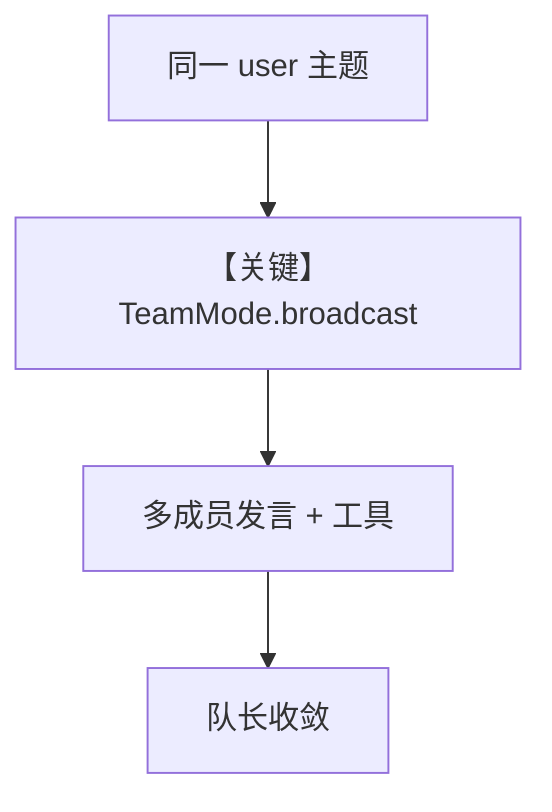

# 03_delegate_to_all_members.py — 实现原理分析

<!-- cookbook-py-source:start -->
## 完整源码

```python
"""
Delegate To All Members
=============================

Demonstrates collaborative team execution with delegate-to-all behavior.
"""

import asyncio
from textwrap import dedent

from agno.agent import Agent
from agno.models.openai import OpenAIResponses
from agno.team import Team, TeamMode
from agno.tools.hackernews import HackerNewsTools
from agno.tools.websearch import WebSearchTools

# ---------------------------------------------------------------------------
# Create Members
# ---------------------------------------------------------------------------
reddit_researcher = Agent(
    name="Reddit Researcher",
    role="Research a topic on Reddit",
    model=OpenAIResponses(id="gpt-5-mini"),
    tools=[WebSearchTools()],
    add_name_to_context=True,
    instructions=dedent("""
    You are a Reddit researcher.
    You will be given a topic to research on Reddit.
    You will need to find the most relevant posts on Reddit.
    """),
)

hackernews_researcher = Agent(
    name="HackerNews Researcher",
    model=OpenAIResponses(id="gpt-5-mini"),
    role="Research a topic on HackerNews.",
    tools=[HackerNewsTools()],
    add_name_to_context=True,
    instructions=dedent("""
    You are a HackerNews researcher.
    You will be given a topic to research on HackerNews.
    You will need to find the most relevant posts on HackerNews.
    """),
)

# ---------------------------------------------------------------------------
# Create Team
# ---------------------------------------------------------------------------
agent_team = Team(
    name="Discussion Team",
    model=OpenAIResponses(id="gpt-5-mini"),
    members=[
        reddit_researcher,
        hackernews_researcher,
    ],
    instructions=[
        "You are a discussion master.",
        "You have to stop the discussion when you think the team has reached a consensus.",
    ],
    markdown=True,
    mode=TeamMode.broadcast,
    show_members_responses=True,
)


async def run_async_collaboration() -> None:
    await agent_team.aprint_response(
        input="Start the discussion on the topic: 'What is the best way to learn to code?'",
        stream=True,
    )


# ---------------------------------------------------------------------------
# Run Team
# ---------------------------------------------------------------------------
if __name__ == "__main__":
    # --- Sync ---
    agent_team.print_response(
        input="Start the discussion on the topic: 'What is the best way to learn to code?'",
        stream=True,
    )

    # --- Async ---
    asyncio.run(run_async_collaboration())
```

<!-- cookbook-py-source:end -->

> 源文件：`cookbook/03_teams/01_quickstart/03_delegate_to_all_members.py`

## 概述

本示例展示 Agno 的 **TeamMode.broadcast 协作讨论** 机制：两名研究员（Reddit + HackerNews 工具）在 **广播模式** 下就同一话题讨论，`instructions` 要求队长在达成共识时结束；支持 **sync / async** `print_response` / `aprint_response`。

**核心配置一览：**

| 配置项 | 值 | 说明 |
|--------|------|------|
| `mode` | `TeamMode.broadcast` | 任务广播给成员 |
| `members` | `reddit_researcher`, `hackernews_researcher` | 各带搜索/ HN 工具 |
| `show_members_responses` | `True` | 展示成员发言 |
| `markdown` | `True` | 队长 markdown |

## 核心组件解析

成员 `instructions` 用 `dedent` 多行字符串；`add_name_to_context=True` 使成员 system 可含名字（`agno/agent/_messages.py` 成员路径 `# 3.2.4` 条件）。

### 运行机制与因果链

1. **路径**：同一讨论主题 → 两成员并行/轮流贡献 → 队长收敛。
2. **工具**：`WebSearchTools`、`HackerNewsTools` 产生外部调用。

## System Prompt 组装

队长 instructions 字面量；成员各有独立 `get_system_message`。

### 还原后的完整 System 文本（队长摘要）

```text
You are a discussion master.
You have to stop the discussion when you think the team has reached a consensus.

Use markdown to format your answers.
```

## 完整 API 请求

多成员 × `OpenAIResponses` + 工具循环。

## Mermaid 流程图


```mermaid
flowchart TD
    T["同一 user 主题"] --> B["【关键】TeamMode.broadcast"]
    B --> D["多成员发言 + 工具"]
    D --> E["队长收敛"]
```

- **【关键】TeamMode.broadcast**：同一输入分发给成员。

## 关键源码文件索引

| 文件 | 作用 |
|------|------|
| `agno/team/team.py` | `TeamMode`、`run` L732+ |
