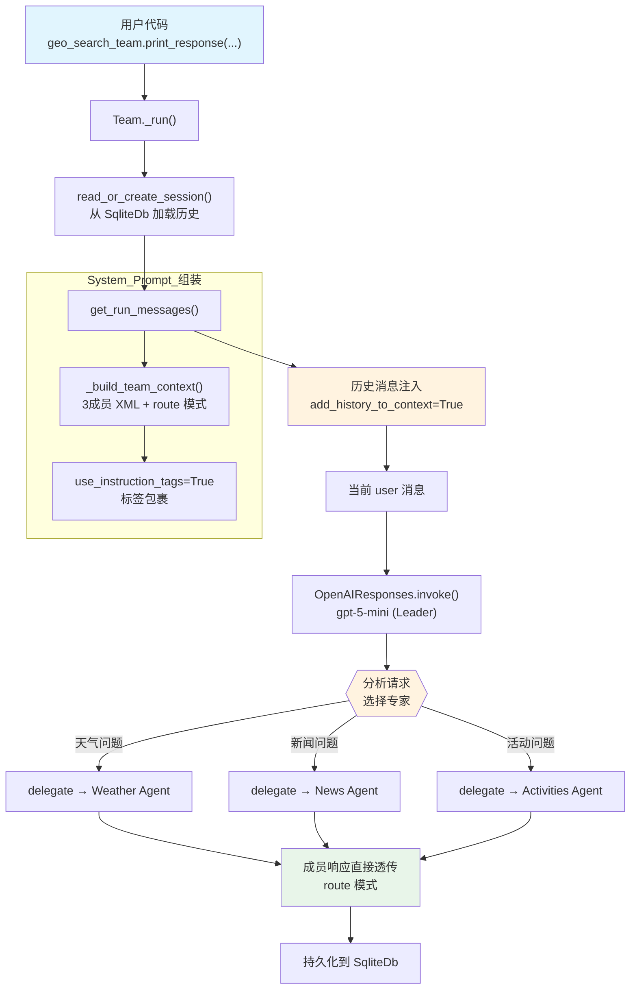

# 04_respond_directly_with_history.py — 实现原理分析

> 源文件：`cookbook/03_teams/01_quickstart/04_respond_directly_with_history.py`

## 概述

本示例展示 Agno 的 **`TeamMode.route` + 持久化历史**机制：Team Leader 路由到专家 Agent 并直接返回其响应，配合 **`SqliteDb` 持久化**和 **`add_history_to_context=True`** 实现跨轮次上下文记忆（第二轮能隐式引用第一轮提到的城市）。

**核心配置一览：**

| 配置项 | 值 | 说明 |
|--------|------|------|
| `name` | `"Geo Search Team"` | Team 名称 |
| `model` | `OpenAIResponses(id="gpt-5-mini")` | Leader 使用 Responses API |
| `mode` | `TeamMode.route` | 路由模式，直接返回成员响应 |
| `members` | `[weather_agent, news_agent, activities_agent]` | 三名专家成员 |
| `instructions` | `str`（单条） | 地理搜索指令 |
| `use_instruction_tags` | `True` | 指令用 `<instructions>` 标签包裹 |
| `db` | `SqliteDb(db_file="tmp/geo_search_team.db")` | SQLite 持久化会话历史 |
| `add_history_to_context` | `True` | 历史消息注入 Leader 上下文 |
| `markdown` | `False` | 未设置 |
| `description` | `None` | 未设置 |

| 成员 | `name` | `model` | `role` | `tools` |
|------|--------|---------|--------|---------|
| weather_agent | `"Weather Agent"` | `OpenAIResponses(id="gpt-5-mini")` | 天气问题解答 | `get_weather`（自定义函数） |
| news_agent | `"News Agent"` | `OpenAIResponses(id="gpt-5-mini")` | 新闻问题解答 | `get_news`（自定义函数） |
| activities_agent | `"Activities Agent"` | `OpenAIResponses(id="gpt-5-mini")` | 活动问题解答 | `get_activities`（自定义函数） |

## 架构分层

```
用户代码层                              agno.team 层（route 模式 + 历史）
┌──────────────────────────────────┐   ┌─────────────────────────────────────────┐
│ 04_respond_directly_with_history │   │ Team._run()                             │
│                                  │   │  ├─ read_or_create_session() + SqliteDb  │
│ 第1轮: "What is the weather       │──>│  ├─ get_run_messages()                  │
│        like in Tokyo?"           │   │  │    get_system_message()               │
│                                  │   │  │      → <team_members> XML            │
│ 第2轮: "Is there any current      │──>│  │      → route 模式指令                │
│        news about that city?"    │   │  │      → <instructions> 标签           │
│                                  │   │  │    history_messages（前轮对话）       │
│ 第3轮: "What are the activities   │──>│  │    user_message（当前输入）          │
│        in that city?"            │   │  └─ delegate_task_to_member(单成员)     │
└──────────────────────────────────┘   └─────────────────────────────────────────┘
                                                      │ route 模式：直接返回
                                                      ▼
                                         ┌────────────────────────┐
                                         │ OpenAIResponses (Leader)│
                                         │ gpt-5-mini             │
                                         └────────────────────────┘
                                                      │
                                                      ▼
                                         ┌────────────────────────┐
                                         │ Agent._run()（对应专家）│
                                         │ 响应直接透传给用户       │
                                         └────────────────────────┘
```

## 核心组件解析

### add_history_to_context（Team Leader 层历史）

`add_history_to_context=True` 使 Team Leader 在每轮运行时从 `SqliteDb` 加载历史消息并注入到 `get_run_messages()` 中（team/_messages.py 对应 history 步骤）：

```python
# team/_messages.py — get_run_messages() 中的历史注入
# 3. history（来自 SqliteDb，包含前几轮的 user/assistant 消息对）
if team.add_history_to_context:
    history_messages = session.get_history_messages(...)
    run_messages.messages.extend(history_messages)
```

这使 Leader 在第二轮处理 "Is there any current news about **that city**?" 时能识别 "that city" 指的是 "Tokyo"（来自第一轮历史）。

### use_instruction_tags

`use_instruction_tags=True` 会将 instructions 包裹在 `<instructions>` XML 标签中（`team/_messages.py` L237-244）：

```python
# team/_messages.py L237-244 — use_instruction_tags 效果
if team.use_instruction_tags:
    content += "<instructions>"
    if len(instructions) > 1:
        for _upi in instructions:
            content += f"\n- {_upi}"
    else:
        content += "\n" + instructions[0]
    content += "\n</instructions>\n\n"
```

### route 模式 + 专家函数工具

每名成员带有一个简单的 Python 函数作为工具（非 Toolkit，直接传入 callable）。Agno 自动将函数转为 `Function` 对象注册到成员的工具列表中。route 模式下 Leader 选最合适的一个成员委派任务，成员响应直接透传。

### SqliteDb 持久化

`db=SqliteDb(db_file="tmp/geo_search_team.db")` 负责将每轮的 user/assistant 消息持久化存储。下一轮 `read_or_create_session()` 时加载已有会话，`add_history_to_context=True` 则将这些历史消息注入 Leader 的上下文。

## System Prompt 组装（Team Leader）

| 序号 | 组成部分 | 本文件中的值/来源 | 是否生效 |
|------|---------|-----------------|---------|
| 1 | `system_message`（自定义） | `None` | 否 |
| 2.1 | 开场词 + `<team_members>` XML（3个） | weather/news/activities agent | 是 |
| 2.1 | `<how_to_respond>` route 模式 | `mode=TeamMode.route` | 是 |
| 2.2 | `description` | `None` | 否 |
| 2.2 | `role` | `None` | 否 |
| 2.2 | `instructions` 拼接 | 1 条，用 `<instructions>` 包裹 | 是 |
| 2.3 | knowledge 搜索指令 | `None` | 否 |
| 2.4 | memories | `None` | 否 |
| - | `markdown` | `False` | 否 |
| - | `add_history_to_context` | `True` → 历史消息注入 run_messages | 是 |
| - | model system message | OpenAIResponses 内置 | 是 |
| - | `expected_output` | `None` | 否 |
| - | `add_session_state_to_context` | `False` | 否 |

### 最终 System Prompt（Leader）

```text
You coordinate a team of specialized AI agents to fulfill the user's request. Delegate to members when their expertise or tools are needed. For straightforward requests you can handle directly — including using your own tools — respond without delegating.

<team_members>
<member id="Weather Agent" name="Weather Agent">
  Role: You are a weather agent that can answer questions about the weather.
</member>
<member id="News Agent" name="News Agent">
  Role: You are a news agent that can answer questions about the news.
</member>
<member id="Activities Agent" name="Activities Agent">
  Role: You are a activities agent that can answer questions about the activities.
</member>
</team_members>

<how_to_respond>
You operate in route mode. ...
</how_to_respond>

<instructions>
You are a geo search agent that can answer questions about the weather, news and activities in a city.
</instructions>
```

## 完整 API 请求

**第 1 轮（Leader 路由到 Weather Agent）：**

```python
client.responses.create(
    model="gpt-5-mini",
    input=[
        {"role": "developer", "content": "You coordinate a team...<team_members>...<instructions>\nYou are a geo search agent...\n</instructions>"},
        # 无历史（第一轮）
        {"role": "user", "content": "I am doing research on Tokyo. What is the weather like there?"}
    ],
    tools=[{"type": "function", "name": "delegate_task_to_member", ...}],
    stream=True,
    stream_options={"include_usage": True}
)
```

**第 2 轮（Leader 携带历史，路由到 News Agent）：**

```python
client.responses.create(
    model="gpt-5-mini",
    input=[
        {"role": "developer", "content": "You coordinate a team...<instructions>\nYou are a geo search agent...\n</instructions>"},
        # 历史消息注入（第 1 轮的 user/assistant 对）
        {"role": "user", "content": "I am doing research on Tokyo. What is the weather like there?"},
        {"role": "assistant", "content": "The weather in Tokyo is sunny."},
        # 当前输入（"that city" 可通过历史上下文推断为 Tokyo）
        {"role": "user", "content": "Is there any current news about that city?"}
    ],
    tools=[{"type": "function", "name": "delegate_task_to_member", ...}],
    stream=True,
    stream_options={"include_usage": True}
)
```

> Weather Agent 被调用后，其响应直接透传给用户（route 模式无合并步骤）。

## Mermaid 流程图



## 关键源码文件索引

| 文件 | 关键函数/类 | 作用 |
|------|------------|------|
| `agno/team/mode.py` | `TeamMode.route` | 路由模式枚举 |
| `agno/team/_messages.py` | `get_system_message()` L328 | 构建 Leader system prompt |
| `agno/team/_messages.py` | `_get_mode_instructions()` L148-159 | 生成 route 模式 `<how_to_respond>` |
| `agno/team/_messages.py` | `_build_identity_sections()` L221 | 处理 `use_instruction_tags` 包裹 |
| `agno/team/team.py` | `add_history_to_context` L310 | 历史消息注入开关 |
| `agno/team/team.py` | `db` L185 | SqliteDb 持久化配置 |
| `agno/team/_default_tools.py` | `delegate_task_to_member()` | 路由到单个成员 |
