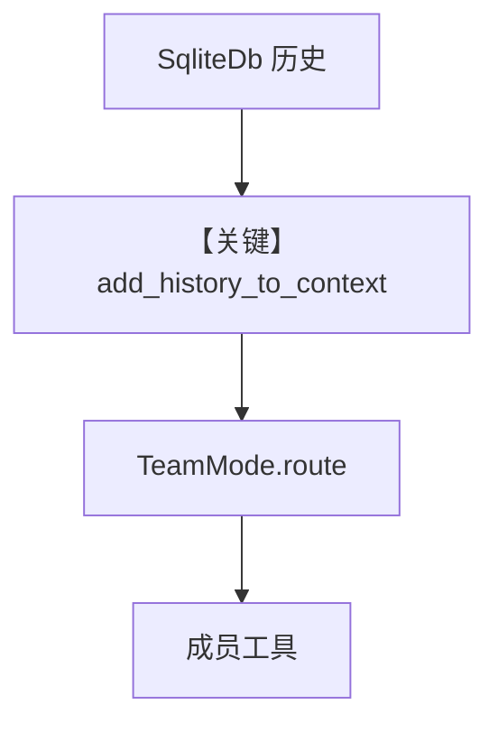

# 04_respond_directly_with_history.py — 实现原理分析

<!-- cookbook-py-source:start -->
## 完整源码

```python
"""
Respond Directly With History
=============================

Demonstrates direct member responses with team history persisted in SQLite.
"""

from agno.agent import Agent
from agno.db.sqlite import SqliteDb
from agno.models.openai import OpenAIResponses
from agno.team import Team, TeamMode


# ---------------------------------------------------------------------------
# Create Members
# ---------------------------------------------------------------------------
def get_weather(city: str) -> str:
    return f"The weather in {city} is sunny."


weather_agent = Agent(
    name="Weather Agent",
    role="You are a weather agent that can answer questions about the weather.",
    model=OpenAIResponses(id="gpt-5-mini"),
    tools=[get_weather],
)


def get_news(topic: str) -> str:
    return f"The news about {topic} is that it is going well!"


news_agent = Agent(
    name="News Agent",
    role="You are a news agent that can answer questions about the news.",
    model=OpenAIResponses(id="gpt-5-mini"),
    tools=[get_news],
)


def get_activities(city: str) -> str:
    return f"The activities in {city} are that it is going well!"


activities_agent = Agent(
    name="Activities Agent",
    role="You are a activities agent that can answer questions about the activities.",
    model=OpenAIResponses(id="gpt-5-mini"),
    tools=[get_activities],
)

# ---------------------------------------------------------------------------
# Create Team
# ---------------------------------------------------------------------------
geo_search_team = Team(
    name="Geo Search Team",
    model=OpenAIResponses(id="gpt-5-mini"),
    mode=TeamMode.route,
    members=[
        weather_agent,
        news_agent,
        activities_agent,
    ],
    instructions="You are a geo search agent that can answer questions about the weather, news and activities in a city.",
    use_instruction_tags=True,
    db=SqliteDb(
        db_file="tmp/geo_search_team.db"
    ),  # Add a database to store the conversation history
    add_history_to_context=True,  # Ensure that the team leader knows about previous requests
)

# ---------------------------------------------------------------------------
# Run Team
# ---------------------------------------------------------------------------
if __name__ == "__main__":
    geo_search_team.print_response(
        "I am doing research on Tokyo. What is the weather like there?", stream=True
    )

    geo_search_team.print_response(
        "Is there any current news about that city?", stream=True
    )

    geo_search_team.print_response("What are the activities in that city?", stream=True)
```

<!-- cookbook-py-source:end -->

> 源文件：`cookbook/03_teams/01_quickstart/04_respond_directly_with_history.py`

## 概述

本示例展示 Agno 的 **Team 会话历史 + 路由（route）** 机制：`SqliteDb` 持久化；`add_history_to_context=True` 使队长在后续 turn 能看到此前对话；`TeamMode.route` 在天气/新闻/活动专家间路由；`use_instruction_tags=True` 使队长 `instructions` 包在 `<instructions>` 内（`team/_messages.py` 对应分支）。

**核心配置一览：**

| 配置项 | 值 | 说明 |
|--------|------|------|
| `mode` | `TeamMode.route` | 路由 |
| `db` | `SqliteDb(db_file="tmp/geo_search_team.db")` | 历史持久化 |
| `add_history_to_context` | `True` | 历史进上下文 |
| `use_instruction_tags` | `True` | 指令标签包裹 |
| `instructions` | 单字符串 | 队长角色 |

## 核心组件解析

三次 `print_response` 模拟同一「东京」调研会话的 follow-up，依赖 session 内历史指代「that city」。

### 运行机制与因果链

1. **路径**：Turn1 天气 → Turn2 新闻 → Turn3 活动；队长历史 + 路由选择成员工具。
2. **副作用**：SQLite 写入会话与 run。

## System Prompt 组装

### 还原后的完整 System 文本（结构）

```text
<instructions>
You are a geo search agent that can answer questions about the weather, news and activities in a city.
</instructions>

（若 team 默认 build_context 且 markdown 未开启，则无「Use markdown…」；本例 `markdown` 未显式 True，以实际 Team 默认为准。）
```

本文件 `markdown` 未传入 Team 构造函数，Team 默认 `markdown: bool = False`（`team.py` L157），故队长 **无** `# 1.3.1` markdown 行，除非模型自带。

## 完整 API 请求

`OpenAIResponses` + 工具函数 `get_weather` 等。

## Mermaid 流程图


```mermaid
flowchart TD
    H["SqliteDb 历史"] --> A["【关键】add_history_to_context"]
    A --> R["TeamMode.route"]
    R --> M["成员工具"]
```

- **【关键】add_history_to_context**：多轮指代解析依赖队长侧历史。

## 关键源码文件索引

| 文件 | 作用 |
|------|------|
| `agno/team/team.py` | 历史相关字段、run |
| `agno/team/_messages.py` | `use_instruction_tags` 拼装 |
