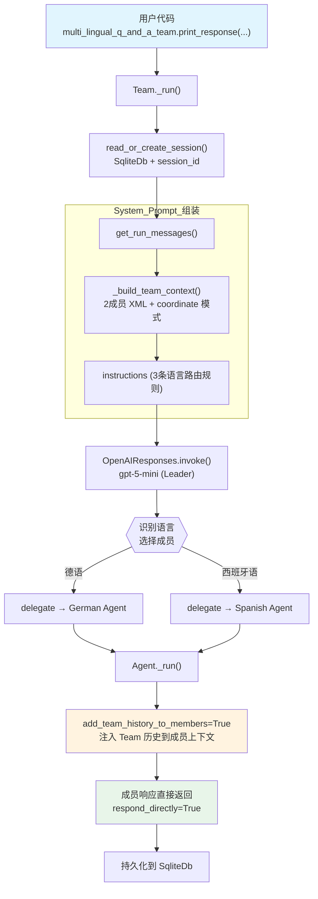

# 05_team_history.py — 实现原理分析

> 源文件：`cookbook/03_teams/01_quickstart/05_team_history.py`

## 概述

本示例展示 Agno 的 **`add_team_history_to_members`** 机制：将 Team 层级的历史对话（用户与 Team 的完整交互记录）传递给被委派的成员 Agent，让成员在回答时能感知之前轮次的上下文。配合 **`respond_directly=True`** 和 **`determine_input_for_members=False`** 实现透传式多语言问答。

**核心配置一览：**

| 配置项 | 值 | 说明 |
|--------|------|------|
| `name` | `"Multi Lingual Q and A Team"` | Team 名称 |
| `model` | `OpenAIResponses(id="gpt-5-mini")` | Leader 使用 Responses API |
| `mode` | `None`（默认 coordinate） | 协调模式（respond_directly 覆盖行为） |
| `members` | `[german_agent, spanish_agent]` | 两名语言专家成员 |
| `instructions` | `[str, str, str]` | 3 条语言路由与翻译指令 |
| `db` | `SqliteDb(db_file="tmp/multi_lingual_q_and_a_team.db")` | SQLite 持久化 |
| `respond_directly` | `True` | 成员响应直接返回，不经 Leader 合并 |
| `determine_input_for_members` | `False` | 原始输入直接发给成员，不经 Leader 重写 |
| `add_team_history_to_members` | `True` | 将 Team 历史传递给成员 |
| `markdown` | `False` | 未设置 |
| `description` | `None` | 未设置 |

| 成员 | `name` | `model` | `role` |
|------|--------|---------|--------|
| german_agent | `"German Agent"` | `OpenAIResponses(id="gpt-5-mini")` | `"You answer German questions."` |
| spanish_agent | `"Spanish Agent"` | `OpenAIResponses(id="gpt-5-mini")` | `"You answer Spanish questions."` |

## 架构分层

```
用户代码层                        agno.team 层（Team 历史共享）
┌──────────────────────────┐      ┌─────────────────────────────────────────┐
│ 05_team_history.py       │      │ Team._run()                             │
│                          │      │  ├─ read_or_create_session() + SqliteDb  │
│ 第1轮（德语问候）         │─────>│  ├─ get_run_messages()                  │
│ session_id=uuid4         │      │  │    get_system_message()               │
│                          │      │  │    history_messages（Team 层历史）    │
│ 第2轮（西班牙语跟进）     │─────>│  │    user_message                      │
│ session_id=uuid4         │      │  ├─ Leader 决定委派哪个成员              │
└──────────────────────────┘      │  └─ delegate_task_to_member(成员)       │
                                  │       ↳ add_team_history_to_members=True │
                                  │         → 将 Team 历史注入成员上下文     │
                                  └─────────────────────────────────────────┘
                                                    │
                                                    ▼
                                        ┌──────────────────────┐
                                        │ OpenAIResponses (Leader)│
                                        │ gpt-5-mini            │
                                        └──────────────────────┘
                                                    │ respond_directly=True
                                                    ▼
                                        ┌──────────────────────┐
                                        │ Agent._run()（成员）  │
                                        │ + Team 历史上下文     │
                                        └──────────────────────┘
```

## 核心组件解析

### add_team_history_to_members

`add_team_history_to_members=True` 是本示例的核心机制。在委派任务给成员 Agent 时，Team 会将 **Team 层级的历史消息**（用户与 Team 的完整对话）注入到成员的请求中（`team/_default_tools.py` L392）：

```python
# team/_default_tools.py L392 — 委派时注入 Team 历史
if team.add_team_history_to_members and session:
    # 获取 Team 层历史消息
    team_history = session.get_team_history_messages(
        num_runs=team.num_team_history_runs  # 默认 3 轮
    )
    # 将历史注入成员的 additional_messages
    member_run_kwargs["additional_messages"] = team_history
```

这使成员在第二轮对话中收到第一轮的 user/assistant 历史，从而能理解上下文（如知道 "John" 是第一轮中提到的名字）。

### respond_directly 与 determine_input_for_members

| 参数 | 值 | 作用 |
|------|-----|------|
| `respond_directly` | `True` | 成员响应不经 Leader 合并，直接返回给用户 |
| `determine_input_for_members` | `False` | 用户原始输入直接发给成员，Leader 不重写任务描述 |

两者组合实现「透传」效果：Leader 只负责**选择**哪个成员，不修改输入也不整合输出。

### session_id 跨轮共享

通过 `uuid4()` 生成固定的 `session_id`，两次 `print_response()` 使用同一 session_id，确保 `SqliteDb` 能在第二轮找到第一轮的历史：

```python
session_id = f"conversation_{uuid4()}"

multi_lingual_q_and_a_team.print_response(
    "Hallo, wie heißt du? Meine Name ist John.",
    session_id=session_id,  # 第 1 轮
)

multi_lingual_q_and_a_team.print_response(
    "Cuéntame una historia de 2 oraciones usando mi nombre real.",
    session_id=session_id,  # 第 2 轮，同 session
)
```

### 成员历史 vs Team 历史的区别

| 机制 | 配置项 | 历史来源 | 注入位置 |
|------|--------|---------|---------|
| **Team 历史** | `add_team_history_to_members=True` | Team 层用户/Team 对话 | 成员的 additional_messages |
| **成员自身历史** | Agent 的 `add_history_to_context=True` | 成员自己被调用的历史 | 成员的 get_run_messages |

本示例使用 Team 历史（前者），成员 Agent 本身未设 `add_history_to_context`。

## System Prompt 组装（Team Leader）

| 序号 | 组成部分 | 本文件中的值/来源 | 是否生效 |
|------|---------|-----------------|---------|
| 1 | `system_message`（自定义） | `None` | 否 |
| 2.1 | 开场词 + `<team_members>` XML（2个） | German / Spanish Agent | 是 |
| 2.1 | `<how_to_respond>` coordinate 模式 | 默认（respond_directly 覆盖行为） | 是 |
| 2.2 | `description` | `None` | 否 |
| 2.2 | `role` | `None` | 否 |
| 2.2 | `instructions` 拼接 | 3 条路由与翻译指令 | 是 |
| 2.3 | knowledge 搜索指令 | `None` | 否 |
| - | `markdown` | `False` | 否 |
| - | `add_history_to_context` | `False`（Team Leader 自身） | 否 |
| - | `add_team_history_to_members` | `True` → 注入成员上下文 | 是（成员层） |
| - | model system message | OpenAIResponses 内置 | 是 |

### 最终 System Prompt（Leader）

```text
You coordinate a team of specialized AI agents to fulfill the user's request. ...

<team_members>
<member id="German Agent" name="German Agent">
  Role: You answer German questions.
</member>
<member id="Spanish Agent" name="Spanish Agent">
  Role: You answer Spanish questions.
</member>
</team_members>

<how_to_respond>
You operate in coordinate mode. ...
</how_to_respond>

- You are a multi lingual Q and A team that can answer questions in English and Spanish. You MUST delegate the task to the appropriate member based on the language of the question.
- If the question is in German, delegate to the German agent. If the question is in Spanish, delegate to the Spanish agent.
- Always translate the response from the appropriate language to English and show both the original and translated responses.
```

## 完整 API 请求

**第 2 轮（Spanish Agent 被调用，携带 Team 历史）：**

```python
# Leader 第 2 轮调用
client.responses.create(
    model="gpt-5-mini",
    input=[
        {"role": "developer", "content": "You coordinate a team...<team_members>..."},
        # 无 add_history_to_context，Leader 自身不携带历史
        {"role": "user", "content": "Cuéntame una historia de 2 oraciones usando mi nombre real."}
    ],
    tools=[{"type": "function", "name": "delegate_task_to_member", ...}],
    stream=True,
    stream_options={"include_usage": True}
)

# Leader 委派给 Spanish Agent，注入 Team 历史
client.responses.create(
    model="gpt-5-mini",
    input=[
        {"role": "developer", "content": "<your_role>\nYou answer Spanish questions.\n</your_role>"},
        # add_team_history_to_members=True → 注入 Team 第 1 轮历史
        {"role": "user", "content": "Hallo, wie heißt du? Meine Name ist John."},       # 第 1 轮用户
        {"role": "assistant", "content": "Ich heiße German Agent. Schön Sie kennenzulernen, John."},  # 第 1 轮回答
        # 当前任务（determine_input_for_members=False → 原始输入）
        {"role": "user", "content": "Cuéntame una historia de 2 oraciones usando mi nombre real."}
    ],
    stream=True
)
# respond_directly=True → Spanish Agent 的响应直接返回给用户
```

> Spanish Agent 通过 Team 历史知道用户名为 "John"，据此编写故事。

## Mermaid 流程图



## 关键源码文件索引

| 文件 | 关键函数/类 | 作用 |
|------|------------|------|
| `agno/team/team.py` | `add_team_history_to_members` L128 | Team 历史传递给成员的开关 |
| `agno/team/team.py` | `respond_directly` L101 | 成员响应直接透传开关 |
| `agno/team/team.py` | `determine_input_for_members` L105 | 禁用 Leader 重写任务描述 |
| `agno/team/_default_tools.py` | `delegate_task_to_member()` L392 | 委派时注入 Team 历史的具体实现 |
| `agno/team/team.py` | `num_team_history_runs` L130 | 注入的历史轮次数（默认 3） |
| `agno/db/sqlite/` | `SqliteDb` | 会话历史持久化 |
