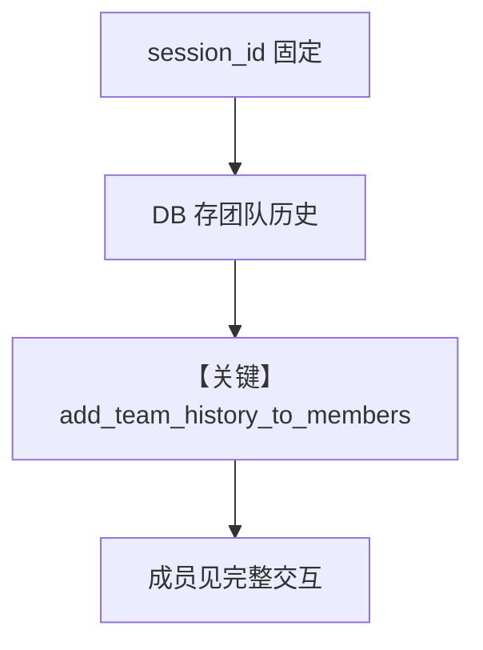

# 05_team_history.py — 实现原理分析

<!-- cookbook-py-source:start -->
## 完整源码

```python
"""
Team History
=============================

Demonstrates sharing team history with member agents across a session.
"""

from uuid import uuid4

from agno.agent import Agent
from agno.db.sqlite import SqliteDb
from agno.models.openai import OpenAIResponses
from agno.team import Team

# ---------------------------------------------------------------------------
# Create Members
# ---------------------------------------------------------------------------
german_agent = Agent(
    name="German Agent",
    role="You answer German questions.",
    model=OpenAIResponses(id="gpt-5-mini"),
)

spanish_agent = Agent(
    name="Spanish Agent",
    role="You answer Spanish questions.",
    model=OpenAIResponses(id="gpt-5-mini"),
)

# ---------------------------------------------------------------------------
# Create Team
# ---------------------------------------------------------------------------
multi_lingual_q_and_a_team = Team(
    name="Multi Lingual Q and A Team",
    model=OpenAIResponses(id="gpt-5-mini"),
    members=[german_agent, spanish_agent],
    instructions=[
        "You are a multi lingual Q and A team that can answer questions in English and Spanish. You MUST delegate the task to the appropriate member based on the language of the question.",
        "If the question is in German, delegate to the German agent. If the question is in Spanish, delegate to the Spanish agent.",
        "Always translate the response from the appropriate language to English and show both the original and translated responses.",
    ],
    db=SqliteDb(
        db_file="tmp/multi_lingual_q_and_a_team.db"
    ),  # Add a database to store the conversation history. This is a requirement for history to work correctly.
    respond_directly=True,
    determine_input_for_members=False,  # Send input directly to members.
    add_team_history_to_members=True,  # Send all interactions between the user and the team to the member agents.
)

# ---------------------------------------------------------------------------
# Run Team
# ---------------------------------------------------------------------------
if __name__ == "__main__":
    session_id = f"conversation_{uuid4()}"

    # First give information to the team
    # Ask question in German
    multi_lingual_q_and_a_team.print_response(
        "Hallo, wie heißt du? Meine Name ist John.",
        stream=True,
        session_id=session_id,
    )

    # Then watch them recall the information (the question below states:
    # "Tell me a 2-sentence story using my name")
    # Follow up in Spanish
    multi_lingual_q_and_a_team.print_response(
        "Cuéntame una historia de 2 oraciones usando mi nombre real.",
        stream=True,
        session_id=session_id,
    )
```

<!-- cookbook-py-source:end -->

> 源文件：`cookbook/03_teams/01_quickstart/05_team_history.py`

## 概述

本示例展示 Agno 的 **add_team_history_to_members + respond_directly** 机制：`add_team_history_to_members=True`（`team.py` L128–131）把用户与团队交互同步给成员；`respond_directly=True`（L100–102）队长不二次加工成员响应；`determine_input_for_members=False`（L105–106）输入直达成员；`db=SqliteDb` 持久化；固定 `session_id` 跨两轮德语/西班牙语对话。

**核心配置一览：**

| 配置项 | 值 |
|--------|-----|
| `respond_directly` | `True` |
| `determine_input_for_members` | `False` |
| `add_team_history_to_members` | `True` |
| `db` | `SqliteDb("tmp/multi_lingual_q_and_a_team.db")` |

## 核心组件解析

`Team` 字段语义见 `agno/team/team.py` L100–131 注释。

### 运行机制与因果链

第二轮西语请求应能利用第一轮中自述姓名等信息（经团队历史传给成员）。

## System Prompt 组装

队长 instructions 三行字面量（多语言委派与英译展示）。

### 还原后的完整 System 文本

```text
You are a multi lingual Q and A team that can answer questions in English and Spanish. You MUST delegate the task to the appropriate member based on the language of the question.
If the question is in German, delegate to the German agent. If the question is in Spanish, delegate to the Spanish agent.
Always translate the response from the appropriate language to English and show both the original and translated responses.
```

## 完整 API 请求

`OpenAIResponses` 多次调用；成员直接响应用户语言。

## Mermaid 流程图


```mermaid
flowchart TD
    S["session_id 固定"] --> H["DB 存团队历史"]
    H --> K["【关键】add_team_history_to_members"]
    K --> M["成员见完整交互"]
```

- **【关键】add_team_history_to_members**：成员获得团队级历史。

## 关键源码文件索引

| 文件 | 作用 |
|------|------|
| `agno/team/team.py` | L100-131 行为开关 |
