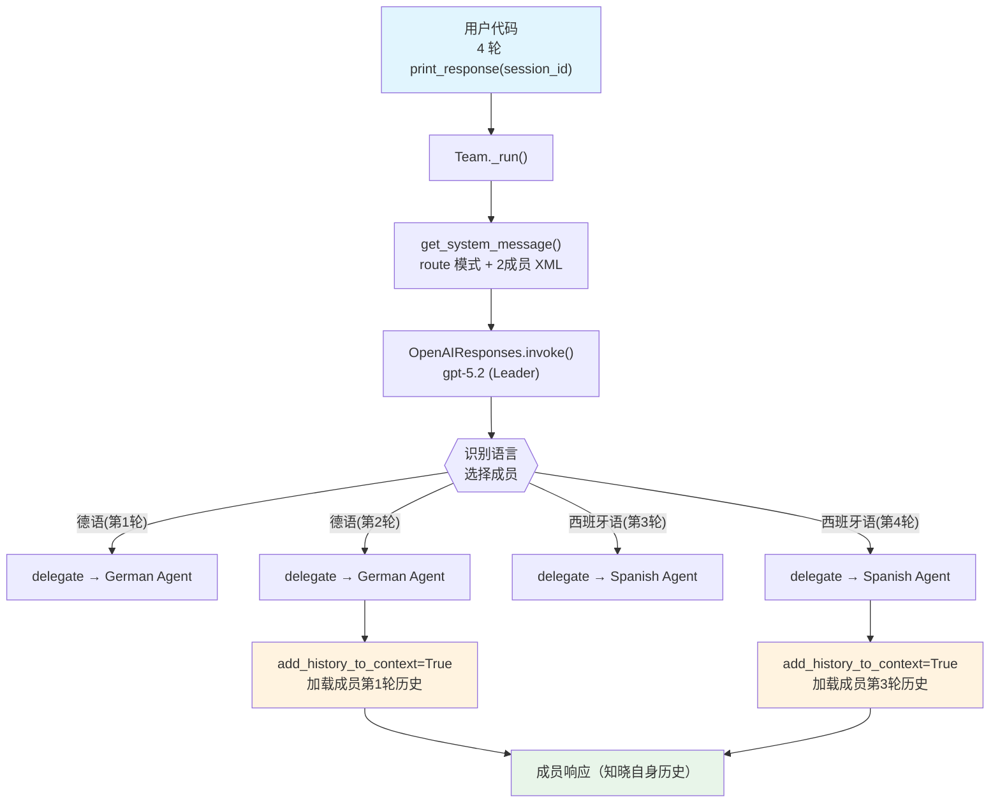

# 06_history_of_members.py — 实现原理分析

> 源文件：`cookbook/03_teams/01_quickstart/06_history_of_members.py`

## 概述

本示例展示 Agno 的**成员级历史**机制：每个成员 Agent 独立维护自身的历史上下文（`add_history_to_context=True`），而非 Team 层级的共享历史。当同一成员被多次委派时，它能记住与自己的上一轮对话，实现跨轮次的角色内连续对话。

**核心配置一览：**

| 配置项 | 值 | 说明 |
|--------|------|------|
| `name` | `"Multi Lingual Q and A Team"` | Team 名称 |
| `model` | `OpenAIResponses(id="gpt-5.2")` | Leader 使用 Responses API |
| `mode` | `TeamMode.route` | 路由模式 |
| `members` | `[german_agent, spanish_agent]` | 两名语言专家成员 |
| `instructions` | `[str, str]` | 2 条语言路由指令 |
| `db` | `SqliteDb(db_file="tmp/multi_lingual_q_and_a_team.db")` | SQLite 持久化 |
| `determine_input_for_members` | `False` | 原始输入直接发给成员 |
| `markdown` | `False` | 未设置 |
| `add_team_history_to_members` | `False`（未设置） | Team 历史不传给成员 |
| `respond_directly` | `False`（未设置） | Leader 仍可合并 |

| 成员 | `name` | `model` | `role` | `add_history_to_context` |
|------|--------|---------|--------|--------------------------|
| german_agent | `"German Agent"` | `OpenAIResponses(id="gpt-5.2")` | `"You answer German questions."` | `True` |
| spanish_agent | `"Spanish Agent"` | `OpenAIResponses(id="gpt-5.2")` | `"You answer Spanish questions."` | `True` |

## 架构分层

```
用户代码层                       agno.team 层（成员独立历史）
┌──────────────────────────┐    ┌──────────────────────────────────────────┐
│ 06_history_of_members.py │    │ Team._run()                              │
│                          │    │  ├─ get_system_message()                 │
│ 第1轮: 德语问候           │───>│  ├─ route → German Agent._run()         │
│                          │    │  │    add_history_to_context=True        │
│ 第2轮: 德语跟进           │───>│  │    → 成员从 SqliteDb 加载自身历史    │
│ (同 session_id)           │    │  ├─ route → German Agent._run()         │
│                          │    │  │    携带第1轮成员历史                  │
│ 第3轮: 西班牙语问候       │───>│  ├─ route → Spanish Agent._run()        │
│ 第4轮: 西班牙语跟进       │───>│  └─ route → Spanish Agent._run()        │
└──────────────────────────┘         携带第3轮西班牙语历史
                                                    │
                                                    ▼
                                        ┌──────────────────────────┐
                                        │ OpenAIResponses (Leader)  │
                                        │ gpt-5.2                   │
                                        └──────────────────────────┘
                                                    │
                                                    ▼
                                        ┌──────────────────────────┐
                                        │ Agent._run()（对应成员）  │
                                        │ 携带成员自身历史          │
                                        └──────────────────────────┘
```

## 核心组件解析

### 成员级 add_history_to_context

每个成员 Agent 设置了 `add_history_to_context=True`，这与 Team 层的 `add_history_to_context` 是独立的两套机制。成员的历史从成员自己的会话数据中加载（team `db` 会话传播给成员）：

```python
# agent/_messages.py — get_run_messages() 中的成员历史注入
# 步骤 3: history（成员自身的历史运行记录）
if agent.add_history_to_context:
    history_messages = session.get_agent_history_messages(
        num_runs=agent.num_history_runs
    )
    run_messages.messages.extend(history_messages)
```

### 成员历史 vs Team 历史对比

| 机制 | 配置位置 | 历史范围 | 历史来源 | 用例 |
|------|---------|---------|---------|------|
| `add_history_to_context`（成员） | 每个成员 Agent | 该成员被调用的历史 | 成员自身会话 | 成员跨轮记住自己的对话 |
| `add_team_history_to_members`（Team） | Team 配置 | Team 层用户/Team 对话 | Team 会话 | 成员知晓用户与 Team 的全局历史 |
| `add_history_to_context`（Team） | Team 配置 | Team 层 Leader 历史 | Team 会话 | Leader 自身的跨轮历史 |

本示例只使用第一种（成员级），各成员的历史互相隔离：German Agent 只知道自己被调用的历史，Spanish Agent 同理。

### determine_input_for_members=False

`determine_input_for_members=False` 使 Leader 不重写任务描述，用户的原始输入直接作为任务发给成员。这对语言路由场景很重要——保持原始语言不被 Leader 改写。

### session_id 跨轮共享

使用固定 `session_id` 确保 4 轮问答都在同一会话中，成员的历史才能被正确加载：

```python
session_id = f"conversation_{uuid4()}"
# 所有 4 次 print_response 都传入同一 session_id
```

## System Prompt 组装（Team Leader）

| 序号 | 组成部分 | 本文件中的值/来源 | 是否生效 |
|------|---------|-----------------|---------|
| 1 | `system_message`（自定义） | `None` | 否 |
| 2.1 | 开场词 + `<team_members>` XML（2个） | German / Spanish Agent | 是 |
| 2.1 | `<how_to_respond>` route 模式 | `mode=TeamMode.route` | 是 |
| 2.2 | `description` | `None` | 否 |
| 2.2 | `role` | `None` | 否 |
| 2.2 | `instructions` 拼接 | 2 条路由指令 | 是 |
| 2.3 | knowledge 搜索指令 | `None` | 否 |
| - | `markdown` | `False` | 否 |
| - | 成员 `add_history_to_context` | `True` → 成员各自携带历史 | 是（成员层） |
| - | model system message | OpenAIResponses 内置 | 是 |

### 最终 System Prompt（Leader）

```text
You coordinate a team of specialized AI agents to fulfill the user's request. ...

<team_members>
<member id="German Agent" name="German Agent">
  Role: You answer German questions.
</member>
<member id="Spanish Agent" name="Spanish Agent">
  Role: You answer Spanish questions.
</member>
</team_members>

<how_to_respond>
You operate in route mode. ...
</how_to_respond>

- You are a multi lingual Q and A team that can answer questions in English and Spanish. You MUST delegate the task to the appropriate member based on the language of the question.
- If the question is in German, delegate to the German agent. If the question is in Spanish, delegate to the Spanish agent.
```

## 完整 API 请求

**第 2 轮（German Agent 携带第 1 轮自身历史）：**

```python
# Leader 路由到 German Agent（第 2 轮）
client.responses.create(
    model="gpt-5.2",
    input=[
        {"role": "developer", "content": "You coordinate a team...<team_members>..."},
        {"role": "user", "content": "Erzähl mir eine Geschichte mit zwei Sätzen und verwende dabei meinen richtigen Namen."}
    ],
    tools=[{"type": "function", "name": "delegate_task_to_member", ...}],
    stream=True,
    stream_options={"include_usage": True}
)

# German Agent 被调用，携带自身第 1 轮历史
client.responses.create(
    model="gpt-5.2",
    input=[
        {"role": "developer", "content": "<your_role>\nYou answer German questions.\n</your_role>"},
        # add_history_to_context=True → 成员自身第 1 轮历史
        {"role": "user", "content": "Hallo, wie heißt du? Mein Name ist John."},           # 第 1 轮成员消息
        {"role": "assistant", "content": "Ich heiße German Agent. Schön Sie kennenzulernen, John!"},  # 第 1 轮成员回答
        # 当前任务
        {"role": "user", "content": "Erzähl mir eine Geschichte mit zwei Sätzen und verwende dabei meinen richtigen Namen."}
    ],
    stream=True
)
# German Agent 知道 "mein richtiger Name" 是 "John"（来自自身历史）
```

## Mermaid 流程图



## 关键源码文件索引

| 文件 | 关键函数/类 | 作用 |
|------|------------|------|
| `agno/agent/agent.py` | `add_history_to_context` L127 | 成员 Agent 历史注入开关 |
| `agno/agent/_messages.py` | `get_run_messages()` L1146 | 成员 Agent 历史消息注入实现 |
| `agno/team/mode.py` | `TeamMode.route` | 路由模式枚举 |
| `agno/team/team.py` | `determine_input_for_members` L105 | 禁用 Leader 重写任务描述 |
| `agno/team/_messages.py` | `_get_mode_instructions()` L148 | 生成 route 模式指令 |
| `agno/db/sqlite/` | `SqliteDb` | 成员历史持久化 |
