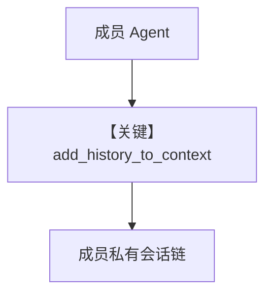

# 06_history_of_members.py — 实现原理分析

<!-- cookbook-py-source:start -->
## 完整源码

```python
"""
History Of Members
=============================

Demonstrates member-level history where each member tracks its own prior context.
"""

from uuid import uuid4

from agno.agent import Agent
from agno.db.sqlite import SqliteDb
from agno.models.openai import OpenAIResponses
from agno.team import Team, TeamMode

# ---------------------------------------------------------------------------
# Create Members
# ---------------------------------------------------------------------------
german_agent = Agent(
    name="German Agent",
    role="You answer German questions.",
    model=OpenAIResponses(id="gpt-5.2"),
    add_history_to_context=True,  # The member will have access to it's own history.
)

spanish_agent = Agent(
    name="Spanish Agent",
    role="You answer Spanish questions.",
    model=OpenAIResponses(id="gpt-5.2"),
    add_history_to_context=True,  # The member will have access to it's own history.
)

# ---------------------------------------------------------------------------
# Create Team
# ---------------------------------------------------------------------------
multi_lingual_q_and_a_team = Team(
    name="Multi Lingual Q and A Team",
    model=OpenAIResponses(id="gpt-5.2"),
    members=[german_agent, spanish_agent],
    instructions=[
        "You are a multi lingual Q and A team that can answer questions in English and Spanish. You MUST delegate the task to the appropriate member based on the language of the question.",
        "If the question is in German, delegate to the German agent. If the question is in Spanish, delegate to the Spanish agent.",
    ],
    db=SqliteDb(
        db_file="tmp/multi_lingual_q_and_a_team.db"
    ),  # Add a database to store the conversation history. This is a requirement for history to work correctly.
    determine_input_for_members=False,  # Send input directly to member agents.
    mode=TeamMode.route,  # Return member responses directly to the user.
)

# ---------------------------------------------------------------------------
# Run Team
# ---------------------------------------------------------------------------
if __name__ == "__main__":
    session_id = f"conversation_{uuid4()}"

    # Ask question in German
    multi_lingual_q_and_a_team.print_response(
        "Hallo, wie heißt du? Mein Name ist John.",
        stream=True,
        session_id=session_id,
    )

    # Follow up in German
    multi_lingual_q_and_a_team.print_response(
        "Erzähl mir eine Geschichte mit zwei Sätzen und verwende dabei meinen richtigen Namen.",
        stream=True,
        session_id=session_id,
    )

    # Ask question in Spanish
    multi_lingual_q_and_a_team.print_response(
        "Hola, ¿cómo se llama? Mi nombre es Juan.",
        stream=True,
        session_id=session_id,
    )

    # Follow up in Spanish
    multi_lingual_q_and_a_team.print_response(
        "Cuenta una historia de dos oraciones y utiliza mi nombre real.",
        stream=True,
        session_id=session_id,
    )
```

<!-- cookbook-py-source:end -->

> 源文件：`cookbook/03_teams/01_quickstart/06_history_of_members.py`

## 概述

本示例展示 Agno 的 **成员级历史（add_history_to_context on Agent）** 与 **TeamMode.route**：`german_agent` / `spanish_agent` 均 `add_history_to_context=True`，各自 DB 中保留**自己**的多轮上下文；队长 `mode=TeamMode.route`；`determine_input_for_members=False`。

**核心配置一览：**

| 配置项 | 值 |
|--------|-----|
| `mode` | `TeamMode.route` |
| 成员 `add_history_to_context` | `True` |
| `determine_input_for_members` | `False` |
| `db` | `SqliteDb(...)` |

## 核心组件解析

与 `05_team_history.py`（团队历史到成员）对照：本例强调 **Agent 私有历史**，同一 session 下德语线程与西语线程分别延续。

## System Prompt 组装

队长 instructions 同系列多语言委派（与 05 类似两行）。

### 还原后的完整 System 文本

```text
You are a multi lingual Q and A team that can answer questions in English and Spanish. You MUST delegate the task to the appropriate member based on the language of the question.
If the question is in German, delegate to the German agent. If the question is in Spanish, delegate to the Spanish agent.
```

## 完整 API 请求

`OpenAIResponses(id="gpt-5.2")`。

## Mermaid 流程图


```mermaid
flowchart TD
    A["成员 Agent"] --> B["【关键】add_history_to_context"]
    B --> C["成员私有会话链"]
```

- **【关键】add_history_to_context**：成员侧历史，区别于团队级 `add_team_history_to_members`。

## 关键源码文件索引

| 文件 | 作用 |
|------|------|
| `agno/agent/agent.py` | 成员 `add_history_to_context` |
| `agno/team/team.py` | `mode` |
