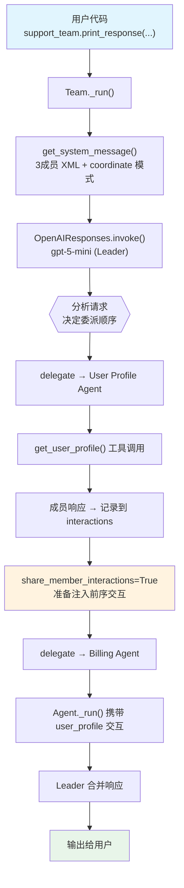

# 07_share_member_interactions.py — 实现原理分析

> 源文件：`cookbook/03_teams/01_quickstart/07_share_member_interactions.py`

## 概述

本示例展示 Agno 的 **`share_member_interactions`** 机制：在同一次 `print_response` 运行中，当多个成员依次被委派时，后续成员能看到前序成员的请求和响应。技术支持 Team 依赖这个机制让 billing_agent 知晓 user_profile_agent 已经获取到的用户信息，避免重复查询。

**核心配置一览：**

| 配置项 | 值 | 说明 |
|--------|------|------|
| `name` | `"Technical Support Team"` | Team 名称 |
| `model` | `OpenAIResponses(id="gpt-5-mini")` | Leader 使用 Responses API |
| `mode` | `None`（默认 coordinate） | 协调模式 |
| `members` | `[user_profile_agent, technical_support_agent, billing_agent]` | 三名专家成员 |
| `instructions` | `[str, str]` | 2 条支持团队指令 |
| `db` | `SqliteDb(db_file="tmp/technical_support_team.db")` | SQLite 持久化 |
| `share_member_interactions` | `True` | 同次运行内成员交互可见给后续成员 |
| `show_members_responses` | `True` | 显示成员 Agent 的响应 |
| `markdown` | `False` | 未设置 |
| `description` | `None` | 未设置 |

| 成员 | `name` | `model` | `role` | `tools` |
|------|--------|---------|--------|---------|
| user_profile_agent | `"User Profile Agent"` | `OpenAIResponses(id="gpt-5.2")` | 用户档案查询 | `get_user_profile`（自定义函数） |
| technical_support_agent | `"Technical Support Agent"` | `OpenAIResponses(id="gpt-5.2")` | 技术支持 | 无 |
| billing_agent | `"Billing Agent"` | `OpenAIResponses(id="gpt-5.2")` | 账单问题 | 无 |

## 架构分层

```
用户代码层                         agno.team 层（成员交互共享）
┌──────────────────────────────┐   ┌─────────────────────────────────────────┐
│ 07_share_member_interactions │   │ Team._run()                             │
│                              │   │  ├─ get_system_message()                │
│ 第1轮: "What is my billing   │──>│  ├─ Leader → user_profile_agent         │
│         address and how do   │   │  │    (get_user_profile 工具调用)        │
│         I change it?"        │   │  │    响应 → 记录到 member_interactions  │
│                              │   │  ├─ share_member_interactions=True       │
│ 第2轮: "Do I have MFA        │──>│  │    → billing_agent 收到前序交互       │
│         enabled?"            │   │  └─ Leader → billing_agent              │
└──────────────────────────────┘   └─────────────────────────────────────────┘
                                                    │
                                                    ▼
                                        ┌──────────────────────────┐
                                        │ OpenAIResponses (Leader)  │
                                        │ gpt-5-mini               │
                                        └──────────────────────────┘
                                                    │
                                        ┌───────────┴───────────────┐
                                        ▼                           ▼
                              ┌──────────────────┐       ┌──────────────────┐
                              │ user_profile_agent│       │  billing_agent   │
                              │ gpt-5.2          │       │  gpt-5.2         │
                              │ + get_user_profile│       │ + 前序成员交互   │
                              └──────────────────┘       └──────────────────┘
```

## 核心组件解析

### share_member_interactions

`share_member_interactions=True` 使 Team 在委派给后续成员时，将**本次运行中**前序成员的请求/响应记录注入到新成员的上下文（`team/_tools.py` L453）：

```python
# team/_tools.py L453 — 委派时注入已发生的成员交互
if team.share_member_interactions:
    prior_member_messages = _collect_member_interactions(
        team, current_member_id
    )
    # 将前序成员的 task/response 作为 additional_messages 注入
    member_run_kwargs["additional_messages"] = prior_member_messages
```

关键特点：这是**运行内（intra-run）共享**，不跨 `print_response` 调用。当 billing_agent 被委派时，它能看到 user_profile_agent 已经调用了 `get_user_profile` 并获取到账单地址等信息，从而避免重复查询，直接基于已有数据回答问题。

### add_team_history_to_members vs share_member_interactions 对比

| 机制 | 时间范围 | 内容范围 |
|------|---------|---------|
| `add_team_history_to_members` | 跨 `print_response` 调用（历史轮次） | Team 层用户/Team 对话 |
| `share_member_interactions` | 同一次 `print_response` 运行内 | 当次运行中前序成员的交互 |

### 多成员协作流程

第 1 轮（账单地址问题）：
1. Leader 判断需要先查用户档案 → 委派 `user_profile_agent`
2. `user_profile_agent` 调用 `get_user_profile()` → 获取 `billing_address="123 Main St, Anytown, USA"`
3. `share_member_interactions=True` → 将 user_profile_agent 的完整交互存入当次运行记录
4. Leader 委派 `billing_agent` → billing_agent 看到 user_profile_agent 的结果，直接回答如何修改账单地址

### show_members_responses

`show_members_responses=True` 会在终端打印每个成员 Agent 的完整响应，便于调试观察每个成员的输出和工具调用情况。

## System Prompt 组装（Team Leader）

| 序号 | 组成部分 | 本文件中的值/来源 | 是否生效 |
|------|---------|-----------------|---------|
| 1 | `system_message`（自定义） | `None` | 否 |
| 2.1 | 开场词 + `<team_members>` XML（3个） | user_profile/technical/billing | 是 |
| 2.1 | `<how_to_respond>` coordinate 模式 | 默认 coordinate | 是 |
| 2.2 | `description` | `None` | 否 |
| 2.2 | `role` | `None` | 否 |
| 2.2 | `instructions` 拼接 | 2 条技术支持指令 | 是 |
| 2.3 | knowledge 搜索指令 | `None` | 否 |
| - | `markdown` | `False` | 否 |
| - | model system message | OpenAIResponses 内置 | 是 |
| - | `add_session_state_to_context` | `False` | 否 |

### 最终 System Prompt（Leader）

```text
You coordinate a team of specialized AI agents to fulfill the user's request. ...

<team_members>
<member id="User Profile Agent" name="User Profile Agent">
  Role: You are a user profile agent that can retrieve information about the user and the user's account.
</member>
<member id="Technical Support Agent" name="Technical Support Agent">
  Role: You are a technical support agent that can answer questions about the technical support.
</member>
<member id="Billing Agent" name="Billing Agent">
  Role: You are a billing agent that can answer questions about the billing.
</member>
</team_members>

<how_to_respond>
You operate in coordinate mode. ...
</how_to_respond>

- You are a technical support team for a Facebook account that can answer questions about the technical support and billing for Facebook.
- Get the user's profile information first if the question is about the user's profile or account.
```

## 完整 API 请求

**第一轮，user_profile_agent 被调用后，billing_agent 携带前序交互被调用：**

```python
# billing_agent 收到的请求（携带 user_profile_agent 的交互）
client.responses.create(
    model="gpt-5.2",
    input=[
        {"role": "developer", "content": "<your_role>\nYou are a billing agent that can answer questions about the billing.\n</your_role>"},
        # share_member_interactions=True → 注入 user_profile_agent 的完整交互
        {"role": "user", "content": "<task>\nGet user profile information\n</task>"},
        {"role": "assistant", "content": "The user profile is: {name: 'John Doe', billing_address: '123 Main St, Anytown, USA', ...}"},
        # 当前任务：基于已有信息回答账单地址问题
        {"role": "user", "content": "<task>\nWhat is the user's billing address and how do I change it?\n</task>"}
    ],
    stream=True
)
```

## Mermaid 流程图



## 关键源码文件索引

| 文件 | 关键函数/类 | 作用 |
|------|------------|------|
| `agno/team/team.py` | `share_member_interactions` L132 | 同次运行内成员交互共享开关 |
| `agno/team/_tools.py` | L453 | 委派时注入前序成员交互的实现 |
| `agno/team/_messages.py` | `get_system_message()` L328 | 构建 Leader system prompt |
| `agno/team/_default_tools.py` | `delegate_task_to_member()` | 委派工具实现 |
| `agno/db/sqlite/` | `SqliteDb` | 会话持久化 |
