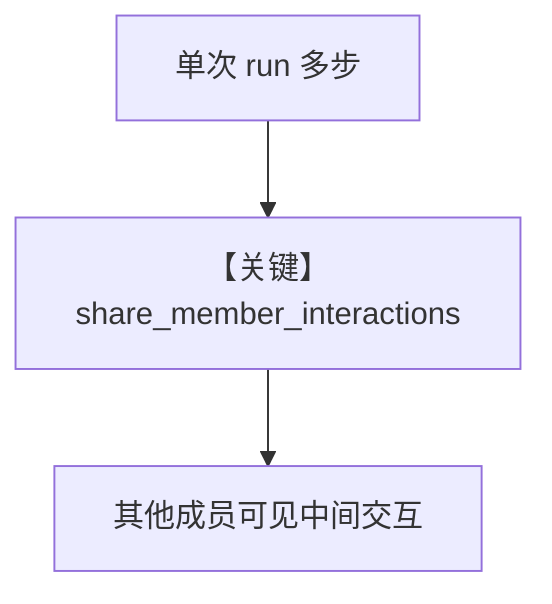

# 07_share_member_interactions.py — 实现原理分析

<!-- cookbook-py-source:start -->
## 完整源码

```python
"""
Share Member Interactions
=============================

Demonstrates sharing interactions among team members during execution.
"""

from uuid import uuid4

from agno.agent import Agent
from agno.db.sqlite import SqliteDb
from agno.models.openai import OpenAIResponses
from agno.team import Team


# ---------------------------------------------------------------------------
# Create Members
# ---------------------------------------------------------------------------
def get_user_profile() -> dict:
    """Get the user profile."""
    return {
        "name": "John Doe",
        "email": "john.doe@example.com",
        "phone": "1234567890",
        "billing_address": "123 Main St, Anytown, USA",
        "login_type": "email",
        "mfa_enabled": True,
    }


user_profile_agent = Agent(
    name="User Profile Agent",
    role="You are a user profile agent that can retrieve information about the user and the user's account.",
    model=OpenAIResponses(id="gpt-5.2"),
    tools=[get_user_profile],
)

technical_support_agent = Agent(
    name="Technical Support Agent",
    role="You are a technical support agent that can answer questions about the technical support.",
    model=OpenAIResponses(id="gpt-5.2"),
)

billing_agent = Agent(
    name="Billing Agent",
    role="You are a billing agent that can answer questions about the billing.",
    model=OpenAIResponses(id="gpt-5.2"),
)

# ---------------------------------------------------------------------------
# Create Team
# ---------------------------------------------------------------------------
support_team = Team(
    name="Technical Support Team",
    model=OpenAIResponses(id="gpt-5-mini"),
    members=[user_profile_agent, technical_support_agent, billing_agent],
    instructions=[
        "You are a technical support team for a Facebook account that can answer questions about the technical support and billing for Facebook.",
        "Get the user's profile information first if the question is about the user's profile or account.",
    ],
    db=SqliteDb(
        db_file="tmp/technical_support_team.db"
    ),  # Add a database to store the conversation history.
    share_member_interactions=True,  # Send member interactions during the current run.
    show_members_responses=True,
)

# ---------------------------------------------------------------------------
# Run Team
# ---------------------------------------------------------------------------
if __name__ == "__main__":
    session_id = f"conversation_{uuid4()}"

    # Ask question about technical support
    support_team.print_response(
        "What is my billing address and how do I change it?",
        stream=True,
        session_id=session_id,
    )

    support_team.print_response(
        "Do I have multi-factor enabled? How do I disable it?",
        stream=True,
        session_id=session_id,
    )
```

<!-- cookbook-py-source:end -->

> 源文件：`cookbook/03_teams/01_quickstart/07_share_member_interactions.py`

## 概述

本示例展示 Agno 的 **share_member_interactions** 机制：`team.py` L131–133：`share_member_interactions=True` 时，**当前 run 内**成员间请求/响应会共享给被委派成员，便于多步支持场景（如先取档案再答账单）。

**核心配置一览：**

| 配置项 | 值 |
|--------|-----|
| `share_member_interactions` | `True` |
| `show_members_responses` | `True` |
| `db` | `SqliteDb("tmp/technical_support_team.db")` |

## 核心组件解析

`user_profile_agent` 带 `get_user_profile` 工具；后续技术/账单问题可间接受益于同 run 内交互可见性。

## System Prompt 组装

```text
You are a technical support team for a Facebook account that can answer questions about the technical support and billing for Facebook.
Get the user's profile information first if the question is about the user's profile or account.
```

## 完整 API 请求

`OpenAIResponses`；工具返回模拟 profile。

## Mermaid 流程图


```mermaid
flowchart TD
    R["单次 run 多步"] --> S["【关键】share_member_interactions"]
    S --> X["其他成员可见中间交互"]
```

- **【关键】share_member_interactions**：当前 run 内成员互见。

## 关键源码文件索引

| 文件 | 作用 |
|------|------|
| `agno/team/team.py` | L131-133 |
