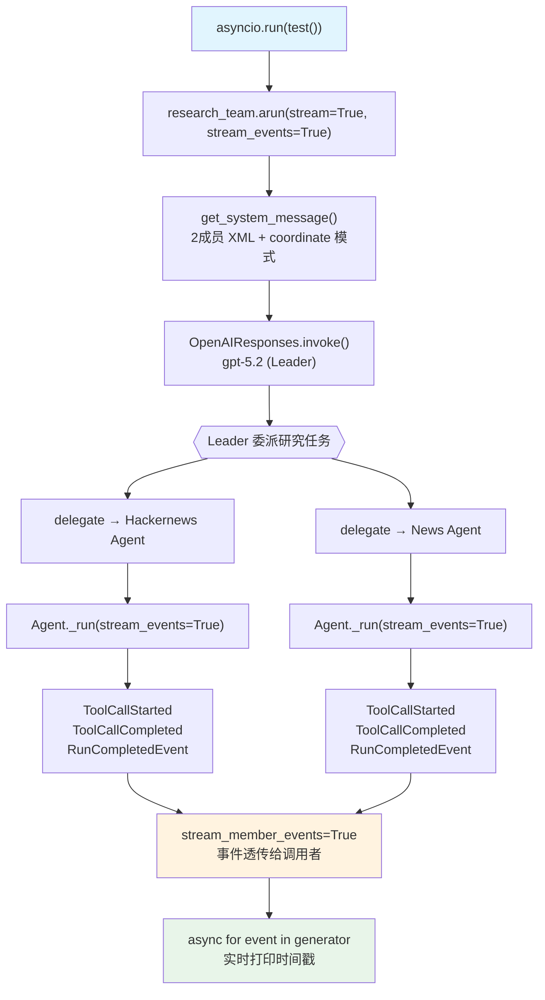

# 08_concurrent_member_agents.py — 实现原理分析

> 源文件：`cookbook/03_teams/01_quickstart/08_concurrent_member_agents.py`

## 概述

本示例展示 Agno 的**并发成员流式事件**机制：通过 `stream_events=True`（成员级）和 `stream_member_events=True`（Team 级），用户可以**实时接收**每个成员 Agent 的工具调用开始/结束事件，从而观察并发成员的执行时间线。异步 `arun()` 配合事件迭代器实现非阻塞的实时监控。

**核心配置一览：**

| 配置项 | 值 | 说明 |
|--------|------|------|
| `name` | `"Reasoning Research Team"` | Team 名称 |
| `model` | `OpenAIResponses(id="gpt-5.2")` | Leader 使用 Responses API |
| `mode` | `None`（默认 coordinate） | 协调模式 |
| `members` | `[hackernews_agent, news_agent]` | 两名研究成员 |
| `instructions` | `[str, str, str]` | 3 条协作研究指令 |
| `markdown` | `True` | 启用 markdown 格式化 |
| `show_members_responses` | `True` | 显示成员响应 |
| `stream_member_events` | `True` | 将成员 Agent 事件流式传播给调用者 |
| `description` | `None` | 未设置 |
| `db` | `None` | 未设置 |

| 成员 | `name` | `model` | `role` | `tools` | `stream` | `stream_events` |
|------|--------|---------|--------|---------|---------|----------------|
| hackernews_agent | `"Hackernews Agent"` | `OpenAIResponses(id="gpt-5.2")` | HackerNews 请求 | `HackerNewsTools()` | `True` | `True` |
| news_agent | `"News Agent"` | `OpenAIResponses(id="gpt-5.2")` | 新闻与时事分析 | `WebSearchTools()` | `True` | `True` |

## 架构分层

```
用户代码层（异步事件迭代）        agno.team 层（事件流转）
┌────────────────────────┐      ┌──────────────────────────────────────────┐
│ 08_concurrent_member   │      │ Team._run()（异步）                      │
│                        │      │  ├─ get_system_message()                 │
│ generator = team.arun( │─────>│  ├─ Leader LLM → delegate to members    │
│   ...,                 │      │  ├─ hackernews_agent._run(stream_events) │
│   stream=True,         │      │  │    → ToolCallStarted event            │
│   stream_events=True,  │      │  │    → ToolCallCompleted event          │
│ )                      │      │  │    → RunCompletedEvent                │
│                        │      │  ├─ news_agent._run(stream_events)       │
│ async for event in gen │<─────│  │    → ToolCallStarted event            │
│   if "ToolCallStarted" │      │  │    → ToolCallCompleted event          │
│   if "ToolCallCompleted│      │  └─ stream_member_events=True            │
│   if "RunStarted"      │      │       → 将成员事件透传给调用者           │
└────────────────────────┘      └──────────────────────────────────────────┘
                                                │
                                                ▼
                                    ┌──────────────────────────┐
                                    │ OpenAIResponses (Leader)  │
                                    │ gpt-5.2                   │
                                    └──────────────────────────┘
                                                │
                              ┌─────────────────┴─────────────────┐
                              ▼                                   ▼
                   ┌──────────────────┐               ┌──────────────────┐
                   │ hackernews_agent  │               │ news_agent        │
                   │ gpt-5.2          │               │ gpt-5.2          │
                   │ + HackerNewsTools │               │ + WebSearchTools  │
                   │ stream_events=True│               │ stream_events=True│
                   └──────────────────┘               └──────────────────┘
```

## 核心组件解析

### stream_member_events（Team 级）

`stream_member_events=True` 使 Team 将成员 Agent 产生的事件（工具调用事件、运行完成事件等）**透传**给 Team 调用者（`team/_response.py` L1239）：

```python
# team/_response.py L1239 — 条件性传播成员事件
if team.stream_member_events:
    # 将成员 Agent 的 RunOutputEvent 包装为 TeamRunOutputEvent 并 yield
    yield TeamRunOutputEvent(
        event=member_event.event,
        member_id=member_id,
        ...
    )
```

### stream_events（成员 Agent 级）

每个成员 Agent 设置 `stream_events=True`，使其在流式响应中生成细粒度事件对象而非纯文本 token：

```python
# 成员 Agent 启用 stream_events
hackernews_agent = Agent(
    stream=True,
    stream_events=True,  # 产生 ToolCallStarted/ToolCallCompleted/RunCompletedEvent
)
```

成员运行时 `Agent._run()` 中 `stream_events=True` 会使 `arun()` 返回 `AsyncIterator[RunOutputEvent]` 而非 `AsyncIterator[str]`（`agent/run/agent.py` L134）。

### 事件类型与过滤

用户代码通过检查 `event.event` 字符串过滤关注的事件类型：

```python
async for event in generator:
    if hasattr(event, "event"):
        if "ToolCallStarted" in event.event:
            print(f"[{elapsed:.2f}s] {event.event} - {event.tool.tool_name}")
        elif "ToolCallCompleted" in event.event:
            print(f"[{elapsed:.2f}s] {event.event} - {event.tool.tool_name}")
        elif "RunStarted" in event.event:
            print(f"[{elapsed:.2f}s] {event.event}")
```

这使用户能精确测量每个工具调用的开始和结束时间，观察两个成员的并发执行时间线。

### 并发执行时间线

通过 `time.time()` 打印时间戳，可以观察到两个成员 Agent 的工具调用是否并行发生（Agno Team 在 coordinate 模式下可以串行委派多个成员，但由于 Leader 依次委派，实际执行时序取决于 Leader 的决策）。

## System Prompt 组装（Team Leader）

| 序号 | 组成部分 | 本文件中的值/来源 | 是否生效 |
|------|---------|-----------------|---------|
| 1 | `system_message`（自定义） | `None` | 否 |
| 2.1 | 开场词 + `<team_members>` XML（2个） | hackernews/news agent | 是 |
| 2.1 | `<how_to_respond>` coordinate 模式 | 默认 coordinate | 是 |
| 2.2 | `description` | `None` | 否 |
| 2.2 | `role` | `None` | 否 |
| 2.2 | `instructions` 拼接 | 3 条研究协作指令 | 是 |
| - | `markdown` | `True` → "Use markdown..." | 是 |
| - | model system message | OpenAIResponses 内置 | 是 |
| - | `add_session_state_to_context` | `False` | 否 |

### 最终 System Prompt（Leader）

```text
You coordinate a team of specialized AI agents to fulfill the user's request. ...

<team_members>
<member id="Hackernews Agent" name="Hackernews Agent">
  Role: Handle hackernews requests
</member>
<member id="News Agent" name="News Agent">
  Role: Handle news requests and current events analysis
</member>
</team_members>

<how_to_respond>
You operate in coordinate mode. ...
</how_to_respond>

- Collaborate to provide comprehensive research and news insights
- Research latest world news and hackernews posts
- Use tables and charts to display data clearly and professionally

<additional_information>
- Use markdown to format your answers.
</additional_information>
```

## 完整 API 请求

**Leader 初始调用（决定委派两个研究员）：**

```python
client.responses.create(
    model="gpt-5.2",
    input=[
        {"role": "developer", "content": "You coordinate a team...<team_members>...<how_to_respond>coordinate mode...</how_to_respond>..."},
        {"role": "user", "content": "Research and compare recent developments in AI Agents:\n1. Get latest news about AI Agents from all your sources\n..."}
    ],
    tools=[{"type": "function", "name": "delegate_task_to_member", ...}],
    stream=True,
    stream_options={"include_usage": True}
)
```

**HackerNews Agent 被委派（stream_events=True）：**

```python
client.responses.create(
    model="gpt-5.2",
    input=[
        {"role": "developer", "content": "<your_role>\nHandle hackernews requests\n</your_role>\n...\n- Always include sources"},
        {"role": "user", "content": "<task>\nResearch latest AI Agents news from HackerNews\n</task>"}
    ],
    tools=[
        # HackerNewsTools 的工具
        {"type": "function", "name": "get_top_hackernews_stories", ...},
        {"type": "function", "name": "get_hackernews_story", ...}
    ],
    stream=True,
    stream_options={"include_usage": True}
    # stream_events=True 在 agno 层控制事件粒度，不体现在 API 参数上
)
# 产生 ToolCallStarted → ToolCallCompleted → RunCompletedEvent 事件流
```

## Mermaid 流程图



## 关键源码文件索引

| 文件 | 关键函数/类 | 作用 |
|------|------------|------|
| `agno/team/team.py` | `stream_member_events` L335 | Team 级成员事件流开关 |
| `agno/team/_response.py` | L1239 | 成员事件透传实现 |
| `agno/agent/agent.py` | `stream_events` L304 | 成员 Agent 事件流开关 |
| `agno/run/agent.py` | `RunEvent` L134 | 事件类型枚举（ToolCallStarted 等） |
| `agno/run/team.py` | `TeamRunOutputEvent` | Team 层事件包装类型 |
| `agno/team/_default_tools.py` | `delegate_task_to_member()` | 委派工具，触发成员 Agent._run() |
