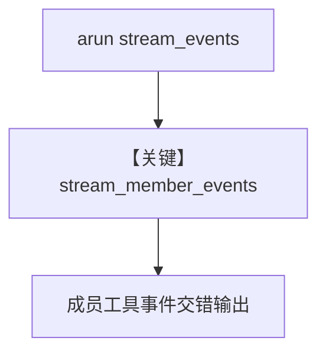

# 08_concurrent_member_agents.py — 实现原理分析

> 源文件：`cookbook/03_teams/01_quickstart/08_concurrent_member_agents.py`

## 概述

本示例展示 Agno 的 **stream_member_events + 成员 stream/stream_events** 机制：成员 Agent 设置 `stream=True`、`stream_events=True`；`Team` 设置 `stream_member_events=True`；`research_team.arun(..., stream=True, stream_events=True)` 异步迭代事件，打印 `ToolCallStarted` / `ToolCallCompleted` 等，用于观察 **并发/交错** 的成员级工具事件。

**核心配置一览：**

| 配置项 | 值 |
|--------|-----|
| `stream_member_events` | `True` |
| 成员 | `stream=True`, `stream_events=True` |
| `arun` | `stream=True`, `stream_events=True` |

## 核心组件解析

事件对象含 `event`、`tool` 等字段（示例用 `hasattr`/`in` 判断字符串）。

## System Prompt 组装

队长 instructions 三行；成员各有 `instructions`。

## 完整 API 请求

异步流式 Responses + 工具；事件驱动观测。

## Mermaid 流程图

```mermaid
flowchart TD
    A["arun stream_events"] --> B["【关键】stream_member_events"]
    B --> C["成员工具事件交错输出"]
```

- **【关键】stream_member_events**：团队层转发成员流事件。

## 关键源码文件索引

| 文件 | 作用 |
|------|------|
| `agno/team/team.py` | `stream_member_events` 字段 |
| `agno/team/_run.py` | 事件派发（需结合实现） |
