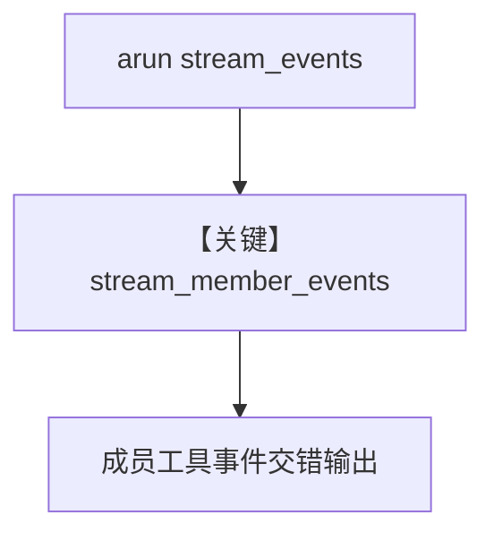

# 08_concurrent_member_agents.py — 实现原理分析

<!-- cookbook-py-source:start -->
## 完整源码

```python
"""
Concurrent Member Agents
=============================

Demonstrates concurrent delegation to team members with streamed member events.
"""

import asyncio
import time

from agno.agent import Agent
from agno.models.openai import OpenAIResponses
from agno.team import Team
from agno.tools.hackernews import HackerNewsTools
from agno.tools.websearch import WebSearchTools

# ---------------------------------------------------------------------------
# Create Members
# ---------------------------------------------------------------------------
hackernews_agent = Agent(
    name="Hackernews Agent",
    role="Handle hackernews requests",
    model=OpenAIResponses(id="gpt-5.2"),
    tools=[HackerNewsTools()],
    instructions="Always include sources",
    stream=True,
    stream_events=True,
)

news_agent = Agent(
    name="News Agent",
    role="Handle news requests and current events analysis",
    model=OpenAIResponses(id="gpt-5.2"),
    tools=[WebSearchTools()],
    instructions=[
        "Use tables to display news information and findings.",
        "Clearly state the source and publication date.",
        "Focus on delivering current and relevant news insights.",
    ],
    stream=True,
    stream_events=True,
)

# ---------------------------------------------------------------------------
# Create Team
# ---------------------------------------------------------------------------
research_team = Team(
    name="Reasoning Research Team",
    model=OpenAIResponses(id="gpt-5.2"),
    members=[hackernews_agent, news_agent],
    instructions=[
        "Collaborate to provide comprehensive research and news insights",
        "Research latest world news and hackernews posts",
        "Use tables and charts to display data clearly and professionally",
    ],
    markdown=True,
    show_members_responses=True,
    stream_member_events=True,
)


async def test() -> None:
    print("Starting agent run...")
    start_time = time.time()

    generator = research_team.arun(
        """Research and compare recent developments in AI Agents:
        1. Get latest news about AI Agents from all your sources
        2. Compare and contrast the news from all your sources
        3. Provide a summary of the news from all your sources""",
        stream=True,
        stream_events=True,
    )

    async for event in generator:
        current_time = time.time() - start_time

        if hasattr(event, "event"):
            if "ToolCallStarted" in event.event:
                print(f"[{current_time:.2f}s] {event.event} - {event.tool.tool_name}")
            elif "ToolCallCompleted" in event.event:
                print(f"[{current_time:.2f}s] {event.event} - {event.tool.tool_name}")
            elif "RunStarted" in event.event:
                print(f"[{current_time:.2f}s] {event.event}")

    total_time = time.time() - start_time
    print(f"Total execution time: {total_time:.2f}s")


# ---------------------------------------------------------------------------
# Run Team
# ---------------------------------------------------------------------------
if __name__ == "__main__":
    asyncio.run(test())
```

<!-- cookbook-py-source:end -->

> 源文件：`cookbook/03_teams/01_quickstart/08_concurrent_member_agents.py`

## 概述

本示例展示 Agno 的 **stream_member_events + 成员 stream/stream_events** 机制：成员 Agent 设置 `stream=True`、`stream_events=True`；`Team` 设置 `stream_member_events=True`；`research_team.arun(..., stream=True, stream_events=True)` 异步迭代事件，打印 `ToolCallStarted` / `ToolCallCompleted` 等，用于观察 **并发/交错** 的成员级工具事件。

**核心配置一览：**

| 配置项 | 值 |
|--------|-----|
| `stream_member_events` | `True` |
| 成员 | `stream=True`, `stream_events=True` |
| `arun` | `stream=True`, `stream_events=True` |

## 核心组件解析

事件对象含 `event`、`tool` 等字段（示例用 `hasattr`/`in` 判断字符串）。

## System Prompt 组装

队长 instructions 三行；成员各有 `instructions`。

## 完整 API 请求

异步流式 Responses + 工具；事件驱动观测。

## Mermaid 流程图


```mermaid
flowchart TD
    A["arun stream_events"] --> B["【关键】stream_member_events"]
    B --> C["成员工具事件交错输出"]
```

- **【关键】stream_member_events**：团队层转发成员流事件。

## 关键源码文件索引

| 文件 | 作用 |
|------|------|
| `agno/team/team.py` | `stream_member_events` 字段 |
| `agno/team/_run.py` | 事件派发（需结合实现） |
