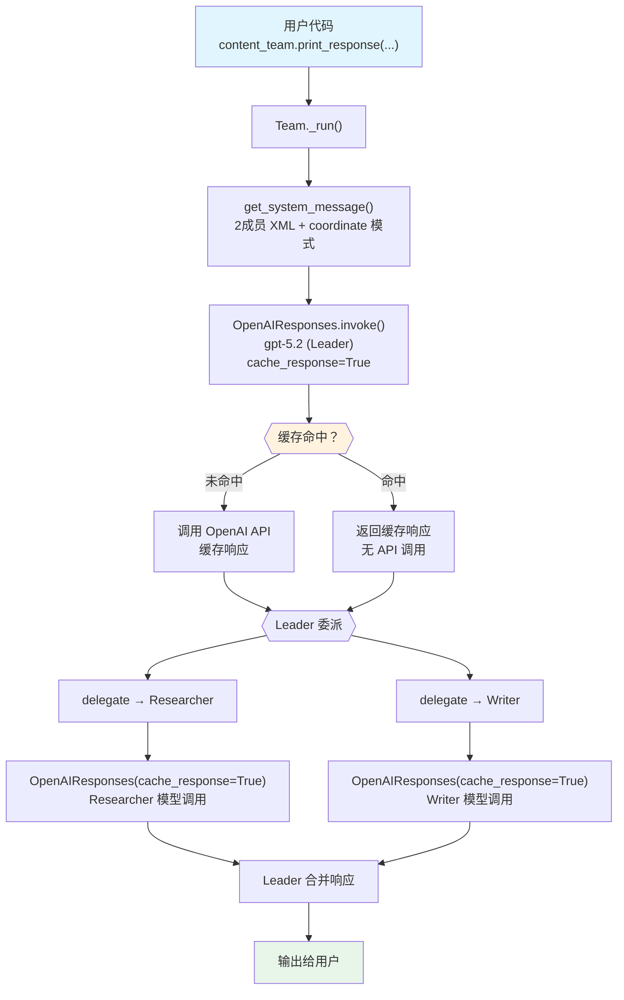

# 09_caching.py — 实现原理分析

> 源文件：`cookbook/03_teams/01_quickstart/09_caching.py`

## 概述

本示例展示 Agno 的**模型响应缓存**机制：通过在 `OpenAIResponses` 模型上设置 `cache_response=True`，对相同请求缓存 LLM 响应，减少重复 API 调用的成本和延迟。Team Leader 和所有成员 Agent 均启用缓存，形成两层缓存覆盖。

**核心配置一览：**

| 配置项 | 值 | 说明 |
|--------|------|------|
| `name` | `None` | Team 未命名 |
| `model` | `OpenAIResponses(id="gpt-5.2", cache_response=True)` | Leader 模型启用响应缓存 |
| `members` | `[researcher, writer]` | 两名成员 |
| `markdown` | `True` | 启用 markdown 格式化 |
| `debug_mode` | `True` | 启用调试日志（可观察缓存命中） |
| `mode` | `None`（默认 coordinate） | 协调模式 |
| `instructions` | `None` | 未设置 |
| `description` | `None` | 未设置 |
| `db` | `None` | 未设置 |
| `show_members_responses` | `False`（默认） | 未设置 |

| 成员 | `name` | `model` | `role` | `cache_response` |
|------|--------|---------|--------|-----------------|
| researcher | `"Researcher"` | `OpenAIResponses(id="gpt-5.2", cache_response=True)` | `"Research and gather information"` | `True` |
| writer | `"Writer"` | `OpenAIResponses(id="gpt-5.2", cache_response=True)` | `"Write clear and engaging content"` | `True` |

## 架构分层

```
用户代码层                         agno.team 层（两层缓存）
┌──────────────────────────┐      ┌────────────────────────────────────────┐
│ 09_caching.py            │      │ Team._run()                            │
│                          │      │  ├─ get_system_message()               │
│ content_team             │─────>│  ├─ Leader LLM 调用（cache_response=True）│
│   .print_response(       │      │  │    → 检查缓存 → 命中返回 / 未命中调用│
│     "Write a ...",       │      │  ├─ delegate → researcher              │
│   )                      │      │  │    researcher 模型（cache_response=True）│
│                          │      │  ├─ delegate → writer                  │
└──────────────────────────┘      │  │    writer 模型（cache_response=True） │
                                  └────────────────────────────────────────┘
                                                │
                          ┌─────────────────────┼─────────────────────┐
                          ▼                     ▼                     ▼
               ┌──────────────────┐ ┌──────────────────┐ ┌──────────────────┐
               │ OpenAIResponses  │ │ OpenAIResponses  │ │ OpenAIResponses  │
               │ gpt-5.2 (Leader) │ │ gpt-5.2          │ │ gpt-5.2         │
               │ cache_response=T │ │ (researcher)     │ │ (writer)        │
               └──────────────────┘ │ cache_response=T │ │ cache_response=T│
                                    └──────────────────┘ └──────────────────┘
```

## 核心组件解析

### cache_response 参数

`cache_response=True` 是 `OpenAIResponses` 模型的参数，不是 Team/Agent 的参数。它指示 Agno 在向 OpenAI Responses API 发送请求时启用响应缓存（`models/openai/responses.py`）：

```python
# OpenAIResponses 模型（models/openai/responses.py）
# cache_response=True 会在模型请求中启用 OpenAI 的 prompt caching 功能
# 相同的长前缀文本（system message + 历史）会被缓存，后续调用复用
OpenAIResponses(id="gpt-5.2", cache_response=True)
```

OpenAI Responses API 的 prompt caching 会自动缓存 token 超过一定数量的请求前缀，后续具有相同前缀的请求以较低价格命中缓存。

### 两层缓存结构

本示例在 Team 和所有成员上都启用了 `cache_response=True`，形成两层缓存：

| 层级 | 模型实例 | 缓存作用 |
|------|---------|---------|
| Team Leader | `OpenAIResponses(id="gpt-5.2", cache_response=True)` | 缓存 Leader 的协调决策 |
| researcher | `OpenAIResponses(id="gpt-5.2", cache_response=True)` | 缓存研究员的信息收集响应 |
| writer | `OpenAIResponses(id="gpt-5.2", cache_response=True)` | 缓存写手的内容生成响应 |

### debug_mode=True

`debug_mode=True` 会启用详细日志输出，包括：
- 每次模型调用的参数
- 缓存命中/未命中状态
- 工具调用详情

```python
# Team 级 debug_mode 会传播给成员 Agent
content_team = Team(
    model=OpenAIResponses(id="gpt-5.2", cache_response=True),
    debug_mode=True,  # 所有层级的模型调用都输出详细日志
)
```

## System Prompt 组装（Team Leader）

| 序号 | 组成部分 | 本文件中的值/来源 | 是否生效 |
|------|---------|-----------------|---------|
| 1 | `system_message`（自定义） | `None` | 否 |
| 2.1 | 开场词 + `<team_members>` XML（2个） | researcher / writer | 是 |
| 2.1 | `<how_to_respond>` coordinate 模式 | 默认 coordinate | 是 |
| 2.2 | `description` | `None` | 否 |
| 2.2 | `role` | `None` | 否 |
| 2.2 | `instructions` | `None` | 否 |
| - | `markdown` | `True` → "Use markdown..." | 是 |
| - | model system message | OpenAIResponses 内置 | 是 |
| - | `add_session_state_to_context` | `False` | 否 |

### 最终 System Prompt（Leader）

```text
You coordinate a team of specialized AI agents to fulfill the user's request. Delegate to members when their expertise or tools are needed. For straightforward requests you can handle directly — including using your own tools — respond without delegating.

<team_members>
<member id="Researcher" name="Researcher">
  Role: Research and gather information
</member>
<member id="Writer" name="Writer">
  Role: Write clear and engaging content
</member>
</team_members>

<how_to_respond>
You operate in coordinate mode. ...
</how_to_respond>

<additional_information>
- Use markdown to format your answers.
</additional_information>
```

## 完整 API 请求

**Leader 初始调用（携带 cache_response=True 参数）：**

```python
client.responses.create(
    model="gpt-5.2",
    input=[
        {"role": "developer", "content": "You coordinate a team...<team_members>...<how_to_respond>..."},
        {"role": "user", "content": "Write a very very very explanation of caching in software"}
    ],
    tools=[{"type": "function", "name": "delegate_task_to_member", ...}],
    # cache_response=True 对应 OpenAI Responses API 的 prompt caching
    # 长 system message 前缀会被自动缓存
    stream=False  # 未指定 stream，默认非流式
)
```

**Researcher 被委派（缓存命中场景）：**

```python
# 第一次调用（cache miss）：
client.responses.create(
    model="gpt-5.2",
    input=[
        {"role": "developer", "content": "<your_role>\nResearch and gather information\n</your_role>"},
        {"role": "user", "content": "<task>\nResearch the concept of caching in software...\n</task>"}
    ]
)

# 第二次相同调用（cache hit，减少 latency 和成本）：
# 同样的请求结构 → OpenAI 返回缓存的响应
```

## Mermaid 流程图



## 关键源码文件索引

| 文件 | 关键函数/类 | 作用 |
|------|------------|------|
| `agno/models/openai/responses.py` | `OpenAIResponses` L31 | 支持 `cache_response` 参数的模型类 |
| `agno/team/team.py` | `debug_mode` L346 | 调试模式开关 |
| `agno/team/_messages.py` | `get_system_message()` L328 | 构建 Leader system prompt |
| `agno/team/_default_tools.py` | `delegate_task_to_member()` | 委派工具 |
| `agno/team/mode.py` | `TeamMode.coordinate` | 默认协调模式 |
