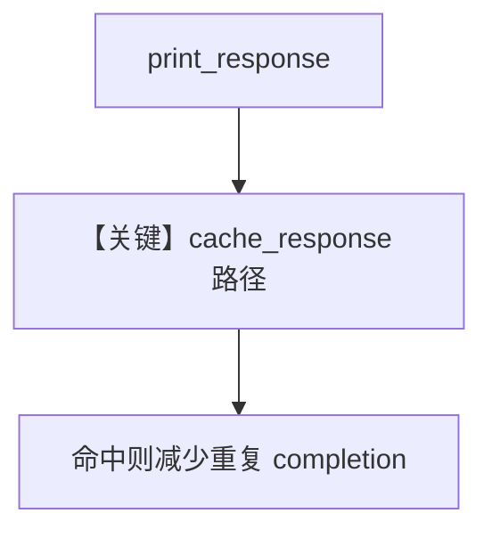

# 09_caching.py — 实现原理分析

> 源文件：`cookbook/03_teams/01_quickstart/09_caching.py`

## 概述

本示例展示 Agno 的 **模型响应缓存（cache_response）** 机制：队长与成员 `OpenAIResponses` 均 `cache_response=True`，在重复或相似请求时复用提供商侧或客户端缓存结果（具体语义见 `Model` 实现）；`debug_mode=True` 便于观察。

**核心配置一览：**

| 配置项 | 值 |
|--------|-----|
| `researcher` / `writer` | `cache_response=True` |
| `Team.model` | `cache_response=True` |
| `debug_mode` | `True` |

## 核心组件解析

缓存发生在模型适配器层；Team 结构为双成员无显式 `mode`。

## System Prompt 组装

未设队长 `instructions`，默认 system 可能仅含模型默认指令。

### 还原说明

无显式 team instructions；完整队长 system 依赖默认拼装，可运行时打印 `team.get_system_message(...)`。

## 完整 API 请求

`OpenAIResponses` 带缓存标志的请求参数（见 `responses.py` 与 invoke 实现）。

## Mermaid 流程图

```mermaid
flowchart TD
    Q["print_response"] --> C["【关键】cache_response 路径"]
    C --> H["命中则减少重复 completion"]
```

- **【关键】cache_response 路径**：本示例唯一变量。

## 关键源码文件索引

| 文件 | 作用 |
|------|------|
| `agno/models/openai/responses.py` | `OpenAIResponses` 与缓存相关参数 |
